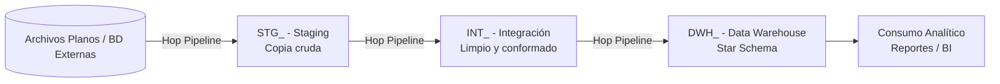

# LIN-ETL-HOP-001 — Estándar de Desarrollo de ETL con Apache Hop
## Oficina de Normalización Previsional — OTI
### Código: LIN-ETL-HOP-001 | Versión 0.1.0 | Estado: Borrador

---

## Control de versiones

| Versión | Fecha | Autor | Descripción |
|---------|-------|-------|-------------|
| 0.1.0 | 2026-09-25 | OTI | Versión inicial. |

---

## Tabla de contenidos

- [1. Alcance y vigencia](#1-alcance-y-vigencia)
- [2. Principios de diseño de ETL](#2-principios-de-diseño-de-etl)
- [3. Arquitectura de capas](#3-arquitectura-de-capas)
  - [3.4 Ingesta desde archivos planos](#34-ingesta-desde-archivos-planos)
- [4. Estructura de proyecto Hop](#4-estructura-de-proyecto-hop)
- [5. Convenciones de nomenclatura](#5-convenciones-de-nomenclatura)
- [6. Idempotencia y parametrización](#6-idempotencia-y-parametrización)
- [7. Diseño de Pipelines y Workflows](#7-diseño-de-pipelines-y-workflows)
- [8. Calidad de datos, cuarentena, logs y pruebas](#8-calidad-de-datos-cuarentena-logs-y-pruebas)
- [9. Seguridad y protección de datos personales](#9-seguridad-y-protección-de-datos-personales)
- [10. Control de versiones (Git)](#10-control-de-versiones-git)
- [11. Integración con orquestador (a futuro)](#11-integración-con-orquestador-a-futuro)
- [12. Gobierno y excepciones](#12-gobierno-y-excepciones)
- [Anexo A: Checklist de Definition of Done (DoD) para ETLs Hop](#anexo-a-checklist-de-definition-of-done-dod-para-etls-hop)
- [Anexo B: Plantillas de referencia](#anexo-b-plantillas-de-referencia)

---

## 1. Alcance y vigencia

### 1.1 Propósito

Este lineamiento establece las reglas de diseño, nomenclatura, idempotencia, calidad y seguridad que debe seguir todo desarrollo de ETL construido con **Apache Hop** sobre **Oracle**, de modo que cualquier persona que construya o mantenga un flujo de carga de datos en la ONP siga un criterio común, y que cualquiera que llegue después pueda entender, operar y dar mantenimiento a ese flujo sin depender del autor original.

Este documento es un **estándar de construcción de ETL**, no un estándar de modelado de base de datos transaccional ni un documento de arquitectura de plataforma.

### 1.2 Ámbito de aplicación

Este estándar aplica a:

- Todo proyecto nuevo de integración/carga de datos (ETL/ELT) que se implemente con Apache Hop sobre Oracle en la ONP. El uso actual de referencia es la carga de archivos planos hacia Oracle.
- Equipos internos y contratistas que desarrollen o mantengan Workflows (`.hwf`) y Pipelines (`.hpl`) de Hop para fines de explotación analítica o integración de datos.
- Los esquemas Oracle de staging, integración y Data Warehouse que sirvan como destino de estos procesos (ver [sección 3](#3-arquitectura-de-capas)).

**No aplica** a:

- Bases de datos y esquemas **transaccionales (OLTP)** de sistemas de negocio. Los esquemas de staging/integración/DWH de este documento tienen un ciclo de vida, un modelo de concurrencia y un propósito distintos (recarga masiva e idempotente, modelo desnormalizado orientado a lectura analítica), y por eso no heredan sus convenciones de nomenclatura de esquema/columna ni sus reglas de auditoría.
- Desarrollos nuevos sobre IBM DataStage/QualityStage o Pentaho Data Integration, que se rigen por sus propios estándares.
- El stack Lakehouse (Airflow + Spark + Iceberg + Nessie + Trino + MinIO). Hoy Apache Hop **no forma parte de la infraestructura oficial desplegada**: opera como herramienta de diseño independiente. Cuando Hop se incorpore formalmente a esa infraestructura junto con Python, el alcance de este documento deberá revisarse — ver [sección 11](#11-integración-con-orquestador-a-futuro).

---

## 2. Principios de diseño de ETL

Estos principios son agnósticos de herramienta y se heredan de la clasificación de Ralph Kimball. Todo desarrollo de ETL en Hop debe poder ubicarse en uno de estos cuatro grupos:

- **Extracción**: obtención de datos desde la fuente de origen (archivos planos, bases de datos externas) sin transformación de negocio.
- **Limpieza y conformación**: validación, estandarización, deduplicación — ocurre en la capa de Integración (`INT_`, ver [sección 3.2](#32-int---integración)).
- **Entrega**: modelado dimensional final para consumo — ocurre en la capa de Data Warehouse (`DWH_`, ver [sección 3.3](#33-dwh---data-warehouse-star-schema)).
- **Gestión**: programación, control de versiones, monitorización, reinicio/recuperación de los propios procesos ETL.

Ningún Pipeline o Workflow debe mezclar responsabilidades de más de un grupo cuando sea evitable — esto es lo que permite que un proceso de carga se pueda diagnosticar, reprocesar o rediseñar por partes.

---

## 3. Arquitectura de capas

Se adopta un modelo de tres capas sobre esquemas Oracle dedicados, distinto del modelo "un esquema por dominio funcional de negocio" que rige para sistemas transaccionales:



### 3.1 STG — Staging

- **Propósito**: réplica cruda e inalterada de la fuente de origen. Punto de entrada del pipeline.
- **Prohibido**: aplicar transformaciones de negocio, limpiezas o filtros en esta capa. Se preservan los nombres y tipos de columna del origen en la medida en que el tipo de dato Oracle lo permita.
- **Estrategia de carga**: `TRUNCATE + INSERT` (snapshot completo) o `INSERT` incremental por partición de fecha de ingesta, según el volumen y la naturaleza de la fuente.
- Si la fuente trae datos personales, esta capa es el punto de mayor exposición de PII — ver [sección 9.2](#92-pii-ley-n-29733).

### 3.2 INT — Integración

- **Propósito**: datos limpios, validados, deduplicados y estandarizados. Fuente de verdad técnica para el modelado dimensional.
- **Transformaciones mandatorias**: estandarización de formatos de fecha, limpieza de cadenas, normalización de identificadores, deduplicación por clave de negocio.
- Puede modelarse en 3FN o en estructuras desnormalizadas orientadas a proceso, según convenga al dominio.

### 3.3 DWH — Data Warehouse (Star Schema)

- **Propósito**: datos modelados listos para consumo de reportes/BI.
- **Modelado obligatorio**: Esquema Estrella — tablas de hechos (`FCT_`) y tablas de dimensión (`DIM_`).
- **Transformaciones permitidas**: agregaciones, joins entre dominios de Integración, cálculo de KPIs de negocio.

### 3.4 Ingesta desde archivos planos

El uso actual de referencia de Hop en el equipo es este: llevar archivos planos (CSV, TXT delimitado, ancho fijo) hacia Oracle. Se exige disciplina de control de archivo, no solo de dato:

- **Carpetas de control**: `inbox/` (archivo pendiente de procesar), `processing/` (en proceso — evita que un segundo workflow tome el mismo archivo dos veces), `processed/` (cargado con éxito), `rejected/` (archivo con error estructural que impidió el parseo).
- **Patrón de nombre esperado**: declarar explícitamente el patrón que debe cumplir el archivo entrante (ej. `<FUENTE>_<ENTIDAD>_YYYYMMDD.csv`). Un archivo que no cumpla el patrón no se procesa y se mueve directo a `rejected/`.
- **Encoding y delimitador**: declarar explícitamente el encoding (UTF-8 salvo excepción documentada) y el delimitador/formato esperado como parte de la metadata del Pipeline (`Text file input`) — nunca asumido implícitamente.
- **Post-carga**: el archivo se mueve de `processing/` a `processed/` únicamente si la carga fue exitosa, aunque existan filas desviadas a cuarentena (`ERR_<TABLA>`, [sección 8.1](#81-aislamiento-de-errores-quarantine)). Si la carga falla por completo (archivo corrupto, columnas faltantes), el archivo se mueve a `rejected/` y no se reintenta automáticamente.
- **Retención**: definir por proyecto cuánto tiempo se conserva el archivo original en `processed/` antes de purgarlo — es la evidencia de origen ante una auditoría, y es justamente lo que la columna `ETL_SOURCE_FILE` ([sección 5.4](#54-columnas-de-auditoría-técnica-obligatorias-en-toda-tabla-destino)) referencia.
- El Workflow de extracción indica que la fuente es un archivo con el sufijo `FILE` (ver [sección 5.6](#56-workflows-hwf)): ej. `WF_EXT_STG_PADRON_FILE`.

---

## 4. Estructura de proyecto Hop

Apache Hop organiza todo como metadata en archivos JSON dentro de un **proyecto**, lo cual se aprovecha directamente en vez de inventar una estructura propia:

```
<raíz del proyecto Hop>
├── config/
│   ├── hop-config.json
│   └── <ambiente>.json          → una configuración por Lifecycle Environment (dev/test/prod)
├── metadata/                    → conexiones, esquemas y demás metadata reutilizable del proyecto
└── projects/
    └── <nombre_proyecto>/
        ├── metadata.json
        ├── workflows/           → Workflows (.hwf)
        ├── pipelines/           → Pipelines (.hpl)
        └── sql/                 → Scripts SQL versionados (DDL de esquemas STG/INT/DWH, MERGE, DML)
```

Las carpetas de artefactos de ejecución (`inbox/`, `processing/`, `processed/`, `rejected/`, `logs/`) no se versionan — ver [sección 3.4](#34-ingesta-desde-archivos-planos) y [Anexo B](#anexo-b-plantillas-de-referencia).

**Ambientes**: se usan los **Lifecycle Environments** nativos de Hop (dev/test/producción) — no se codifica el ambiente en nombres de conexión ni de archivo (ver [sección 5.5](#55-metadata-conexiones)).

---

## 5. Convenciones de nomenclatura

### 5.1 Esquemas Oracle

| Capa | Patrón | Ejemplo |
|---|---|---|
| Staging | `STG_<FUENTE>` | `STG_PADRON_EXTERNO` |
| Integración | `INT_<DOMINIO>` | `INT_PADRON` |
| Data Warehouse | `DWH_<DOMINIO>` | `DWH_PADRON` |

### 5.2 Tablas

| Capa | Patrón | Ejemplo |
|---|---|---|
| Staging | `STG_<FUENTE>.<NOMBRE_ORIGEN>` | `STG_PADRON_EXTERNO.PERSONA` |
| Integración | `INT_<DOMINIO>.<NOMBRE>` | `INT_PADRON.PERSONA` |
| Hechos (DWH) | `DWH_<DOMINIO>.FCT_<NOMBRE>` | `DWH_PADRON.FCT_ACTUALIZACION_PADRON` |
| Dimensión (DWH) | `DWH_<DOMINIO>.DIM_<NOMBRE>` | `DWH_PADRON.DIM_PERSONA` |
| Cuarentena/error (cualquier capa) | `ERR_<TABLA>` | `ERR_STG_PERSONA` |

### 5.3 Columnas

| Prefijo/Sufijo | Tipo de dato | Ejemplo |
|---|---|---|
| `ID_<TABLA>` | Clave de negocio (natural, viene del origen) | `ID_PERSONA` (DNI) |
| `SK_<TABLA>` | Clave subrogada (secuencia o hash), PK técnica de dimensiones/hechos | `SK_PERSONA` |
| `_AT` (sufijo) | `TIMESTAMP` | `CREATED_AT`, `UPDATED_AT` |
| `_DATE` (sufijo) | `DATE` (sin hora) | `BIRTH_DATE` |
| `IS_` / `HAS_` (prefijo) | Flag binario, `NUMBER(1)` (`1`/`0`) o `CHAR(1)` con `CHECK` | `IS_ACTIVO`, `HAS_OBSERVACION` |

### 5.4 Columnas de auditoría técnica (obligatorias en toda tabla destino)

Las tablas de este stack no registran "usuario que modificó el registro" sino **linaje del proceso de carga** — es la información que realmente importa para diagnosticar y reprocesar un ETL:

| Columna | Tipo | Descripción |
|---|---|---|
| `ETL_LOADED_AT` | `TIMESTAMP` | Fecha/hora de inserción del registro. |
| `ETL_UPDATED_AT` | `TIMESTAMP` | Fecha/hora de la última actualización (MERGE). |
| `ETL_SOURCE_FILE` | `VARCHAR2(200)` | Nombre del archivo o identificador del origen. Vital cuando la fuente no es una tabla única. |
| `ETL_BATCH_ID` | `VARCHAR2(36)` | Identificador de la corrida/lote que insertó o modificó el registro. |

Estas cuatro columnas son obligatorias en **toda** tabla de STG, INT y DWH — no solo en staging.

### 5.5 Metadata (conexiones)

Convención oficial de Apache Hop, adoptada tal cual: el nombre de una conexión describe **qué contiene o para qué sirve**, nunca la tecnología ni el ambiente.

| Correcto | Incorrecto | Por qué |
|---|---|---|
| `PADRON` | `PADRON_ORACLE_PROD` | La tecnología (Oracle) y el ambiente (prod) se resuelven vía Lifecycle Environment, no en el nombre — cambiar de motor o de ambiente no debería obligar a renombrar la conexión en cada pipeline que la usa. |

### 5.6 Workflows (`.hwf`)

```
WF_<ACCION>_<DESTINO>
```

| Acción | Significado |
|---|---|
| `EXT` | Extracción de la fuente hacia Staging |
| `TRN` | Transformación / carga a Integración |
| `CAR` | Carga final a Data Warehouse |
| `CTL` | Control/orquestación de un conjunto de workflows |

Ejemplos: `WF_EXT_STG_PADRON_FILE`, `WF_CAR_DWH_PADRON_FCT_ACTUALIZACION`, `WF_CTL_EJEC_DIARIA_PADRON`.

Los Workflows contienen **únicamente**: control de flujo, validación de precondiciones (¿llegó el archivo?, ¿hay conexión a la base?), manejo de errores y notificación. Ninguna lógica de transformación de datos vive en un Workflow.

### 5.7 Pipelines (`.hpl`)

```
PL_<ORIGEN>_<DESTINO>
```

Ejemplo: `PL_ARCHIVO_STG_PERSONA`.

Cada Pipeline resuelve **una** tarea atómica de movimiento de datos (1 origen → 1 destino de staging/integración/DWH). Toda transformación compleja (joins multitabla, agregaciones pesadas, window functions) debe resolverse en SQL dentro de Oracle — Hop actúa como extractor/orquestador, no como motor de transformación pesada.

### 5.8 Transforms y Actions

Convención oficial de Apache Hop, adoptada tal cual: nombre funcional que describe lo que hace el transform/action, nunca el nombre genérico por defecto.

| Correcto | Incorrecto |
|---|---|
| `dni_valido = 8 digitos` | `Filter rows` |
| `split_nombre_completo` | `Filter rows 2` |

### 5.9 Variables y parámetros

- Variables de entorno: `MAYUSCULAS_CON_GUION_BAJO`.
- Parámetros de pipeline/workflow: `camelCase`.
- Regla oficial de Hop: *"Parameterize everything"* — cero valores hardcodeados. Usar `${PROJECT_HOME}` para rutas relativas al proyecto en vez de rutas del sistema operativo o expresiones internas de Hop.

---

## 6. Idempotencia y parametrización

### 6.1 Cargas idempotentes

- **Incrementales**: exclusivamente vía `MERGE INTO` en Oracle. Prohibido depender únicamente de transforms de `Insert / Update` de Hop en volúmenes medianos o grandes — no es idempotente ni eficiente a escala.
- **Por partición**: borrado previo de la partición de fecha (`DELETE` o `TRUNCATE PARTITION`) seguido de inserción en bloque.

### 6.2 Parámetros de ventana de tiempo

Ningún pipeline calcula "ayer" internamente. Todo pipeline recibe la ventana de ejecución como parámetro externo: `${EXECUTION_DATE}`, `${START_DATE}`, `${END_DATE}`. Esto es lo que permite reprocesar una fecha específica sin tocar el diseño del pipeline.

### 6.3 Externalización de configuración

Cero credenciales, URLs o rutas en duro en pipelines/workflows. Las conexiones se definen como metadata del proyecto ([sección 5.5](#55-metadata-conexiones)) y los valores que cambian por ambiente se resuelven vía Lifecycle Environments — nunca editando el pipeline entre ambientes.

---

## 7. Diseño de Pipelines y Workflows

Reglas de diseño tomadas de la documentación oficial de Apache Hop:

- **Límite razonable de transforms por pipeline**: cada transform de Hop genera al menos un thread; un pipeline con cientos de transforms degrada el rendimiento y dificulta el diagnóstico. Si un pipeline crece demasiado, dividirlo usando `Serialize to file` / `De-serialize from file`.
- **Reutilización**: lógica recurrente (ej. normalización de un identificador que se repite en varios pipelines) se implementa una sola vez con `Simple Mapping` y se invoca desde los pipelines que la necesiten. Para pipelines que solo cambian de configuración según parámetro, usar `Metadata Injection` en vez de duplicar el diseño.
- **Loops**: usar `Pipeline Executor` / `Workflow Executor`, o las actions `Repeat`/`End repeat` en workflows. No usar el patrón legado `Copy rows to result` para iterar — oculta la lógica del loop.
- **Rendimiento**: un pipeline es una red — su velocidad la limita el transform más lento (se visualiza con línea punteada en el diseñador de Hop). Agregar copias a un transform no mejora el rendimiento de forma automática; medir antes de paralelizar.

---

## 8. Calidad de datos, cuarentena, logs y pruebas

### 8.1 Aislamiento de errores (Quarantine)

Los registros que fallen validaciones de negocio o casteo **no abortan el pipeline completo**: se desvían a una tabla de descarte `ERR_<TABLA>` con el motivo del fallo. El pipeline continúa con los registros válidos.

### 8.2 Monitoreo y métricas

Al finalizar cada ejecución se deben registrar como mínimo: filas leídas, filas insertadas/actualizadas, filas rechazadas (a `ERR_<TABLA>`) y tiempo total del proceso. Usar el logging nativo de Hop (`Pipeline Log` / `Workflow Log`) en vez de un mecanismo ad hoc.

### 8.3 Pruebas unitarias de pipeline

A diferencia de otras herramientas de este mismo dominio, Hop trae un framework nativo de pruebas unitarias de pipeline. Todo pipeline que alimente `INT_` o `DWH_` debe tener al menos una prueba unitaria que verifique el resultado esperado sobre un conjunto de datos de entrada controlado, y estas pruebas se ejecutan como parte del pase a cada ambiente.

### 8.4 Notificación de ejecución

Todo Workflow de orquestación (`WF_CTL_*`) debe notificar por correo el resultado de la ejecución: éxito (con el log de operaciones adjunto) o error (con momento, traza del log y pipeline/workflow donde ocurrió).

---

## 9. Seguridad y protección de datos personales

### 9.1 Gestión de secretos

Prohibido almacenar secretos directamente en la metadata de Hop (conexiones, variables fijas). Se referencian indirectamente vía variables, se ofuscan como mínimo con `hop encrypt`, y para credenciales sensibles se usa cifrado AES (`AES two way password encoder`) o un `Variable Resolver` contra un almacén de secretos (vault).

### 9.2 PII (Ley N.° 29733)

Cuando la fuente trae datos personales, la capa `STG_` es la réplica cruda de mayor exposición:

- Clasificación de columnas PII desde la ingesta (documentar en el diccionario de datos del proyecto).
- Cifrado en reposo del tablespace que aloja los esquemas `STG_`/`INT_`/`DWH_`.
- Acceso nominal y auditado a `STG_` — no por cuenta compartida.
- Retención declarada: `STG_` no debe crecer indefinidamente; definir política de purga por dominio.
- Replicar `STG_`/`INT_`/`DWH_` hacia un ambiente no productivo exige enmascaramiento previo e irreversible.

### 9.3 Plugins y scripting

Retirar del directorio `plugins/` cualquier plugin de Hop que no esté en uso, para reducir superficie de ataque. Minimizar el uso de transforms de scripting (`JavaScript`, `Script`); todo script en producción pasa por revisión de código y queda con logging de auditoría de su ejecución.

---

## 10. Control de versiones (Git)

- Todo el proyecto Hop (carpetas `config/`, `metadata/`, `projects/`) se versiona en GitLab — al ser metadata en JSON, el diff es legible de forma nativa, a diferencia del XML de otras herramientas de este dominio.
- Toda referencia de commit relevante (caso, incidencia) se documenta en el mensaje de commit.
- Los scripts DDL/DML/MERGE de `sql/` se versionan igual que cualquier script de base de datos.

---

## 11. Integración con orquestador (a futuro)

Hoy Apache Hop opera de forma **standalone** (Hop GUI para diseño, `hop run` para ejecución programada vía cron o el scheduler disponible). Cuando el equipo despliegue la infraestructura oficial del stack Objetivo y Hop se incorpore a ella junto con Python, la orquestación pasa a Apache Airflow, mediante el plugin de Airflow para Hop o la ejecución nativa de workflows/pipelines de Hop desde un operador de Airflow. Esa migración implica revisar el alcance de este documento — no se asume ni se diseña por adelantado en esta versión.

---

## 12. Gobierno y excepciones

Una desviación de este lineamiento en un proyecto concreto se registra como `EXC-BI-NNN`, con vigencia acotada y fecha de revisión — nunca indefinida. Debe ser aprobada por la Oficina de Arquitectura de la OTI, y si afecta protección de datos personales, además por Seguridad Digital.

---

## Anexo A: Checklist de Definition of Done (DoD) para ETLs Hop

- [ ] **Capas**: el flujo respeta la separación STG → INT → DWH; ninguna transformación de negocio ocurre en STG.
- [ ] **Nomenclatura**: esquemas, tablas, columnas, Workflows y Pipelines siguen [sección 5](#5-convenciones-de-nomenclatura).
- [ ] **Idempotencia**: la carga incremental usa `MERGE INTO`; ningún workflow calcula fechas relativas internamente.
- [ ] **Auditoría**: las cuatro columnas `ETL_*` están presentes en toda tabla destino.
- [ ] **Cuarentena**: existe tabla `ERR_<TABLA>` y el pipeline continúa ante registros inválidos.
- [ ] **Ingesta de archivos**: respeta el patrón de nombre esperado y el ciclo `inbox → processing → processed/rejected` de [sección 3.4](#34-ingesta-desde-archivos-planos).
- [ ] **Configuración externalizada**: conexiones como metadata del proyecto, cero credenciales/rutas en duro.
- [ ] **Pruebas**: existe al menos una prueba unitaria de pipeline para lo que alimenta INT/DWH.
- [ ] **Notificación**: el Workflow de control notifica éxito/error por correo.
- [ ] **PII**: si aplica, columnas clasificadas, cifrado en reposo y retención declarada.

---

## Anexo B: Plantillas de referencia

### B.1 Estructura mínima de `config/<ambiente>.json`

```json
{
  "name": "produccion",
  "variables": {
    "PROJECT_HOME": "/opt/hop/projects/padron",
    "PATH_INBOX": "${PROJECT_HOME}/inbox",
    "PATH_PROCESSING": "${PROJECT_HOME}/processing",
    "PATH_PROCESSED": "${PROJECT_HOME}/processed",
    "PATH_REJECTED": "${PROJECT_HOME}/rejected"
  }
}
```

### B.2 MERGE INTO idempotente (ejemplo INT → DWH)

```sql
MERGE INTO DWH_PADRON.DIM_PERSONA d
USING (
    SELECT ID_PERSONA, NOMBRE, FECHA_NACIMIENTO
    FROM INT_PADRON.PERSONA
    WHERE ETL_BATCH_ID = :v_batch_id
) s
ON (d.ID_PERSONA = s.ID_PERSONA)
WHEN MATCHED THEN UPDATE SET
    d.NOMBRE = s.NOMBRE,
    d.FECHA_NACIMIENTO = s.FECHA_NACIMIENTO,
    d.ETL_UPDATED_AT = SYSTIMESTAMP,
    d.ETL_BATCH_ID = :v_batch_id
WHEN NOT MATCHED THEN INSERT (
    SK_PERSONA, ID_PERSONA, NOMBRE, FECHA_NACIMIENTO,
    ETL_LOADED_AT, ETL_BATCH_ID
) VALUES (
    DWH_PADRON.SQ_DIM_PERSONA.NEXTVAL, s.ID_PERSONA, s.NOMBRE, s.FECHA_NACIMIENTO,
    SYSTIMESTAMP, :v_batch_id
);
```
