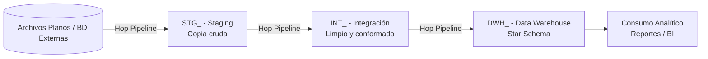
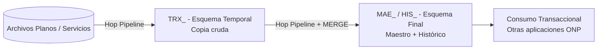

# LIN-ETL-HOP-001 — Estándar de Desarrollo de ETL con Apache Hop
## Oficina de Normalización Previsional — OTI
### Código: LIN-ETL-HOP-001 | Versión 0.1.0 | Estado: Borrador

---

## Control de versiones

| Versión | Fecha | Autor | Descripción |
|---------|-------|-------|-------------|
| 0.1.0 | 2026-09-25 | OTI | Versión inicial. |

---

## Tabla de contenidos

- [1. Alcance y vigencia](#1-alcance-y-vigencia)
- [2. Principios de diseño de ETL](#2-principios-de-diseño-de-etl)
- [3. Arquitectura de capas](#3-arquitectura-de-capas)
  - [3.4 Modelo B — Transaccional/Maestro](#34-modelo-b--transaccionalmaestro)
  - [3.5 Ingesta desde archivos planos](#35-ingesta-desde-archivos-planos)
- [4. Estructura de proyecto Hop](#4-estructura-de-proyecto-hop)
- [5. Convenciones de nomenclatura](#5-convenciones-de-nomenclatura)
- [6. Idempotencia y parametrización](#6-idempotencia-y-parametrización)
  - [6.4 Carga inicial (Modelo B)](#64-carga-inicial-modelo-b)
- [7. Diseño de Pipelines y Workflows](#7-diseño-de-pipelines-y-workflows)
- [8. Calidad de datos, cuarentena, logs y pruebas](#8-calidad-de-datos-cuarentena-logs-y-pruebas)
  - [8.5 Consumo de servicios web desde un ETL](#85-consumo-de-servicios-web-desde-un-etl)
- [9. Seguridad y protección de datos personales](#9-seguridad-y-protección-de-datos-personales)
- [10. Control de versiones (Git)](#10-control-de-versiones-git)
- [11. Gobierno y excepciones](#11-gobierno-y-excepciones)
- [Anexo A: Checklist de Definition of Done (DoD) para ETLs Hop](#anexo-a-checklist-de-definition-of-done-dod-para-etls-hop)
- [Anexo B: Plantillas de referencia](#anexo-b-plantillas-de-referencia)

---

## 1. Alcance y vigencia

### 1.1 Propósito

Este lineamiento establece las reglas de diseño, nomenclatura, idempotencia, calidad y seguridad que debe seguir todo desarrollo de ETL construido con **Apache Hop** sobre **Oracle**, de modo que cualquier persona que construya o mantenga un flujo de carga de datos en la ONP siga un criterio común, y que cualquiera que llegue después pueda entender, operar y dar mantenimiento a ese flujo sin depender del autor original.

Este documento es un **estándar de construcción de ETL**, no un estándar de modelado de base de datos transaccional ni un documento de arquitectura de plataforma.

### 1.2 Ámbito de aplicación

Este estándar aplica a:

- Todo proyecto nuevo de integración/carga de datos (ETL/ELT) que se implemente con Apache Hop sobre Oracle en la ONP, ya sea que el destino final sea un modelo de explotación analítica (Modelo A) o una tabla maestra operativa (Modelo B) — ver [sección 3](#3-arquitectura-de-capas). El uso actual de referencia es la carga de archivos planos hacia Oracle.
- Todo proyecto ETL que migre desde Pentaho Data Integration a Apache Hop: desde su migración se rige por este estándar (ver [sección 5.8](#58-pipelines-hpl) para la equivalencia de nombres).
- Equipos internos y contratistas que desarrollen o mantengan Workflows (`.hwf`) y Pipelines (`.hpl`) de Hop para fines de explotación analítica o integración/actualización de datos maestros.
- Los esquemas Oracle (staging/integración/Data Warehouse en el Modelo A, o temporal/maestro/histórico en el Modelo B) que sirvan como destino de estos procesos (ver [sección 3](#3-arquitectura-de-capas)).

**No aplica** a:

- El diseño de bases de datos y esquemas **transaccionales (OLTP)** de sistemas de negocio que **no** sean alimentados por un proceso ETL de este tipo (ej. tablas escritas directamente por una aplicación). Esas tablas siguen las convenciones institucionales de base de datos Oracle sin necesidad de este documento. Cuando sí es un ETL Hop el que alimenta una tabla maestra operativa, aplica el Modelo B de este documento.
- Desarrollos sobre IBM DataStage/QualityStage o Pentaho Data Integration, que se rigen por sus propios estándares.

---

## 2. Principios de diseño de ETL

Estos principios son agnósticos de herramienta y se heredan de la clasificación de Ralph Kimball. Todo desarrollo de ETL en Hop debe poder ubicarse en uno de estos cuatro grupos:

- **Extracción**: obtención de datos desde la fuente de origen (archivos planos, servicios web REST internos o externos, bases de datos externas) sin transformación de negocio — aterriza en `STG_` (Modelo A) o `TRX_` (Modelo B).
- **Limpieza y conformación**: validación, estandarización, deduplicación — ocurre en la capa de Integración (`INT_`, Modelo A, ver [sección 3.2](#32-int--integración)) o directamente en el pipeline hacia el esquema final (Modelo B, que no tiene capa intermedia separada).
- **Entrega**: modelado final para consumo — Star Schema en `DWH_` (Modelo A, ver [sección 3.3](#33-dwh--data-warehouse-star-schema)) o tabla maestra `MAE_`/histórico `HIS_` (Modelo B, ver [sección 3.4](#34-modelo-b--transaccionalmaestro)).
- **Gestión**: programación, control de versiones, monitorización, reinicio/recuperación de los propios procesos ETL.

Ningún Pipeline o Workflow debe mezclar responsabilidades de más de un grupo cuando sea evitable — esto es lo que permite que un proceso de carga se pueda diagnosticar, reprocesar o rediseñar por partes.

---

## 3. Arquitectura de capas

Este documento cubre **dos modelos de destino**, según el tipo de proyecto. El equipo debe declarar cuál aplica antes de diseñar el ETL — no son combinables dentro de un mismo flujo:

- **Modelo A — Analítico (BI/DWH)** ([3.1](#31-stg--staging)-[3.3](#33-dwh--data-warehouse-star-schema)): para proyectos de explotación analítica. Tres capas (`STG_`/`INT_`/`DWH_`), modelado Star Schema.
- **Modelo B — Transaccional/Maestro** ([3.4](#34-modelo-b--transaccionalmaestro)): para proyectos donde el destino es una tabla maestra operativa consultada en tiempo real por otros sistemas (ej. un padrón de personas). Dos capas (`TRX_` y `MAE_`/`HIS_`).

### Modelo A — Analítico (BI/DWH)

Tres capas sobre esquemas Oracle dedicados, distinto del modelo "un esquema por dominio funcional de negocio" que rige para sistemas transaccionales:


```mermaid
graph LR
    Fuentes[(Archivos Planos / BD Externas)] -- Hop Pipeline --> STG[STG_ - Staging\nCopia cruda]
    STG -- Hop Pipeline --> INT[INT_ - Integración\nLimpio y conformado]
    INT -- Hop Pipeline --> DWH[DWH_ - Data Warehouse\nStar Schema]
    DWH --> BI[Consumo Analítico\nReportes / BI]
```

### 3.1 STG — Staging

- **Propósito**: réplica cruda e inalterada de la fuente de origen. Punto de entrada del pipeline.
- **Prohibido**: aplicar transformaciones de negocio, limpiezas o filtros en esta capa. Se preservan los nombres y tipos de columna del origen en la medida en que el tipo de dato Oracle lo permita.
- **Estrategia de carga**: `TRUNCATE + INSERT` (snapshot completo) o `INSERT` incremental por partición de fecha de ingesta, según el volumen y la naturaleza de la fuente.
- Si la fuente trae datos personales, esta capa es el punto de mayor exposición de PII — ver [sección 9.2](#92-pii-ley-n-29733).

### 3.2 INT — Integración

- **Propósito**: datos limpios, validados, deduplicados y estandarizados. Fuente de verdad técnica para el modelado dimensional.
- **Transformaciones mandatorias**: estandarización de formatos de fecha, limpieza de cadenas, normalización de identificadores, deduplicación por clave de negocio.
- Puede modelarse en 3FN o en estructuras desnormalizadas orientadas a proceso, según convenga al dominio.

### 3.3 DWH — Data Warehouse (Star Schema)

- **Propósito**: datos modelados listos para consumo de reportes/BI.
- **Modelado obligatorio**: Esquema Estrella — tablas de hechos (`FCT_`) y tablas de dimensión (`DIM_`).
- **Transformaciones permitidas**: agregaciones, joins entre dominios de Integración, cálculo de KPIs de negocio.

### 3.4 Modelo B — Transaccional/Maestro

Aplica cuando el destino del ETL es una tabla maestra operativa consultada en tiempo real por otros sistemas (ej. un padrón de personas), no un esquema de explotación analítica. A diferencia del Modelo A, aquí no hay tres capas sino dos: esquema temporal de trabajo y esquema final.


```mermaid
graph LR
    Fuentes[(Archivos Planos / Servicios)] -- Hop Pipeline --> TRX[TRX_ - Esquema Temporal\nCopia cruda]
    TRX -- Hop Pipeline + MERGE --> MAE[MAE_ / HIS_ - Esquema Final\nMaestro + Histórico]
    MAE --> APP[Consumo Transaccional\nOtras aplicaciones ONP]
```

- **`TRX_` (esquema temporal de trabajo)**: réplica cruda de la fuente externa (archivo plano o respuesta de servicio). Mismo criterio que `STG_` en el Modelo A — sin transformación de negocio, estrategia `TRUNCATE + INSERT` por ejecución. Es el punto de control que permite prescindir del archivo plano de origen una vez copiado.
- **`MAE_` (maestra)**: siempre el dato vigente (equivalente al Tipo 1 de Kimball — se sobreescribe). Recibe `INSERT` (alta, cuando el registro no existe) o `MERGE` (actualización, cuando ya existe) — nunca se borra físicamente un registro existente.
- **`HIS_` (histórico)**: snapshot completo de la fila anterior a cada cambio, capturado **antes** de aplicar el `MERGE` a `MAE_`, dentro de la misma transacción y una sola vez por lote. Puede haber más de una tabla `HIS_` si distintos grupos de columnas de una misma entidad se historizan por separado (ej. `HIS_PERSONA` e `HIS_DIRECCION`).

La nomenclatura de esquemas, tablas, columnas y auditoría de este modelo está en [sección 5.5](#55-esquemas-tablas-columnas-y-auditoría-modelo-b--transaccionalmaestro).

### 3.5 Ingesta desde archivos planos

Aplica por igual a ambos modelos (A y B). El uso actual de referencia de Hop en el equipo es este: llevar archivos planos (CSV, TXT delimitado, ancho fijo) hacia Oracle. Se exige disciplina de control de archivo, no solo de dato:

- **Carpetas de control**: `inbox/` (archivo pendiente de procesar), `processing/` (en proceso — evita que un segundo workflow tome el mismo archivo dos veces), `processed/` (cargado con éxito), `rejected/` (archivo con error estructural que impidió el parseo).
- **Patrón de nombre esperado**: declarar explícitamente el patrón que debe cumplir el archivo entrante (ej. `<FUENTE>_<ENTIDAD>_YYYYMMDD.csv`). Un archivo que no cumpla el patrón no se procesa y se mueve directo a `rejected/`.
- **Encoding y delimitador**: declarar explícitamente el encoding (UTF-8 salvo excepción documentada) y el delimitador/formato esperado como parte de la metadata del Pipeline (`Text file input`) — nunca asumido implícitamente.
- **Post-carga**: el archivo se mueve de `processing/` a `processed/` únicamente si la carga fue exitosa, aunque existan filas desviadas a cuarentena (`ERR_<TABLA>`, [sección 8.1](#81-aislamiento-de-errores-quarantine)). Si la carga falla por completo (archivo corrupto, columnas faltantes), el archivo se mueve a `rejected/` y no se reintenta automáticamente.
- **Retención**: definir por proyecto cuánto tiempo se conserva el archivo original en `processed/` antes de purgarlo — es la evidencia de origen ante una auditoría. En Modelo A, es lo que la columna `ETL_SOURCE_FILE` ([sección 5.4](#54-columnas-de-auditoría-técnica-obligatorias-en-toda-tabla-destino-modelo-a)) referencia; en Modelo B, esa evidencia la da el nombre del archivo procesado, registrado en el control de ejecución del proyecto.
- El Workflow de extracción indica que la fuente es un archivo con el sufijo `FILE` (ver [sección 5.6](#57-workflows-hwf)): ej. `WF_EXT_STG_PADRON_FILE` (Modelo A) o `WF_EXT_TRX_RENIEC_ACTUALIZACION_FILE` (Modelo B).

---

## 4. Estructura de proyecto Hop

Apache Hop organiza todo como metadata en archivos JSON dentro de un **proyecto**, lo cual se aprovecha directamente en vez de inventar una estructura propia:

```
<raíz del proyecto Hop>
├── config/
│   ├── hop-config.json
│   └── <ambiente>.json          → una configuración por Lifecycle Environment (dev/test/prod)
├── metadata/                    → conexiones, esquemas y demás metadata reutilizable del proyecto
└── projects/
    └── <nombre_proyecto>/
        ├── metadata.json
        ├── workflows/           → Workflows (.hwf)
        ├── pipelines/           → Pipelines (.hpl)
        └── sql/                 → Scripts SQL versionados (DDL de esquemas STG/INT/DWH o TRX/MAE/HIS, MERGE, DML)
```

Las carpetas de artefactos de ejecución (`inbox/`, `processing/`, `processed/`, `rejected/`, `logs/`) no se versionan — ver [sección 3.4](#35-ingesta-desde-archivos-planos) y [Anexo B](#anexo-b-plantillas-de-referencia).

**Ambientes**: se usan los **Lifecycle Environments** nativos de Hop (dev/test/producción) — no se codifica el ambiente en nombres de conexión ni de archivo (ver [sección 5.5](#56-metadata-conexiones)).

---

## 5. Convenciones de nomenclatura

Las secciones 5.1 a 5.4 aplican al **Modelo A** (analítico). Para el **Modelo B** (transaccional/maestro), ver [sección 5.5](#55-esquemas-tablas-columnas-y-auditoría-modelo-b--transaccionalmaestro). Las secciones 5.6 a 5.10 (metadata, Workflows, Pipelines, transforms y variables) aplican por igual a ambos modelos.

### 5.1 Esquemas Oracle (Modelo A)

| Capa | Patrón | Ejemplo |
|---|---|---|
| Staging | `STG_<FUENTE>` | `STG_PADRON_EXTERNO` |
| Integración | `INT_<DOMINIO>` | `INT_PADRON` |
| Data Warehouse | `DWH_<DOMINIO>` | `DWH_PADRON` |

### 5.2 Tablas (Modelo A)

| Capa | Patrón | Ejemplo |
|---|---|---|
| Staging | `STG_<FUENTE>.<NOMBRE_ORIGEN>` | `STG_PADRON_EXTERNO.PERSONA` |
| Integración | `INT_<DOMINIO>.<NOMBRE>` | `INT_PADRON.PERSONA` |
| Hechos (DWH) | `DWH_<DOMINIO>.FCT_<NOMBRE>` | `DWH_PADRON.FCT_ACTUALIZACION_PADRON` |
| Dimensión (DWH) | `DWH_<DOMINIO>.DIM_<NOMBRE>` | `DWH_PADRON.DIM_PERSONA` |
| Cuarentena/error (cualquier capa) | `ERR_<TABLA>` | `ERR_STG_PERSONA` |

### 5.3 Columnas (Modelo A)

| Prefijo/Sufijo | Tipo de dato | Ejemplo |
|---|---|---|
| `ID_<TABLA>` | Clave de negocio (natural, viene del origen) | `ID_PERSONA` (DNI) |
| `SK_<TABLA>` | Clave subrogada (secuencia o hash), PK técnica de dimensiones/hechos | `SK_PERSONA` |
| `_AT` (sufijo) | `TIMESTAMP` | `CREATED_AT`, `UPDATED_AT` |
| `_DATE` (sufijo) | `DATE` (sin hora) | `BIRTH_DATE` |
| `IS_` / `HAS_` (prefijo) | Flag binario, `NUMBER(1)` (`1`/`0`) o `CHAR(1)` con `CHECK` | `IS_ACTIVO`, `HAS_OBSERVACION` |

### 5.4 Columnas de auditoría técnica (obligatorias en toda tabla destino, Modelo A)

Las tablas de este modelo no registran "usuario que modificó el registro" sino **linaje del proceso de carga** — es la información que realmente importa para diagnosticar y reprocesar un ETL:

| Columna | Tipo | Descripción |
|---|---|---|
| `ETL_LOADED_AT` | `TIMESTAMP` | Fecha/hora de inserción del registro. |
| `ETL_UPDATED_AT` | `TIMESTAMP` | Fecha/hora de la última actualización (MERGE). |
| `ETL_SOURCE_FILE` | `VARCHAR2(200)` | Nombre del archivo o identificador del origen. Vital cuando la fuente no es una tabla única. |
| `ETL_BATCH_ID` | `VARCHAR2(36)` | Identificador de la corrida/lote que insertó o modificó el registro. |

Estas cuatro columnas son obligatorias en **toda** tabla de STG, INT y DWH — no solo en staging.

### 5.5 Esquemas, tablas, columnas y auditoría (Modelo B — transaccional/maestro)

**Esquemas**: por dominio de negocio, no por capa (ej. `PADRON`), consistente con el estándar institucional de base de datos Oracle.

**Tablas**:

| Tipo | Patrón | Ejemplo |
|---|---|---|
| Esquema temporal de trabajo (staging) | `TRX_<FUENTE>` | `PADRON.TRX_RENIEC_ACTUALIZACION` |
| Maestra (destino final) | `MAE_<ENTIDAD>` | `PADRON.MAE_PERSONA` |
| Histórico | `HIS_<ENTIDAD>` | `PADRON.HIS_PERSONA`, `PADRON.HIS_DIRECCION` |
| Cuarentena/error | `ERR_<TABLA>` | `ERR_TRX_RENIEC_ACTUALIZACION` |

**Columnas**:

| Prefijo | Tipo de dato | Ejemplo |
|---|---|---|
| `ID_` | Identificador técnico o clave foránea numérica | `ID_PERSONA NUMBER(19)` |
| `C_` | Alfanumérico corto | `C_NOMBRE`, `C_DNI` |
| `N_` | Numérico | `N_IMPORTE` |
| `FE_` | Fecha/hora | `FE_NACIMIENTO`, `FE_FALLECIMIENTO` |
| `IN_` | Indicador lógico, `NUMBER(1)` con `CHECK IN (0,1)` | `IN_ACTIVO` |
| `DE_` | Descripción, terminal o IP | `DE_TERMINAL` |

**Claves**: la PK técnica es siempre `ID_<ENTIDAD> NUMBER(19)` generada por secuencia Oracle — nunca el identificador de negocio directo. La clave de negocio (ej. DNI) se modela como columna propia (`C_DNI`) con restricción `UNIQUE`, y es la que se usa para cruzar `TRX_` con `MAE_`.

**Auditoría técnica** (obligatoria en `MAE_`/`HIS_`; exenta en `TRX_` por ser esquema de carga masiva):

| Columna | Tipo | Nulabilidad |
|---|---|---|
| `ID_USUA_CREA` | `VARCHAR2(30)` | `NOT NULL` |
| `FE_USUA_CREA` | `TIMESTAMP` | `NOT NULL` |
| `DE_TERM_CREA` | `VARCHAR2(39)` | `NOT NULL` |
| `ID_USUA_MODI` | `VARCHAR2(30)` | `NULL` |
| `FE_USUA_MODI` | `TIMESTAMP` | `NULL` |
| `DE_TERM_MODI` | `VARCHAR2(39)` | `NULL` |

Cuando quien escribe es el propio proceso ETL (no una persona), `ID_USUA_CREA`/`ID_USUA_MODI` se puebla con un identificador técnico fijo que represente al proceso (ej. `ETL_RENIEC`) — nunca con una cuenta de base de datos compartida genérica ni con un valor vacío. `HIS_` incluye además la columna de lote (`C_LOTE`) que hace idempotente el archivado (ver [Anexo B.3](#b3-archivar--merge-idempotente--modelo-b-ejemplo-trx--mae_his_)).

### 5.6 Metadata (conexiones)

Convención oficial de Apache Hop, adoptada tal cual: el nombre de una conexión describe **qué contiene o para qué sirve**, nunca la tecnología ni el ambiente.

| Correcto | Incorrecto | Por qué |
|---|---|---|
| `PADRON` | `PADRON_ORACLE_PROD` | La tecnología (Oracle) y el ambiente (prod) se resuelven vía Lifecycle Environment, no en el nombre — cambiar de motor o de ambiente no debería obligar a renombrar la conexión en cada pipeline que la usa. |

### 5.7 Workflows (`.hwf`)

Los códigos de acción son los de la *Guía de Diseño y Programación de Inteligencia de Negocios* (Anexo N.° 13, §11.2.2), vigente en la ONP para DataStage. La única diferencia es el prefijo `WF_` (Workflow) / `PL_` (Pipeline, ver [5.8](#58-pipelines-hpl)), necesario en Hop porque ambos tipos de objeto conviven en el mismo proyecto:

```
WF_<ACCION>_<DESTINO>[_<SECUENCIAL>]
WF_<ACCION>_<DESTINO>_EJEC[_<SECUENCIAL>]
```

- `<DESTINO>`: tabla o entidad que el Workflow escribe (ej. `TRX_RENIEC_ACTUALIZACION`, `MAE_PERSONA`, `DWH_PADRON_FCT_ACTUALIZACION`).
- `<SECUENCIAL>` (4 dígitos): solo cuando existe más de un Workflow con la misma acción y destino, o nombres similares que deban diferenciarse.
- Sufijo `EJEC`: Workflow de secuencia que agrupa Workflows que deben ejecutarse en orden para un mismo proceso. Las mallas generales de ejecución pueden llevar, en lugar de un destino, una descripción puntual de la ejecución que realizan (ej. `WF_SEQ_NOVEDADES_RENIEC_EJEC`).

| Acción | Significado |
|---|---|
| `EXT` | Extracción de una fuente (archivo, servicio, base de datos) hacia un área intermedia (`STG_` / `TRX_`) |
| `TRN` | Transformación de datos (incluye validación y desvío a cuarentena) |
| `LOD` | Carga final al destino (Data Warehouse, o carga inicial en bloque de una tabla maestra) |
| `UPD` | Actualización |
| `INS` | Inserción |
| `UPS` | Actualización e inserción (ej. `MERGE` sobre una tabla maestra, con su archivado en `HIS_`) |
| `SEQ` | Secuencia y control de Workflows (orquestación) — la guía admite también `SQC`; en Hop se usa `SEQ` |
| `CTL` | Control y auditoría (ej. conciliación de conteos, verificación de precondiciones) |
| `CLE` | Limpieza o depuración (ej. vaciado de tablas temporales `TRX_`) |

Los códigos propios de QualityStage de la guía (`INV`, `MFQ`, `STD`) no tienen equivalente en Hop y no se usan.

Ejemplos: `WF_EXT_STG_PADRON_FILE`, `WF_LOD_DWH_PADRON_FCT_ACTUALIZACION`, `WF_UPS_MAE_PERSONA_0001`, `WF_CTL_MAE_PERSONA_CARGA_CERO`, `WF_CLE_TRX_RENIEC`, `WF_SEQ_NOVEDADES_RENIEC_EJEC`.

Los Workflows contienen **únicamente**: control de flujo, validación de precondiciones (¿llegó el archivo?, ¿hay conexión a la base?), manejo de errores y notificación. Ninguna lógica de transformación de datos vive en un Workflow.

### 5.8 Pipelines (`.hpl`)

```
PL_<ORIGEN>_<DESTINO>
```

Ejemplo: `PL_ARCHIVO_STG_PERSONA`.

Cada Pipeline resuelve **una** tarea atómica de movimiento de datos (1 origen → 1 destino de staging/integración/DWH, o temporal/maestro). Toda transformación compleja (joins multitabla, agregaciones pesadas, window functions) debe resolverse en SQL dentro de Oracle — Hop actúa como extractor/orquestador, no como motor de transformación pesada.

**Proyectos migrados desde Pentaho**: al importar un proyecto con la herramienta de importación de Hop, los objetos se renombran conservando la acción, el destino y el secuencial: `J_<ACCION>_<DESTINO>` → `WF_<ACCION>_<DESTINO>`, y `TRF_<ORIGEN>_<DESTINO>` → `PL_<ORIGEN>_<DESTINO>`. La migración se aprovecha para retirar cualquier paso sin equivalente en Hop.

### 5.9 Transforms y Actions

Convención oficial de Apache Hop, adoptada tal cual: nombre funcional que describe lo que hace el transform/action, nunca el nombre genérico por defecto.

| Correcto | Incorrecto |
|---|---|
| `dni_valido = 8 digitos` | `Filter rows` |
| `split_nombre_completo` | `Filter rows 2` |

### 5.10 Variables y parámetros

- Variables de entorno: `MAYUSCULAS_CON_GUION_BAJO`.
- Parámetros de pipeline/workflow: `camelCase`.
- Regla oficial de Hop: *"Parameterize everything"* — cero valores hardcodeados. Usar `${PROJECT_HOME}` para rutas relativas al proyecto en vez de rutas del sistema operativo o expresiones internas de Hop.

---

## 6. Idempotencia y parametrización

### 6.1 Cargas idempotentes

- **Incrementales**: exclusivamente vía `MERGE INTO` en Oracle. Prohibido depender únicamente de transforms de `Insert / Update` de Hop en volúmenes medianos o grandes — no es idempotente ni eficiente a escala.
- **Por partición**: borrado previo de la partición de fecha (`DELETE` o `TRUNCATE PARTITION`) seguido de inserción en bloque.

### 6.2 Parámetros de ventana de tiempo

Ningún pipeline calcula "ayer" internamente. Todo pipeline recibe la ventana de ejecución como parámetro externo: `${EXECUTION_DATE}`, `${START_DATE}`, `${END_DATE}`. Esto es lo que permite reprocesar una fecha específica sin tocar el diseño del pipeline.

### 6.3 Externalización de configuración

Cero credenciales, URLs o rutas en duro en pipelines/workflows. Las conexiones se definen como metadata del proyecto ([sección 5.5](#56-metadata-conexiones)) y los valores que cambian por ambiente se resuelven vía Lifecycle Environments — nunca editando el pipeline entre ambientes.

### 6.4 Carga inicial (Modelo B)

Un proyecto Modelo B comienza con una **carga inicial completa** sobre la tabla maestra vacía (ej. un padrón completo de personas). No es una carga incremental ni una recarga por partición, por lo que no se rige por [6.1](#61-cargas-idempotentes):

- **Carga en bloque, no `MERGE`**: el paso de `TRX_` a `MAE_` se hace con inserción directa en bloque (`INSERT /*+ APPEND */ ... SELECT`, con paralelismo si el volumen lo justifica, o el transform de carga masiva de Oracle). Un `MERGE` sobre una tabla vacía no aporta idempotencia útil y alarga la ventana de carga. Los índices y restricciones no esenciales para la carga se crean o reconstruyen al finalizar, y el uso de `NOLOGGING` y el respaldo posterior se acuerdan con el equipo de base de datos.
- **Validación previa**: los registros pasan por las mismas validaciones que la carga incremental y los rechazados se desvían a `ERR_<TABLA>` ([8.1](#81-aislamiento-de-errores-quarantine)).
- **Guarda de tabla vacía**: el Workflow solo se ejecuta si `MAE_` está vacía; nunca sobre una tabla con datos.
- **Sin histórico**: la carga inicial no genera registros en `HIS_` — no existe versión anterior que archivar.
- **Conciliación obligatoria**: registros del archivo = registros en `TRX_` = registros en `MAE_` + registros en `ERR_`. El resultado se registra en el control de ejecución y se notifica ([8.4](#84-notificación-de-ejecución)).
- **Reproceso total**: si la carga falla, se vacía `MAE_` y se repite completa. Solo es válido antes de habilitar las cargas incrementales y el consumo de la tabla por otros sistemas.
- **Fecha de corte**: se registra la fecha de corte del archivo de carga inicial, y las cargas incrementales se procesan desde esa fecha (no desde la fecha en que se ejecutó la carga), para no perder los cambios ocurridos en el intervalo.

---

## 7. Diseño de Pipelines y Workflows

Reglas de diseño tomadas de la documentación oficial de Apache Hop:

- **Límite razonable de transforms por pipeline**: cada transform de Hop genera al menos un thread; un pipeline con cientos de transforms degrada el rendimiento y dificulta el diagnóstico. Si un pipeline crece demasiado, dividirlo usando `Serialize to file` / `De-serialize from file`.
- **Reutilización**: lógica recurrente (ej. normalización de un identificador que se repite en varios pipelines) se implementa una sola vez con `Simple Mapping` y se invoca desde los pipelines que la necesiten. Para pipelines que solo cambian de configuración según parámetro, usar `Metadata Injection` en vez de duplicar el diseño.
- **Loops**: usar `Pipeline Executor` / `Workflow Executor`, o las actions `Repeat`/`End repeat` en workflows. No usar el patrón legado `Copy rows to result` para iterar — oculta la lógica del loop.
- **Rendimiento**: un pipeline es una red — su velocidad la limita el transform más lento (se visualiza con línea punteada en el diseñador de Hop). Agregar copias a un transform no mejora el rendimiento de forma automática; medir antes de paralelizar.

---

## 8. Calidad de datos, cuarentena, logs y pruebas

### 8.1 Aislamiento de errores (Quarantine)

Los registros que fallen validaciones de negocio o casteo **no abortan el pipeline completo**: se desvían a una tabla de descarte `ERR_<TABLA>` con el motivo del fallo. El pipeline continúa con los registros válidos.

### 8.2 Monitoreo y métricas

Al finalizar cada ejecución se deben registrar como mínimo: filas leídas, filas insertadas/actualizadas, filas rechazadas (a `ERR_<TABLA>`) y tiempo total del proceso. Usar el logging nativo de Hop (`Pipeline Log` / `Workflow Log`) en vez de un mecanismo ad hoc.

### 8.3 Pruebas unitarias de pipeline

A diferencia de otras herramientas de este mismo dominio, Hop trae un framework nativo de pruebas unitarias de pipeline. Todo pipeline que alimente `INT_` o `DWH_` (Modelo A), o `MAE_` (Modelo B), debe tener al menos una prueba unitaria que verifique el resultado esperado sobre un conjunto de datos de entrada controlado, y estas pruebas se ejecutan como parte del pase a cada ambiente.

### 8.4 Notificación de ejecución

Todo Workflow de orquestación (`WF_SEQ_*`) debe notificar por correo el resultado de la ejecución: éxito (con el log de operaciones adjunto) o error (con momento, traza del log y pipeline/workflow donde ocurrió).

### 8.5 Consumo de servicios web desde un ETL

Aplica cuando un ETL invoca un servicio web por cada registro (o por lote) para completar o verificar los datos — por ejemplo, consultar el detalle de cada identificador notificado en un archivo de novedades:

- **Integrador interno primero**: si la ONP cuenta con un servicio interno que ya integra al proveedor externo, el ETL consume ese servicio a través del API Manager/Gateway institucional, con sus propias credenciales de aplicación — nunca invoca directamente al proveedor externo.
- **Pipeline dedicado**: las llamadas al servicio viven en un Pipeline propio (transform `REST Client`), que guarda cada respuesta en `TRX_`. La comparación y el `MERGE` leen de `TRX_`, no de la llamada en curso — así el reproceso no obliga a volver a consumir el servicio.
- **Timeout explícito** en cada llamada, parametrizado por ambiente (Lifecycle Environment); nunca el valor por defecto del transform.
- **Clasificación de cada respuesta** en: éxito, error de negocio definitivo (no se reintenta), error técnico transitorio (se reintenta) y rechazo por límite de consumo o de credencial (se reintenta en una ejecución posterior).
- **Reintentos solo ante errores técnicos**, con espera creciente entre intentos y un tope bajo dentro de la misma ejecución.
- **Reintento entre ejecuciones**: los registros cuya llamada falló se registran en `ERR_<TABLA>` con un contador de intentos; al inicio de cada ejecución se releen los que no alcanzaron el tope, y al alcanzarlo pasan a revisión manual. Los rechazos por límite de consumo o de credencial **no incrementan** el contador, porque no dependen del registro.
- **Paralelismo y tasa de llamadas parametrizados** (número de copias del transform y pausas como variables del proyecto), nunca fijos en el diseño, para respetar los límites del servicio y no afectar a otros consumidores.
- **Métricas propias**, además de las de [8.2](#82-monitoreo-y-métricas): llamadas realizadas, errores por tipo y duración total de la fase de consulta.
- **Credenciales** del servicio según [9.1](#91-gestión-de-secretos).

---

## 9. Seguridad y protección de datos personales

### 9.1 Gestión de secretos

Prohibido almacenar secretos directamente en la metadata de Hop (conexiones, variables fijas). Se referencian indirectamente vía variables, se ofuscan como mínimo con `hop encrypt`, y para credenciales sensibles se usa cifrado AES (`AES two way password encoder`) o un `Variable Resolver` contra un almacén de secretos (vault).

### 9.2 PII (Ley N.° 29733)

Cuando la fuente trae datos personales, la capa de aterrizaje cruda es el punto de mayor exposición — `STG_` en Modelo A, `TRX_` en Modelo B:

- Clasificación de columnas PII desde la ingesta (documentar en el diccionario de datos del proyecto).
- Cifrado en reposo del tablespace que aloja los esquemas (`STG_`/`INT_`/`DWH_` en Modelo A; `TRX_`/`MAE_`/`HIS_` en Modelo B).
- Acceso nominal y auditado a la capa de aterrizaje cruda (`STG_`/`TRX_` según el modelo) — no por cuenta compartida.
- Retención declarada: la capa de aterrizaje cruda no debe crecer indefinidamente; definir política de purga por dominio.
- Replicar cualquiera de estos esquemas hacia un ambiente no productivo exige enmascaramiento previo e irreversible.

### 9.3 Plugins y scripting

Retirar del directorio `plugins/` cualquier plugin de Hop que no esté en uso, para reducir superficie de ataque. Minimizar el uso de transforms de scripting (`JavaScript`, `Script`); todo script en producción pasa por revisión de código y queda con logging de auditoría de su ejecución.

---

## 10. Control de versiones (Git)

- Todo el proyecto Hop (carpetas `config/`, `metadata/`, `projects/`) se versiona en GitLab — al ser metadata en JSON, el diff es legible de forma nativa, a diferencia del XML de otras herramientas de este dominio.
- Toda referencia de commit relevante (caso, incidencia) se documenta en el mensaje de commit.
- Los scripts DDL/DML/MERGE de `sql/` se versionan igual que cualquier script de base de datos.

---

## 11. Gobierno y excepciones

Una desviación de este lineamiento en un proyecto concreto se registra como `EXC-BI-NNN`, con vigencia acotada y fecha de revisión — nunca indefinida. Debe ser aprobada por la Oficina de Arquitectura de la OTI, y si afecta protección de datos personales, además por Seguridad Digital.

---

## Anexo A: Checklist de Definition of Done (DoD) para ETLs Hop

**Aplica a todo ETL**

- [ ] **Modelo declarado**: el proyecto declaró si aplica el Modelo A o el Modelo B ([sección 3](#3-arquitectura-de-capas)).
- [ ] **Nomenclatura**: esquemas, tablas, columnas, Workflows y Pipelines siguen [sección 5](#5-convenciones-de-nomenclatura) según el modelo.
- [ ] **Idempotencia**: la carga incremental usa `MERGE INTO`; ningún workflow calcula fechas relativas internamente.
- [ ] **Cuarentena**: existe tabla `ERR_<TABLA>` y el pipeline continúa ante registros inválidos.
- [ ] **Ingesta de archivos** (si aplica): respeta el patrón de nombre esperado y el ciclo `inbox → processing → processed/rejected` de [sección 3.5](#35-ingesta-desde-archivos-planos).
- [ ] **Consumo de servicios web** (si aplica): cumple [sección 8.5](#85-consumo-de-servicios-web-desde-un-etl) — timeout, clasificación de respuestas, reintentos con tope y paralelismo parametrizado.
- [ ] **Configuración externalizada**: conexiones como metadata del proyecto, cero credenciales/rutas en duro.
- [ ] **Pruebas**: existe al menos una prueba unitaria de pipeline para lo que alimenta `INT_`/`DWH_` o `MAE_`.
- [ ] **Notificación**: el Workflow de secuencia (`WF_SEQ_*`) notifica éxito/error por correo.
- [ ] **PII**: si aplica, columnas clasificadas, cifrado en reposo y retención declarada.

**Modelo A — Analítico**

- [ ] **Capas**: el flujo respeta la separación STG → INT → DWH; ninguna transformación de negocio ocurre en STG.
- [ ] **Auditoría**: las cuatro columnas `ETL_*` están presentes en toda tabla destino.

**Modelo B — Transaccional/Maestro**

- [ ] **Capas**: el flujo respeta `TRX_` → `MAE_`/`HIS_`; ninguna transformación de negocio ocurre en `TRX_`.
- [ ] **Histórico**: la versión anterior se archiva en `HIS_` antes de aplicar el `MERGE`, dentro de la misma transacción, y una sola vez por lote.
- [ ] **Auditoría**: las 6 columnas de auditoría están presentes en `MAE_`/`HIS_` (no en `TRX_`), pobladas con un identificador técnico del proceso.
- [ ] **Claves**: PK técnica `ID_<ENTIDAD>` vía secuencia; clave de negocio (ej. DNI) con `UNIQUE` propio; el cruce entre `TRX_` y `MAE_` se hace por la clave de negocio.
- [ ] **Carga inicial** (si aplica): cumple [sección 6.4](#64-carga-inicial-modelo-b) — carga en bloque, guarda de tabla vacía, conciliación y fecha de corte.

---

## Anexo B: Plantillas de referencia

### B.1 Estructura mínima de `config/<ambiente>.json`

```json
{
  "name": "produccion",
  "variables": {
    "PROJECT_HOME": "/opt/hop/projects/padron",
    "PATH_INBOX": "${PROJECT_HOME}/inbox",
    "PATH_PROCESSING": "${PROJECT_HOME}/processing",
    "PATH_PROCESSED": "${PROJECT_HOME}/processed",
    "PATH_REJECTED": "${PROJECT_HOME}/rejected"
  }
}
```

### B.2 MERGE INTO idempotente — Modelo A (ejemplo INT → DWH)

```sql
MERGE INTO DWH_PADRON.DIM_PERSONA d
USING (
    SELECT ID_PERSONA, NOMBRE, FECHA_NACIMIENTO
    FROM INT_PADRON.PERSONA
    WHERE ETL_BATCH_ID = :v_batch_id
) s
ON (d.ID_PERSONA = s.ID_PERSONA)
WHEN MATCHED THEN UPDATE SET
    d.NOMBRE = s.NOMBRE,
    d.FECHA_NACIMIENTO = s.FECHA_NACIMIENTO,
    d.ETL_UPDATED_AT = SYSTIMESTAMP,
    d.ETL_BATCH_ID = :v_batch_id
WHEN NOT MATCHED THEN INSERT (
    SK_PERSONA, ID_PERSONA, NOMBRE, FECHA_NACIMIENTO,
    ETL_LOADED_AT, ETL_BATCH_ID
) VALUES (
    DWH_PADRON.SQ_DIM_PERSONA.NEXTVAL, s.ID_PERSONA, s.NOMBRE, s.FECHA_NACIMIENTO,
    SYSTIMESTAMP, :v_batch_id
);
```

### B.3 Archivar + MERGE idempotente — Modelo B (ejemplo TRX → MAE_/HIS_)

Archiva en `HIS_PERSONA` la versión anterior de cada registro que cambió y luego aplica el `MERGE` a `MAE_PERSONA`, dentro de la misma transacción (en Hop, un único transform `Execute SQL script` o una action `SQL` del Workflow). Puntos clave:

- El cruce entre `TRX_` y `MAE_` se hace por la **clave de negocio** (`C_DNI`), porque el archivo de origen no conoce la PK técnica `ID_PERSONA`.
- `HIS_PERSONA` incluye la columna `C_LOTE`: es lo que hace idempotente el archivado — al reprocesar el mismo lote, no se duplica el histórico.
- La comparación usa `DECODE`, que trata `NULL = NULL` como igual y detecta los cambios desde o hacia `NULL` (una comparación con `!=` no los detecta).
- Las altas toman la PK de la secuencia, nunca de la fuente.
- El `UPDATE` del `MERGE` solo se aplica si algo cambió, para no registrar como "modificado" un registro idéntico.

```sql
-- 1. Archivar la versión anterior (solo si cambió algo, y una sola vez por lote)
INSERT INTO PADRON.HIS_PERSONA (
    ID_PERSONA, C_DNI, C_NOMBRE, FE_NACIMIENTO, C_LOTE,
    ID_USUA_CREA, FE_USUA_CREA, DE_TERM_CREA
)
SELECT m.ID_PERSONA, m.C_DNI, m.C_NOMBRE, m.FE_NACIMIENTO, :v_batch_id,
       'ETL_RENIEC', SYSTIMESTAMP, :v_terminal
FROM PADRON.MAE_PERSONA m
JOIN PADRON.TRX_RENIEC_ACTUALIZACION t ON t.C_DNI = m.C_DNI
WHERE t.C_LOTE = :v_batch_id
  AND (   DECODE(m.C_NOMBRE,      t.C_NOMBRE,      0, 1) = 1
       OR DECODE(m.FE_NACIMIENTO, t.FE_NACIMIENTO, 0, 1) = 1)
  AND NOT EXISTS (
      SELECT 1 FROM PADRON.HIS_PERSONA h
      WHERE h.ID_PERSONA = m.ID_PERSONA AND h.C_LOTE = :v_batch_id
  );

-- 2. Aplicar el dato nuevo (alta o actualización)
MERGE INTO PADRON.MAE_PERSONA m
USING (
    SELECT C_DNI, C_NOMBRE, FE_NACIMIENTO
    FROM PADRON.TRX_RENIEC_ACTUALIZACION
    WHERE C_LOTE = :v_batch_id
) t
ON (m.C_DNI = t.C_DNI)
WHEN MATCHED THEN UPDATE SET
    m.C_NOMBRE      = t.C_NOMBRE,
    m.FE_NACIMIENTO = t.FE_NACIMIENTO,
    m.ID_USUA_MODI  = 'ETL_RENIEC',
    m.FE_USUA_MODI  = SYSTIMESTAMP,
    m.DE_TERM_MODI  = :v_terminal
  WHERE DECODE(m.C_NOMBRE,      t.C_NOMBRE,      0, 1) = 1
     OR DECODE(m.FE_NACIMIENTO, t.FE_NACIMIENTO, 0, 1) = 1
WHEN NOT MATCHED THEN INSERT (
    ID_PERSONA, C_DNI, C_NOMBRE, FE_NACIMIENTO,
    ID_USUA_CREA, FE_USUA_CREA, DE_TERM_CREA
) VALUES (
    PADRON.SQ_PERSONA.NEXTVAL, t.C_DNI, t.C_NOMBRE, t.FE_NACIMIENTO,
    'ETL_RENIEC', SYSTIMESTAMP, :v_terminal
);
```
