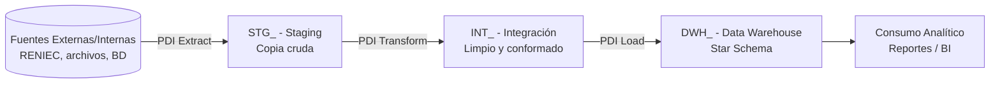

# LIN-ETL-PENTAHO-001 — Estándar de Desarrollo de ETL con Pentaho Data Integration
## Oficina de Normalización Previsional — OTI
### Código: LIN-ETL-PENTAHO-001 | Versión 0.1.0 | Estado: Borrador

---

## Control de versiones

| Versión | Fecha | Autor | Descripción |
|---------|-------|-------|-------------|
| 0.1.0 | 2026-09-24 | OTI | Versión inicial. |

---

## Tabla de contenidos

- [1. Alcance y vigencia](#1-alcance-y-vigencia)
- [2. Principios de diseño de ETL](#2-principios-de-diseño-de-etl)
- [3. Arquitectura de capas](#3-arquitectura-de-capas)
  - [3.4 Ingesta desde archivos planos](#34-ingesta-desde-archivos-planos)
- [4. Organización del repositorio](#4-organización-del-repositorio)
- [5. Convenciones de nomenclatura](#5-convenciones-de-nomenclatura)
- [6. Idempotencia y parametrización](#6-idempotencia-y-parametrización)
- [7. Modularización y preparación para migración a Spark/Airflow](#7-modularización-y-preparación-para-migración-a-sparkairflow)
- [8. Calidad de datos, cuarentena y logs](#8-calidad-de-datos-cuarentena-y-logs)
- [9. Seguridad y protección de datos personales](#9-seguridad-y-protección-de-datos-personales)
- [10. Control de versiones (Git)](#10-control-de-versiones-git)
- [11. Gobierno y excepciones](#11-gobierno-y-excepciones)
- [Anexo A: Checklist de Definition of Done (DoD) para ETLs Pentaho](#anexo-a-checklist-de-definition-of-done-dod-para-etls-pentaho)
- [Anexo B: Plantillas de referencia](#anexo-b-plantillas-de-referencia)

---

## 1. Alcance y vigencia

### 1.1 Propósito

Este lineamiento establece las reglas de diseño, nomenclatura, idempotencia, calidad y seguridad que debe seguir todo desarrollo de ETL construido con **Pentaho Data Integration (PDI)** sobre **Oracle**, de modo que cualquier persona que construya o mantenga un flujo de carga de datos en la ONP siga un criterio común, y que cualquiera que llegue después pueda entender, operar y dar mantenimiento a ese flujo sin depender del autor original.

Este documento cumple, para el stack Pentaho + Oracle: es un **estándar de construcción de ETL**, no un estándar de modelado de base de datos transaccional ni un documento de arquitectura de plataforma.

### 1.2 Ámbito de aplicación

Este estándar aplica a:

- Todo proyecto nuevo de integración/carga de datos (ETL/ELT) que se implemente con Pentaho Data Integration sobre Oracle en la ONP.
- Equipos internos y contratistas que desarrollen o mantengan Jobs (`.kjb`) y Transformations (`.ktr`) de Pentaho para fines de explotación analítica o integración de datos.
- Los esquemas Oracle de staging, integración y Data Warehouse que sirvan como destino de estos procesos (ver [sección 3](#3-arquitectura-de-capas)).

**No aplica** a:

- Bases de datos y esquemas **transaccionales (OLTP)** de sistemas de negocio. Los esquemas de staging/integración/DWH de este documento tienen un ciclo de vida, un modelo de concurrencia y un propósito distintos (recarga masiva e idempotente, modelo desnormalizado orientado a lectura analítica), y por eso no heredan sus convenciones de nomenclatura de esquema/columna ni sus reglas de auditoría
- Desarrollos nuevos sobre IBM DataStage/QualityStage, que siguen rigiéndose por un estandar propio de DataStage.
- El stack Lakehouse (Airflow + Spark + Iceberg + Nessie + Trino + MinIO), que se regirá a futuro por su propio lineamiento.

---

## 2. Principios de diseño de ETL

Estos principios son agnósticos de herramienta y se heredan directamente de la clasificación de Ralph Kimball. Todo desarrollo de ETL en Pentaho debe poder ubicarse en uno de estos cuatro grupos:

- **Extracción**: obtención de datos desde la fuente de origen (API REST de RENIEC, archivos planos, bases de datos externas) sin transformación de negocio.
- **Limpieza y conformación**: validación, estandarización, deduplicación — ocurre en la capa de Integración (`INT_`, ver [sección 3.2](#32-int---integración)).
- **Entrega**: modelado dimensional final para consumo — ocurre en la capa de Data Warehouse (`DWH_`, ver [sección 3.3](#33-dwh---data-warehouse-star-schema)).
- **Gestión**: programación, control de versiones, monitorización, reinicio/recuperación de los propios procesos ETL.

Ningún Job o Transformation debe mezclar responsabilidades de más de un grupo cuando sea evitable — esto es lo que permite que un proceso de carga se pueda diagnosticar, reprocesar o migrar por partes.

---

## 3. Arquitectura de capas

Se adopta un modelo de tres capas sobre esquemas Oracle dedicados, distinto del modelo "un esquema por dominio funcional de negocio" que rige para sistemas transaccionales:



### 3.1 STG — Staging

- **Propósito**: réplica cruda e inalterada de la fuente de origen. Punto de entrada del pipeline.
- **Prohibido**: aplicar transformaciones de negocio, limpiezas o filtros en esta capa. Se preservan los nombres y tipos de columna del origen en la medida en que el tipo de dato Oracle lo permita.
- **Estrategia de carga**: `TRUNCATE + INSERT` (snapshot completo) o `INSERT` incremental por partición de fecha de ingesta, según el volumen y la naturaleza de la fuente.
- Si la fuente trae datos personales (ej. RENIEC: DNI, nombres, domicilio), esta capa es el punto de mayor exposición de PII — ver [sección 9.2](#92-pii-ley-n-29733).

### 3.2 INT — Integración

- **Propósito**: datos limpios, validados, deduplicados y estandarizados. Fuente de verdad técnica para el modelado dimensional.
- **Transformaciones mandatorias**: estandarización de formatos de fecha, limpieza de cadenas, normalización de identificadores (ej. DNI a 8 caracteres con ceros a la izquierda), deduplicación por clave de negocio.
- Puede modelarse en 3FN o en estructuras desnormalizadas orientadas a proceso, según convenga al dominio.

### 3.3 DWH — Data Warehouse (Star Schema)

- **Propósito**: datos modelados listos para consumo de reportes/BI.
- **Modelado obligatorio**: Esquema Estrella — tablas de hechos (`FCT_`) y tablas de dimensión (`DIM_`).
- **Transformaciones permitidas**: agregaciones, joins entre dominios de Integración, cálculo de KPIs de negocio.

### 3.4 Ingesta desde archivos planos

Cuando la fuente de un pipeline es un archivo plano (CSV, TXT delimitado, ancho fijo), se exige disciplina de control de archivo, no solo de dato:

- **Carpetas de control**: `inbox/` (archivo pendiente de procesar), `processing/` (en proceso — evita que un segundo job tome el mismo archivo dos veces), `processed/` (cargado con éxito), `rejected/` (archivo con error estructural que impidió el parseo).
- **Patrón de nombre esperado**: declarar explícitamente el patrón que debe cumplir el archivo entrante (ej. `RENIEC_PERSONA_YYYYMMDD.csv`). Un archivo que no cumpla el patrón no se procesa y se mueve directo a `rejected/`.
- **Encoding y delimitador**: declarar explícitamente el encoding (UTF-8 salvo excepción documentada) y el delimitador/formato esperado como parámetro de la transformación — nunca asumido implícitamente por el step de lectura.
- **Post-carga**: el archivo se mueve de `processing/` a `processed/` únicamente si la carga fue exitosa, aunque existan filas desviadas a cuarentena (`ERR_<TABLA>`, [sección 8.1](#81-aislamiento-de-errores-quarantine)) — el archivo en sí se dio por procesado. Si la carga falla por completo (archivo corrupto, columnas faltantes), el archivo se mueve a `rejected/` y no se reintenta automáticamente.
- **Retención**: definir por proyecto cuánto tiempo se conserva el archivo original en `processed/` antes de purgarlo — es la evidencia de origen ante una auditoría, y es justamente lo que la columna `ETL_SOURCE_FILE` ([sección 5.4](#54-columnas-de-auditoría-técnica-obligatorias-en-toda-tabla-destino)) referencia.
- El nombre del Job de extracción indica que la fuente es un archivo con el sufijo `FILE` (ver [sección 5.5](#55-jobs-kjb)): ej. `J_EXT_STG_RENIEC_PERSONA_FILE`.

---

## 4. Organización del repositorio

Estructura obligatoria a nivel de sistema de archivos / repositorio Git:

```
/jobs               → Jobs (.kjb): control de flujo, orquestación, notificación
/transformations    → Transformations (.ktr): movimiento atómico de datos (1 origen → 1 destino)
/sql                → Scripts SQL versionados (DDL de esquemas STG/INT/DWH, MERGE, DML)
/config             → kettle.properties.template y plantillas de configuración por ambiente
/logs               → (no versionado — ver .gitignore) salida de ejecución
/reject             → (no versionado — ver .gitignore) registros descartados por validación
/inbox              → (no versionado) archivos planos pendientes de procesar
/processing         → (no versionado) archivo plano tomado por un job en ejecución
/processed          → (no versionado) archivo plano cargado con éxito
/rejected           → (no versionado) archivo plano con error estructural de parseo
```

`logs/`, `reject/`, `inbox/`, `processing/`, `processed/` y `rejected/` son artefactos de ejecución, no de diseño: no se versionan, pero su ruta se declara en `kettle.properties` (ver [sección 6.3](#63-externalización-de-configuración)).

---

## 5. Convenciones de nomenclatura

### 5.1 Esquemas Oracle

| Capa | Patrón | Ejemplo |
|---|---|---|
| Staging | `STG_<FUENTE>` | `STG_RENIEC` |
| Integración | `INT_<DOMINIO>` | `INT_PADRON` |
| Data Warehouse | `DWH_<DOMINIO>` | `DWH_PADRON` |

### 5.2 Tablas

| Capa | Patrón | Ejemplo |
|---|---|---|
| Staging | `STG_<FUENTE>.<NOMBRE_ORIGEN>` | `STG_RENIEC.PERSONA` |
| Integración | `INT_<DOMINIO>.<NOMBRE>` | `INT_PADRON.PERSONA` |
| Hechos (DWH) | `DWH_<DOMINIO>.FCT_<NOMBRE>` | `DWH_PADRON.FCT_ACTUALIZACION_PADRON` |
| Dimensión (DWH) | `DWH_<DOMINIO>.DIM_<NOMBRE>` | `DWH_PADRON.DIM_PERSONA` |
| Cuarentena/error (cualquier capa) | `ERR_<TABLA>` | `ERR_STG_PERSONA` |

### 5.3 Columnas

| Prefijo/Sufijo | Tipo de dato | Ejemplo |
|---|---|---|
| `ID_<TABLA>` | Clave de negocio (natural, viene del origen) | `ID_PERSONA` (DNI) |
| `SK_<TABLA>` | Clave subrogada (secuencia o hash), PK técnica de dimensiones/hechos | `SK_PERSONA` |
| `_AT` (sufijo) | `TIMESTAMP` | `CREATED_AT`, `UPDATED_AT` |
| `_DATE` (sufijo) | `DATE` (sin hora) | `BIRTH_DATE` |
| `IS_` / `HAS_` (prefijo) | Flag binario, `NUMBER(1)` (`1`/`0`) o `CHAR(1)` con `CHECK` | `IS_ACTIVO`, `HAS_OBSERVACION` |

### 5.4 Columnas de auditoría técnica (obligatorias en toda tabla destino)

Las tablas de este stack no registran "usuario que modificó el registro" sino **linaje del proceso de carga** — es la información que realmente importa para diagnosticar y reprocesar un ETL:

| Columna | Tipo | Descripción |
|---|---|---|
| `ETL_LOADED_AT` | `TIMESTAMP` | Fecha/hora de inserción del registro. |
| `ETL_UPDATED_AT` | `TIMESTAMP` | Fecha/hora de la última actualización (MERGE). |
| `ETL_SOURCE_FILE` | `VARCHAR2(200)` | Nombre del archivo o identificador del origen (API, CSV, tabla). Vital cuando la fuente no es una tabla única. |
| `ETL_BATCH_ID` | `VARCHAR2(36)` | Identificador de la corrida/lote que insertó o modificó el registro. |

Estas cuatro columnas son obligatorias en **toda** tabla de STG, INT y DWH — no solo en staging. Son la base para responder "¿de dónde vino este dato y en qué corrida se cargó?" sin depender de logs externos.

### 5.5 Jobs (`.kjb`)

Formato oficial de Pentaho ("Naming Standards for PDI"), adaptado:

```
J_<ACCION>_<DESTINO>
```

| Acción | Significado |
|---|---|
| `EXT` | Extracción de la fuente hacia Staging |
| `TRN` | Transformación / carga a Integración |
| `CAR` | Carga final a Data Warehouse |
| `CTL` | Control/orquestación de un conjunto de jobs (equivalente al Job Sequence de DataStage) |

Ejemplos: `J_EXT_STG_RENIEC_PERSONA`, `J_CAR_DWH_PADRON_FCT_ACTUALIZACION`, `J_CTL_EJEC_DIARIA_RENIEC`.

Los Jobs contienen **únicamente**: control de flujo, validación de precondiciones (¿llegó el archivo?, ¿hay conexión a la API?), manejo de errores y notificación. Ninguna lógica de transformación de datos vive en un Job.

### 5.6 Transformations (`.ktr`)

```
TRF_<ORIGEN>_<DESTINO>
```

Ejemplo: `TRF_RENIEC_API_STG_PERSONA`.

Cada Transformation resuelve **una** tarea atómica de movimiento de datos (1 origen → 1 destino de staging/integración/DWH). Toda transformación compleja (joins multitabla, agregaciones pesadas, window functions) debe resolverse en SQL dentro de Oracle (`Execute SQL script` o vista lógica) — Pentaho actúa como extractor/orquestador, no como motor de transformación pesada.

### 5.7 Variables y parámetros

- Variables de entorno: `MAYUSCULAS_CON_GUION_BAJO`.
- Parámetros de transformación/job: `camelCase`.
- Nunca hardcodear nombres de directorio o archivo — usar parámetros (`inputDir`, `outputDir`, `inputFilename`, `outputFilename`).

---

## 6. Idempotencia y parametrización

### 6.1 Cargas idempotentes

- **Incrementales**: exclusivamente vía `MERGE INTO` en Oracle. Prohibido usar el step nativo `Insert / Update` de PDI en volúmenes medianos o grandes — no es idempotente ni eficiente a escala.
- **Por partición**: borrado previo de la partición de fecha (`DELETE` o `TRUNCATE PARTITION`) seguido de inserción en bloque (`Table Output` con batch commit).

### 6.2 Parámetros de ventana de tiempo

Ningún pipeline calcula "ayer" internamente (`SYSDATE - 1` está **prohibido** dentro de la lógica del job). Todo pipeline recibe la ventana de ejecución como parámetro externo: `${EXECUTION_DATE}`, `${START_DATE}`, `${END_DATE}`. Esto es lo que permite reprocesar una fecha específica sin tocar el código del job.

### 6.3 Externalización de configuración

Cero credenciales, URLs o rutas en duro en jobs/transformations. Uso estricto de `kettle.properties`, variables de entorno del sistema operativo, o JNDI para las conexiones a base de datos. Ver plantilla en [Anexo B](#anexo-b-plantillas-de-referencia).

---

## 7. Modularización y preparación para migración a Spark/Airflow

Este stack es una decisión de proyecto, esto que quiere decir que sea el destino final. Las siguientes reglas no tienen justificación dentro de Pentaho por sí solas, pero evitan reescribir todo desde cero si el proyecto migra más adelante:

- **Separación estricta Job/Transformation** (Ver [5.5](#55-jobs-kjb)/Ver [5.6](#56-transformations-ktr)) imita la separación DAG/task de Airflow.
- **Columna particionable obligatoria**: toda tabla de origen o staging de alto volumen debe tener una columna numérica secuencial o temporal indexada, para permitir en el futuro lecturas particionadas vía `spark.read.jdbc(..., partitionColumn=...)`.
- Las columnas de auditoría indicadas en la sección [5.4](#54-columnas-de-auditoría-técnica-obligatorias-en-toda-tabla-destino) (`ETL_BATCH_ID`, `ETL_SOURCE_FILE`) son compatibles en concepto con el linaje, no son los mismos campos, pero resuelven la misma pregunta de trazabilidad, lo que facilita el mapeo conceptual el día que se migre.

---

## 8. Calidad de datos, cuarentena y logs

### 8.1 Aislamiento de errores (Quarantine)

Los registros que fallen validaciones de negocio o casteo **no abortan el pipeline completo**: se desvían a una tabla de descarte `ERR_<TABLA>` con el motivo del fallo. El pipeline continúa con los registros válidos.

### 8.2 Monitoreo y métricas

Al finalizar cada ejecución se deben registrar como mínimo: filas leídas, filas insertadas/actualizadas, filas rechazadas (a `ERR_<TABLA>`) y tiempo total del proceso.

### 8.3 Notificación de ejecución

Todo Job de orquestación (`J_CTL_*`) debe notificar por correo el resultado de la ejecución: éxito (con el log de operaciones adjunto) o error (con momento, traza del log y job/transformation donde ocurrió).

---

## 9. Seguridad y protección de datos personales

### 9.1 Gestión de secretos

Prohibido hardcodear credenciales (usuario, contraseña, tokens de API) en jobs, transformations o scripts SQL. Ver [6.3](#63-externalización-de-configuración).

### 9.2 PII (Ley N.° 29733)

Cuando la fuente trae datos personales (caso RENIEC: DNI, nombres, domicilio), la capa `STG_` es la réplica cruda de mayor exposición:

- Clasificación de columnas PII desde la ingesta (documentar en el diccionario de datos del proyecto).
- Cifrado en reposo del tablespace que aloja los esquemas `STG_`/`INT_`/`DWH_`.
- Acceso nominal y auditado a `STG_` — no por cuenta compartida.
- Retención declarada: `STG_` no debe crecer indefinidamente; definir política de purga por dominio.
- Replicar `STG_`/`INT_`/`DWH_` hacia un ambiente no productivo exige enmascaramiento previo e irreversible.

---

## 10. Control de versiones (Git)

- Todo archivo `.kjb` y `.ktr` se versiona en GitLab.
- Evitar commits que solo muevan cajas visuales en el lienzo de Spoon sin cambio funcional — dificultan la revisión de diffs XML de Pentaho.
- Los scripts DDL/DML/MERGE de `/sql` se versionan igual que cualquier script de base de datos.

---

## 11. Gobierno y excepciones

Una desviación de este lineamiento en un proyecto concreto se registra como `EXC-BI-NNN`, con vigencia acotada y fecha de revisión — nunca indefinida. Debe ser aprobada por la Oficina de Arquitectura de la OTI, y si afecta protección de datos personales, además por Seguridad Digital.

---

## Anexo A: Checklist de Definition of Done (DoD) para ETLs Pentaho

- [ ] **Capas**: el flujo respeta la separación STG → INT → DWH; ninguna transformación de negocio ocurre en STG.
- [ ] **Nomenclatura**: esquemas, tablas, columnas, Jobs y Transformations siguen [sección 5](#5-convenciones-de-nomenclatura).
- [ ] **Idempotencia**: la carga incremental usa `MERGE INTO`; ningún job calcula fechas relativas internamente.
- [ ] **Auditoría**: las cuatro columnas `ETL_*` están presentes en toda tabla destino.
- [ ] **Cuarentena**: existe tabla `ERR_<TABLA>` y el job continúa ante registros inválidos.
- [ ] **Configuración externalizada**: cero credenciales/rutas en duro.
- [ ] **Notificación**: el Job de control notifica éxito/error por correo.
- [ ] **PII**: si aplica, columnas clasificadas, cifrado en reposo y retención declarada.
- [ ] **Columna particionable**: presente en tablas de staging de alto volumen, para migración futura a Spark.
- [ ] **Ingesta de archivos** (si aplica): respeta el patrón de nombre esperado y el ciclo `inbox → processing → processed/rejected` de [sección 3.4](#34-ingesta-desde-archivos-planos).

---

## Anexo B: Plantillas de referencia

### B.1 `kettle.properties.template`

```properties
# Conexión Oracle - Staging
STG_DB_HOST=
STG_DB_PORT=1521
STG_DB_SID=
STG_DB_USER=
STG_DB_PASSWORD=

# Rutas (nunca hardcodear en jobs/transformations)
PATH_INPUT=
PATH_REJECT=
PATH_LOG=
PATH_TMP=
```

### B.2 MERGE INTO idempotente (ejemplo INT → DWH)

```sql
MERGE INTO DWH_PADRON.DIM_PERSONA d
USING (
    SELECT ID_PERSONA, NOMBRE, FECHA_NACIMIENTO
    FROM INT_PADRON.PERSONA
    WHERE ETL_BATCH_ID = :v_batch_id
) s
ON (d.ID_PERSONA = s.ID_PERSONA)
WHEN MATCHED THEN UPDATE SET
    d.NOMBRE = s.NOMBRE,
    d.FECHA_NACIMIENTO = s.FECHA_NACIMIENTO,
    d.ETL_UPDATED_AT = SYSTIMESTAMP,
    d.ETL_BATCH_ID = :v_batch_id
WHEN NOT MATCHED THEN INSERT (
    SK_PERSONA, ID_PERSONA, NOMBRE, FECHA_NACIMIENTO,
    ETL_LOADED_AT, ETL_BATCH_ID
) VALUES (
    DWH_PADRON.SQ_DIM_PERSONA.NEXTVAL, s.ID_PERSONA, s.NOMBRE, s.FECHA_NACIMIENTO,
    SYSTIMESTAMP, :v_batch_id
);
```
