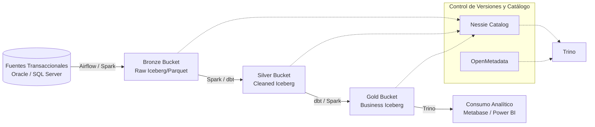

# LIN-BI-001 — Lineamiento de Explotación y Analítica de Datos (Business Intelligence) ONP
## Oficina de Normalización Previsional — OTI
### Código: LIN-BI-001 | Versión 0.1.0 | Estado: Borrador | Marco rector: LIN-ARQ-000

---

## Control de versiones

| Versión | Fecha | Autor | Descripción |
|---------|-------|-------|-------------|
| 0.1.0   | 2026-06-08 | OTI | Versión inicial del borrador alineado con la Sección 9 del *Lineamiento de Estándares de Tecnología v2.0* de la ONP y el piloto de arquitectura Lakehouse. |

---

## Tabla de contenidos

- [Sección 1 Alcance y vigencia](#sección-1-alcance-y-vigencia)
- [Sección 2 Arquitectura Lakehouse (Medallion)](#sección-2-arquitectura-lakehouse-medallion)
- [Sección 3 Plataforma y Stack Tecnológico Homologado](#sección-3-plataforma-y-stack-tecnológico-homologado)
- [Sección 4 Convenciones de Nomenclatura](#sección-4-convenciones-de-nomenclatura)
- [Sección 5 Estrategia de Ramificación (Data Version Control) con Nessie](#sección-5-estrategia-de-ramificación-data-version-control-con-nessie)
- [Sección 6 Evolución del Esquema (Schema Evolution)](#sección-6-evolución-del-esquema-schema-evolution)
- [Sección 7 Calidad, Gobierno y Linaje de Datos](#sección-7-calidad-gobierno-y-linaje-de-datos)
- [Sección 8 Seguridad y Control de Acceso](#sección-8-seguridad-y-control-de-acceso)
- [Sección 9 Gobierno Arquitectónico y Excepciones](#sección-9-gobierno-arquitectónico-y-excepciones)
- [Anexo A: Checklist de "Definition of Done" (DoD) para datasets](#anexo-a-checklist-de-definition-of-done-dod-para-datasets)
- [Anexo B: Consultas y Comandos Útiles de Referencia](#anexo-b-consultas-y-comandos-útiles-de-referencia)

---

## Sección 1 Alcance y vigencia

### 1.1 Propósito

Este lineamiento establece los estándares de diseño, arquitectura, nomenclatura, operación, calidad y gobierno de datos para la Plataforma de Datos (Lakehouse) y los sistemas de Business Intelligence (BI) de la Oficina de Normalización Previsional (ONP). 

El objetivo es garantizar que la ingesta, procesamiento, modelado analítico y consumo de datos masivos se realicen bajo principios comunes de calidad, consistencia y seguridad, reduciendo la deuda técnica y garantizando la trazabilidad integral de la información desde su origen transaccional hasta el reporte de negocio.

### 1.2 Ámbito de aplicación

Este estándar aplica a:
- Todos los proyectos de Business Intelligence, explotación analítica, Big Data y Data Science implementados en la ONP.
- Todos los pipelines de datos (ETL/ELT) que ingesten información desde bases de datos transaccionales de la ONP (Oracle, SQL Server u otras) hacia el Lakehouse.
- Los tres buckets/capas físicas del Lakehouse (**Bronze**, **Silver** y **Gold**).
- Equipos internos de desarrollo, ingenieros de datos, analistas de BI, y contratistas que desarrollen o mantengan flujos de datos analíticos para la institución.

### 1.3 Relación con otros documentos

| Documento | Código | Relación |
|-----------|--------|----------|
| Marco Rector de Diseño y Arquitectura de Software | `LIN-ARQ-000` | Define el dominio complementario BI y el modelo conceptual Lakehouse. |
| Estándar de Base de Datos Oracle | `LIN-BD-ORA-001` | Regula las fuentes transaccionales core de donde se extraen los datos analíticos. |
| Estándar de Seguridad en Aplicaciones | `LIN-SEC-APP-001` | Define las políticas de cifrado, gestión de secretos (Vault) y clasificación PII. |
| Estándar de Versionamiento y Control de Cambios | `LIN-VER-001` | Alinea la estrategia de ramas de código con la estrategia de ramas de datos (Nessie). |
| Lineamiento de Estándares de Tecnología v2.0 | N/A | La Sección 9 define el stack de productos oficial para Ingeniería de Datos en la ONP. |

---

## Sección 2 Arquitectura Lakehouse (Medallion)

La ONP adopta la **Arquitectura Medallion** (Bronze → Silver → Gold) sobre formato de tablas abiertas Apache Iceberg. Este patrón busca mejorar de forma iterativa y estructurada la calidad de los datos analíticos.



### 2.1 Capa Bronze (Raw Ingestion)
- **Propósito**: Almacenar los datos de origen de forma cruda e inalterada. Es el punto de entrada de la plataforma analítica.
- **Formato obligatorio**: Apache Iceberg estructurado sobre archivos Parquet.
- **Estrategia de carga**: *Append-only* (histórico incremental por partición de fecha) o *Overwrite* (snapshots completos periódicos), según la naturaleza y tamaño de la tabla transaccional origen.
- **Reglas de transformación**: Queda **prohibido** aplicar transformaciones lógicas, limpiezas de datos o filtros de negocio en esta capa. Se preservan estrictamente los nombres de columnas y tipos de datos de origen (mapeados a tipos compatibles con Spark).
- **Particionamiento**: Por fecha de ingesta (`ingestion_date`) para facilitar reprocesamientos idempotentes.

### 2.2 Capa Silver (Cleaned & Conformed)
- **Propósito**: Proveer datos limpios, validados, deduplicados y estandarizados para un consumo interno seguro. Es la fuente de verdad técnica de la analítica.
- **Formato obligatorio**: Apache Iceberg.
- **Transformaciones mandatorias**:
  - Estandarización de formatos de fecha (ISO 8601: `YYYY-MM-DD` o `YYYY-MM-DD HH:MM:SS`).
  - Limpieza de cadenas (eliminación de espacios en blanco al inicio/fin, normalización de caracteres especiales).
  - Normalización de identificadores lógicos (ej. DNI a 8 caracteres exactos rellenando con ceros a la izquierda si aplica).
  - Deduplicación física de registros basados en claves primarias del negocio.
  - Aplicación de reglas de calidad básicas mediante **Great Expectations** (severidad `STOP` para incidentes graves; `WARN` para incidencias menores).
- **Modelado**: Tablas normalizadas en Tercera Forma Normal (3NF) o modelos desnormalizados orientados a procesos funcionales.

### 2.3 Capa Gold (Business Level)
- **Propósito**: Exponer datos modelados listos para consumo directo de negocio, herramientas de BI (Power BI, Metabase) y ciencia de datos.
- **Formato obligatorio**: Apache Iceberg.
- **Transformaciones permitidas**:
  - Agregaciones métricas acumulativas e históricas (sumas, promedios, ratios).
  - Joins complejos cruzando diferentes dominios en Silver.
  - Aplicación de lógica y KPIs del negocio (ej. Ratios de sostenibilidad previsional, cálculos consolidados de aportes).
- **Modelado**: Modelado Dimensional — **Esquema Estrella (Star Schema)** con Tablas de Hechos (*Fact Tables*) e Hilos de Dimensiones (*Dimension Tables*).

---

## Sección 3 Plataforma y Stack Tecnológico Homologado

De acuerdo con la **Sección 9 del Lineamiento de Estándares de Tecnología v2.0**, el stack de componentes oficiales que forman la plataforma de datos institucional se define a continuación:

| Función / Componente | Tecnología Aprobada | Detalle / Uso en ONP |
|----------------------|---------------------|----------------------|
| **Lenguaje de Programación** | SQL / Python | SQL para consultas y dbt; Python para lógica de ETL PySpark. |
| **Librerías de Datos** | Pandas, NumPy, PySpark, TensorFlow | Herramientas estándar para manipulación y machine learning. |
| **Orquestador** | Apache Airflow | Coordinación, calendario y control de dependencias de los DAGs. |
| **Procesamiento Masivo** | Apache Spark | Ejecución distribuida de cargas y transformaciones pesadas. |
| **Mensajería y Bus** | Apache Kafka | Transferencia de eventos de integración asíncrona. |
| **Procesamiento Real Time** | Spark Structured Streaming | Cómputo continuo sobre flujos de eventos. |
| **CDC (Change Data Capture)** | Debezium | Captura de cambios transaccionales desde bases de datos core. |
| **Almacenamiento de Objetos**| MinIO | Almacenamiento distribuido compatible con APIs S3. |
| **Formato de Tablas** | Apache Iceberg | Capa de abstracción de datos con transacciones ACID y Schema Evolution. |
| **Catálogo Técnico** | Nessie | Catálogo que provee versionado de datos tipo Git (*Git-for-Data*). |
| **Calidad de Datos** | Great Expectations | Motor para validación de calidad y "gates" de paso entre capas. |
| **Motor de Consulta SQL** | Trino | Motor de ejecución federada para lectura rápida sobre el Lakehouse. |
| **Consumo y Dashboards** | Microsoft Power BI / Metabase | Herramientas autorizadas para tableros finales y exploración. |
| **Entorno de Trabajo** | Jupyter / JupyterHub | Notebooks interactivos para exploración rápida y prototipos. |
| **Gestión de Secretos** | HashiCorp Vault | Almacén seguro para tokens, claves de conexión y contraseñas. |
| **Observabilidad** | Prometheus + Grafana + Loki | Stack integrado de logs, métricas operativas y alertas de la plataforma. |

---

## Sección 4 Convenciones de Nomenclatura

El cumplimiento de nomenclatura garantiza la consistencia del catálogo de datos de la ONP.

### 4.1 Identificadores de DAGs (Airflow)
El identificador único del DAG (`dag_id`) debe seguir el formato:
`{capa}_{fuente}_{entidad}_dag`
- Ejemplo: `bronze_oracle_pensionistas_dag`, `silver_sqlserver_afiliados_dag`.

### 4.2 Esquemas y Tablas en Apache Iceberg
El formato de direccionamiento e invocación de tablas en el catálogo Nessie de Trino/Spark debe ser:
`{capa}.{esquema_o_dominio}.{nombre_tabla}`
- **Bronze**: `bronze.{esquema_fuente}.{nombre_tabla}` (ej. `bronze.prestaciones.mae_expediente`).
- **Silver**: `silver.{dominio_negocio}.{nombre_tabla}` (ej. `silver.pensiones.dim_afiliado`).
- **Gold**: `gold.{dominio_analitico}.{nombre_tabla}` (ej. `gold.sostenibilidad.fact_pagos_mensuales`).

### 4.3 Buckets y Rutas de MinIO (S3)
Los datos persistidos físicamente en MinIO deben organizarse con la estructura:
`s3://warehouse/{capa}/{dominio_negocio}/{nombre_tabla}/`
- Ejemplo: `s3://warehouse/silver/pensiones/dim_afiliado/`.

---

## Sección 5 Estrategia de Ramificación (Data Version Control) con Nessie

Nessie actúa como un servidor de catálogos versionados para Iceberg, habilitando flujos de trabajo similares a Git para datos físicos. Se norman las siguientes directrices operativas.

### 5.1 Jerarquía de Ramas de Datos
1. **`main` (Producción)**:
   - Fuente de verdad definitiva. Utilizada por herramientas de BI, reportes ejecutivos y consumo final.
   - **Restricción**: Queda prohibido escribir directamente en `main` fuera de los jobs productivos orquestados y validados de forma automatizada.
2. **`dev` (Desarrollo e Integración)**:
   - Utilizada por ingenieros de datos para integrar flujos antes del paso a producción.
3. **`feature/<nombre_cambio>`**:
   - Rama temporal aislada para probar nuevas ingestas, cambios de lógica en transformaciones o rediseño dimensional.

### 5.2 Flujo de Trabajo (Workflow) de Ingesta Aislada
Al desarrollar un nuevo pipeline de datos o modificar uno existente:
1. **Crear Rama**: Crear la rama correspondiente a la tarea desde `main`:
   ```sql
   CREATE BRANCH "feature/ingesta-aportes" FROM "main" IN nessie;
   ```
2. **Configuración de Spark/Airflow**: Apuntar la sesión de Spark de desarrollo hacia la rama creada utilizando el parámetro:
   ```python
   "spark.hadoop.iceberg.engine.hive.ref": "feature/ingesta-aportes"
   ```
3. **Ejecutar Ingesta**: Realizar las pruebas de carga y transformación. Los datos físicos resultantes se aíslan en la rama y no impactan a los usuarios que consumen la rama `main`.
4. **Verificación**: Correr pruebas de calidad sobre la rama.
5. **Merge (Promoción)**: Fisionar atómicamente la rama de datos a producción tras validar el éxito de la operación:
   ```sql
   MERGE BRANCH "feature/ingesta-aportes" INTO "main" IN nessie;
   ```
6. **Limpieza**: Eliminar la rama para mantener limpio el catálogo técnico:
   ```sql
   DROP BRANCH "feature/ingesta-aportes" IN nessie;
   ```

---

## Sección 6 Evolución del Esquema (Schema Evolution)

Apache Iceberg y Nessie permiten modificar la estructura de las tablas sin necesidad de reconstruir los datos físicos históricos. Se definen las reglas para mitigar riesgos en consultas activas.

### 6.1 Cambios Permitidos (Safe)
Operaciones seguras que se resuelven a nivel de metadatos y no rompen compatibilidad:
- **Agregar columnas nuevas**: Las filas preexistentes mostrarán automáticamente valores `null` en dicho campo.
- **Renombrar columnas existentes**: Dado que Iceberg mapea campos por IDs numéricos internos e inmutables, el renombrado es transparente y seguro.
- **Promoción de tipos de datos**:
  - `int` a `long`.
  - `float` a `double`.
  - `decimal(P, S)` a `decimal(P', S)` siempre y cuando `P' > P`.
- **Eliminar columnas**: La columna deja de estar visible para los motores de consulta (los datos históricos no se reescriben físicamente por defecto).

### 6.2 Cambios Restringidos
Operaciones de riesgo intermedio que requieren validación de consultas consumidoras:
- **Modificación de tipo con casteo restrictivo** (ej. de `string` a `int`). Requiere validación manual y posible migración de datos.
- **Reordenamiento masivo de columnas**: Afecta directamente la visualización en clientes de BI legados (como archivos Excel enlazados).

### 6.3 Cambios Prohibidos
- **Modificación de la clave de particionamiento** (*Partition Spec*) en tablas productivas de gran volumen sin un plan previo coordinado con Arquitectura de Datos. Cambiar especificaciones de partición de manera desordenada puede provocar fragmentación crítica de archivos (*small files problem*) e inconsistencia en consultas temporales (*time-travel*).

---

## Sección 7 Calidad, Gobierno y Linaje de Datos

### 7.1 "Quality Gates" en Pipelines
Todo flujo de datos (DAG) que promueva información desde Bronze a Silver, o de Silver a Gold, debe incluir validaciones de calidad de datos ejecutadas con **Great Expectations**.
- **Severidad CRITICAL / STOP**: Ante fallas críticas de integridad (ej. DNI nulo o duplicado en clave primaria), el job debe abortar la transacción de forma inmediata e impedir la fusión o merge hacia la rama productiva (`main`).
- **Severidad WARNING**: Para anomalías menores (ej. variación porcentual de volumen, nulos en campos no críticos), el job debe completar pero reportar la alerta a Grafana/OpenMetadata.

### 7.2 Catalogación e Inventario con OpenMetadata
- **Registro Obligatorio**: Ningún dataset o tabla de la capa Gold o Silver puede exponerse para consumo analítico sin estar documentado en OpenMetadata.
- **Campos Mínimos Obligatorios**:
  - Descripción funcional de la tabla y sus columnas clave.
  - Asignación de Roles de Propiedad: *Owner* (Responsable técnico OTI) y *Data Steward* (Dueño de negocio).
  - Tags de clasificación de seguridad (marcado específico para datos `PII` o sensibles).

### 7.3 Linaje de Datos Automático
Los pipelines deben estar instrumentados con agentes de **OpenLineage** (Airflow OpenLineage Provider + Spark OpenLineage Agent). Esto garantiza la generación automatizada de gráficos de procedencia del dato (*Data Lineage*), permitiendo auditorías de impacto ante cambios en el origen transaccional.

---

## Sección 8 Seguridad y Control de Acceso

### 8.1 Gestión de Secretos
Queda estrictamente **prohibido hardcodear credenciales** (nombres de usuario, contraseñas, tokens de S3, tokens de Spark/Nessie) en el código de los DAGs, scripts PySpark o manifiestos YAML. 
- Las credenciales deben residir de forma segura en **HashiCorp Vault**.
- La inyección de secretos a los contenedores de Spark y Airflow se realiza en tiempo de despliegue mediante variables de entorno inyectadas de forma nativa por Kubernetes utilizando el flujo aprobado de Vault.

### 8.2 Control de Accesos en Trino (RBAC)
El motor de consultas federadas Trino debe configurar políticas de acceso basadas en roles:
- **Ingenieros de Datos (Data Engineers)**: Acceso completo de lectura y escritura (`SELECT`, `INSERT`, `CREATE`, `DROP`, `MERGE`) en las capas Bronze, Silver y Gold.
- **Analistas de Negocio / BI (Data Analysts / Consumers)**: Acceso exclusivo de solo lectura (`SELECT`) y únicamente restringido a la capa **Gold**. Tienen prohibido el acceso a datos en crudo (Bronze) o intermedios (Silver).

### 8.3 Protección y Enmascaramiento PII (Ley N.° 29733)
De acuerdo con la legislación de protección de datos personales:
- Las columnas que contengan datos PII (ej. Nombres, correos electrónicos, números telefónicos) deben clasificarse con tags correspondientes en el catálogo.
- Trino debe implementar políticas de enmascaramiento dinámico (*Dynamic Data Masking*) para que los usuarios analistas visualicen datos anonimizados u ofuscados (ej. `XXXX-XXXX`), a menos que requieran explícitamente el acceso bajo justificación y rol autorizado.

---

## Sección 9 Gobierno Arquitectónico y Excepciones

### 9.1 Cumplimiento de Lineamientos
Cualquier desviación o adopción de componentes no homologados en el presente lineamiento (ej. uso de un catálogo diferente a Nessie, o exclusión de la arquitectura Medallion) requiere iniciar un proceso formal de excepción arquitectónica.

### 9.2 Proceso de Excepción (ADR)
1. El equipo del proyecto debe redactar un **ADR (Architecture Decision Record)** justificando la necesidad técnica de la desviación.
2. El ADR debe ser presentado y aprobado por la Oficina de Arquitectura de la OTI.
3. El documento de ADR aprobado se adjuntará obligatoriamente como parte de las evidencias de entrega del proyecto antes del despliegue en entornos productivos.

---

## Anexo A: Checklist de "Definition of Done" (DoD) para datasets

Antes de dar por concluida la creación o modificación de un dataset analítico en el Lakehouse, se debe verificar el cumplimiento de la siguiente lista:

- [ ] **Aislamiento en Rama**: El pipeline fue probado y validado en una rama Nessie `feature/*` sin interferir con producción.
- [ ] **Validación de Calidad**: Cuenta con una suite de validaciones de Great Expectations (GX) que verifique la unicidad de PKs y la integridad de los tipos de datos.
- [ ] **Gobernanza**: La tabla fue registrada en OpenMetadata con su descripción funcional, asignación de *owner* y etiquetado de columnas PII.
- [ ] **Linaje**: El linaje automático se registra correctamente y vincula el DAG de Airflow con la tabla destino Iceberg.
- [ ] **Sin Secretos en Git**: Las credenciales del pipeline están externalizadas en HashiCorp Vault.
- [ ] **Seguridad de Acceso**: La tabla cuenta con políticas de solo lectura asignadas en Trino para roles analíticos.

---

## Anexo B: Consultas y Comandos Útiles de Referencia

### B.1 Gestión de Ramas de Datos (en Trino)
Crear una nueva rama para desarrollo de pipelines:
```sql
CREATE BRANCH "feature/analitica-pensiones-v1" FROM "main" IN nessie;
```

Visualizar las ramas existentes en el catálogo Nessie:
```sql
SHOW REFERENCES IN nessie;
```

Realizar la fusión (merge) de cambios validados:
```sql
MERGE BRANCH "feature/analitica-pensiones-v1" INTO "main" IN nessie;
```

Eliminar la rama de datos después del merge:
```sql
DROP BRANCH "feature/analitica-pensiones-v1" IN nessie;
```

### B.2 Configuración de Sesión en Spark (PySpark)
Fragmento de código de referencia para inicializar la sesión apuntando a una rama Nessie específica en el entorno de ejecución:
```python
from pyspark.sql import SparkSession

spark = SparkSession.builder \
    .appName("PySpark-Nessie-Integration") \
    .config("spark.sql.catalog.nessie", "org.apache.iceberg.spark.SparkCatalog") \
    .config("spark.sql.catalog.nessie.catalog-impl", "org.apache.iceberg.nessie.NessieCatalog") \
    .config("spark.sql.catalog.nessie.uri", "http://nessie.bi-catalog.svc.cluster.local:19120/api/v2") \
    .config("spark.sql.catalog.nessie.ref", "feature/analitica-pensiones-v1") \
    .config("spark.sql.catalog.nessie.warehouse", "s3://warehouse/") \
    .getOrCreate()
```
