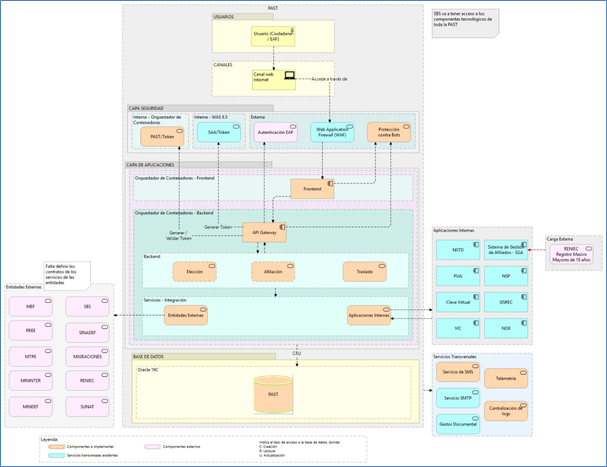
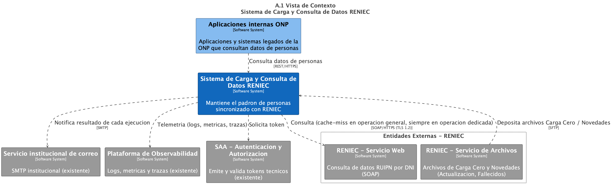
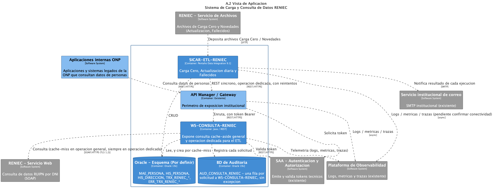
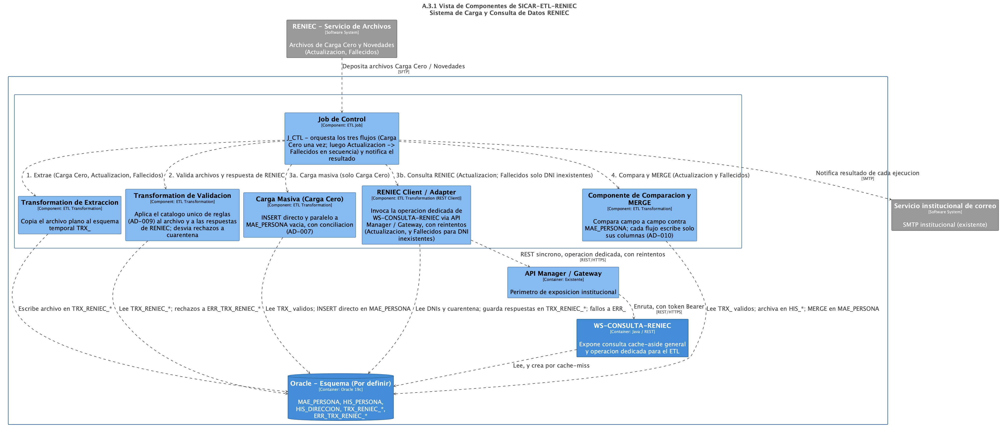
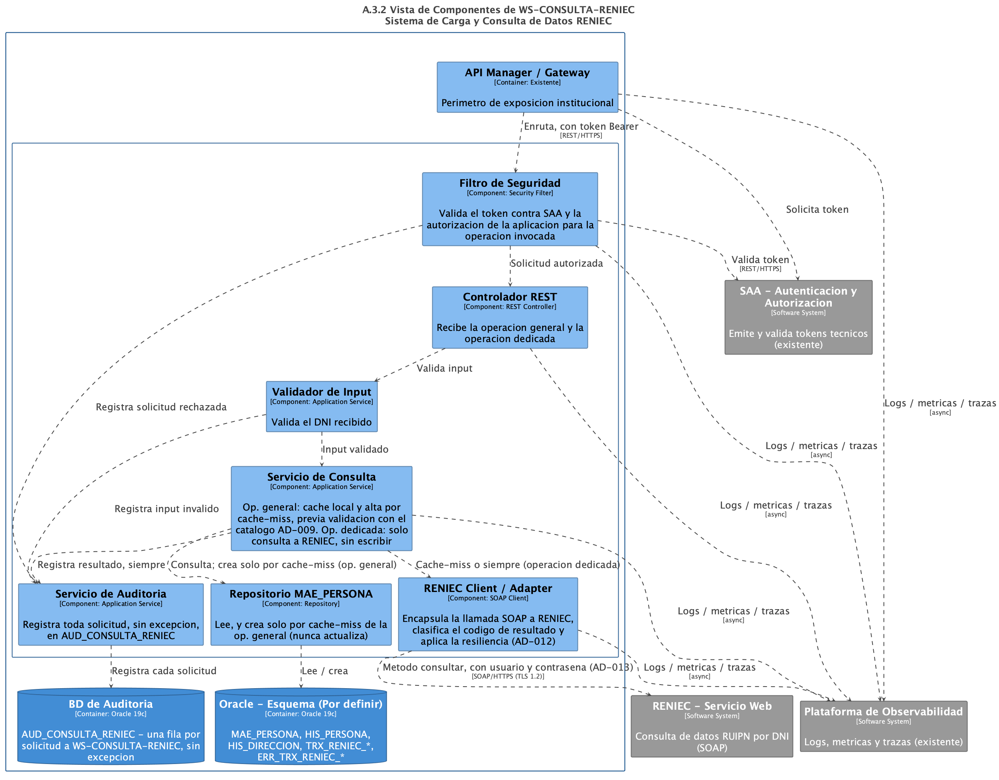
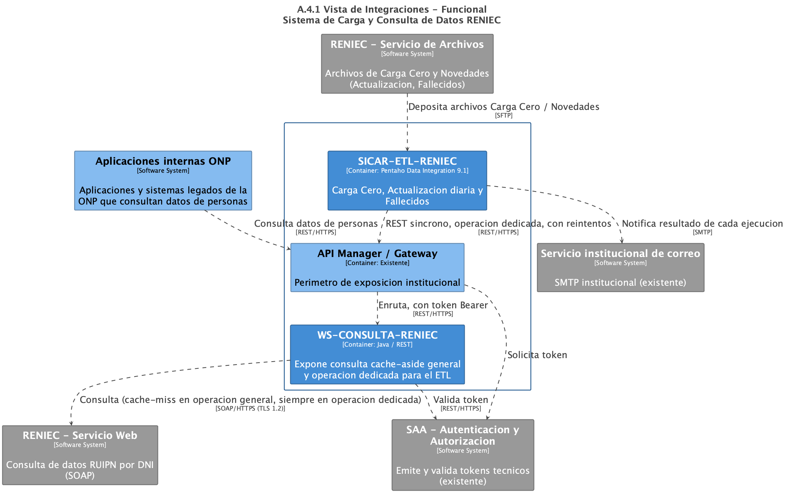
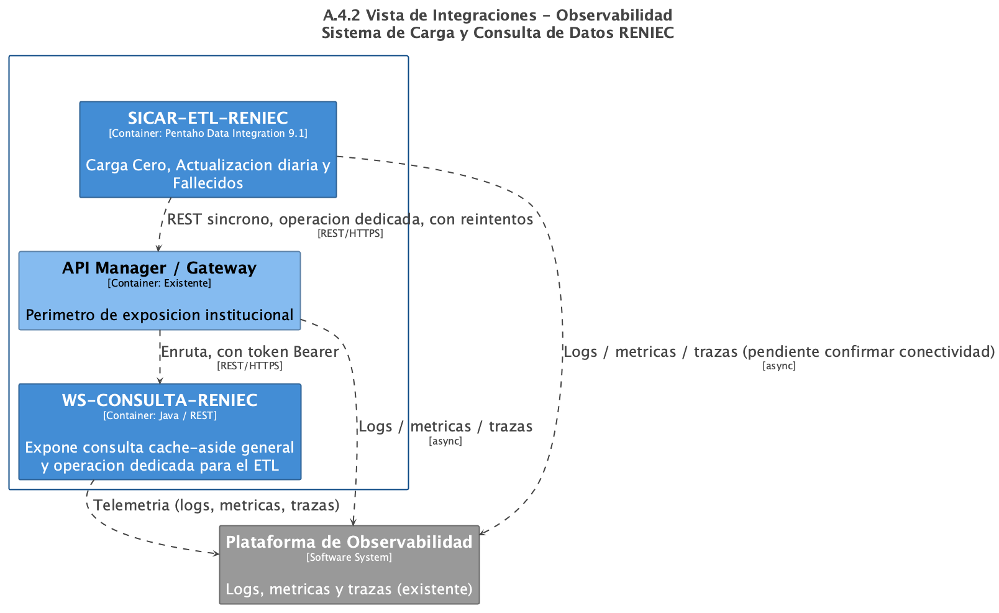
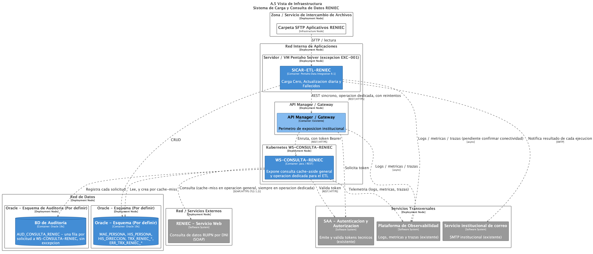

<p align="left"></p>

# DOCUMENTO DE ARQUITECTURA DE TI

**OFICINA DE TECNOLOGÍAS DE LA INFORMACIÓN**

<!-- v3.0: añadido sobre la plantilla operativa v1.4 -->
> **Identidad de esta plantilla — no copiar al documento derivado.**
> **Código:** GOB-PLA-001 · **Versión:** v3.0 · **Estado:** En revisión · **Propietario:** Arquitectura OTI
>
> Es la plantilla normativa del corpus de arquitectura. Mientras el corpus no esté aprobado por la entidad, los documentos se elaboran con la **plantilla operativa v1.4** (`Plantilla_Arquitectura_TI_ONP_v1.4.md`); esta v3.0 es la misma plantilla más las secciones que el corpus exige (marcadas en la fuente con el comentario `v3.0`). El documento que se produzca lleva su propia identidad en la tabla de abajo, y su versión evoluciona de forma independiente de la versión de la plantilla. Al completar el documento, elimina este bloque.

| Campo | Valor |
|---|---|
| **Documento / Entregable** | Documento de Arquitectura de TI |
| **Proyecto / Aplicación** | YYYYYY |
| **Versión** | [vX.Y — versión del documento de arquitectura, no de la plantilla] |
| **Fecha** | XX/XX/2026 |
| **Estado** | Borrador / En revisión / Aprobado |
| **Elaborado por** | [Nombre del Arquitecto] |
| **Revisado por** | [Nombre del Revisor] |
| **Aprobado por** | [Nombre del Aprobador] |
| **Línea base normativa** | [Corpus según `GOB-MAT-001` vX.Y.Z, consultada el DD/MM/AAAA] |
| **Próxima revisión normativa** | [DD/MM/AAAA — máximo 12 meses, o antes si se activa un disparador de `§1.6`] |

## HISTORIAL DE CAMBIOS

| Ítem | Versión | Fecha | Descripción |
|---|---|---|---|
| 1 | X.X.X | DD/MM/YYYY |  |
| 2 | 1.3 | 08/09/2026 | Se incorpora la Vista de Integraciones (Anexo A.4); se corrige la numeración de anexos (C: ADRs, D: Atributos de Calidad, E: Riesgos, Deuda Técnica y Oportunidades de Mejora); se añaden las secciones E.3 Oportunidades de mejora arquitectónica y E.4 Registro de excepciones; se homogeniza el nivel de encabezados del documento. |
| 3 | 1.4 | 02/10/2026 | Se fusionan las dos versiones en Markdown de la v1.3 (`Plantilla_Arquitectura_TI_ONP_v1.3.md` y `Plantilla_Documento_Arquitectura_ONP (1).md`): se incorporan el logo institucional, la tabla de datos del documento, el índice enlazado y los diagramas de ejemplo de la §3 y del Anexo A, recuperados del `.docx` v1.3; los ejemplos del Anexo A (diagramas y narrativas) pasan a describir un único sistema, *Carga y Consulta de Datos RENIEC*, generados desde un modelo Structurizr DSL que se versiona junto a las imágenes; la Vista de Componentes y la de Integraciones muestran cómo dividirse en varios diagramas (A.3.1/A.3.2 y A.4.1/A.4.2); se fija la notación obligatoria (`DOC-R-002`): el §3 se modela en ArchiMate con Archi y las vistas del Anexo A en C4 con Structurizr DSL, y los tipos de vista del Anexo A pasan a nombrarse con los diagramas C4 correspondientes. |
| 4 | 3.0 | 02/10/2026 | **Plantilla normativa `GOB-PLA-001`.** Unifica la plantilla operativa v1.4 con las piezas normativas de `GOB-PLA-001` v2.8 (`Plantilla_Documento_Arquitectura_ONP.md`, que se retira; su historial v2.0–v2.8 queda en git), respetando la estructura y la letra de anexos de la v1.4: identidad de la plantilla y tabla de identidad con línea base normativa; **§1.5 Declaraciones arquitectónicas obligatorias**; **§1.6 Vigencia del documento frente al corpus**; **§5.2 Corpus normativo aplicable**; aviso de contraste con la arquitectura observada en el Anexo A; distinción `AD-`/`ADR-` en el Anexo C; atributos de calidad corregidos (token SAA opaco, `codDetRespuesta` en el cuerpo, Recuperabilidad según `ARQ-R-006`) en el Anexo D; Feature Toggles según `ARQ-R-002` en E.2; **Anexo F — Conformidad y criterios de aprobación**; y **Anexo G — Verificación de brechas (declarado vs. observado)**, que da dónde registrar el contraste semestral de `LIN-ARQ-001 §5.5` (fichas `BR-NNN`). No se incorpora la regla de la v2.8 que hacía del §3 una lectura derivada del Anexo A: desde la v1.4, el §3 es un modelo ArchiMate con fuente propia (`DOC-R-002`). |

## CONTENIDO

- [1. ALCANCE DEL DOCUMENTO](#1-alcance-del-documento)
  - [1.1 Contexto](#11-contexto)
  - [1.2 Objetivo](#12-objetivo)
  - [1.3 Alcance del sistema](#13-alcance-del-sistema)
  - [1.4 Audiencia objetivo](#14-audiencia-objetivo)
  - [1.5 Declaraciones arquitectónicas obligatorias](#15-declaraciones-arquitectónicas-obligatorias)
  - [1.6 Vigencia del documento frente al corpus normativo](#16-vigencia-del-documento-frente-al-corpus-normativo)
- [2. GLOSARIO TÉCNICO](#2-glosario-técnico)
- [3. DIAGRAMA DE ARQUITECTURA DE TI](#3-diagrama-de-arquitectura-de-ti)
  - [A. CAPA DE USUARIOS](#a-capa-de-usuarios)
  - [B. CAPA DE SEGURIDAD](#b-capa-de-seguridad)
  - [C. CAPA DE APLICACIONES](#c-capa-de-aplicaciones)
  - [D. CAPA DE SERVICIOS](#d-capa-de-servicios)
  - [E. CAPA DE DATOS](#e-capa-de-datos)
- [4. SUPUESTOS Y RESTRICCIONES](#4-supuestos-y-restricciones)
  - [4.1 Supuestos](#41-supuestos)
  - [4.2 Restricciones](#42-restricciones)
- [5. DOCUMENTOS ADJUNTOS](#5-documentos-adjuntos)
  - [5.1 Documentos de análisis](#51-documentos-de-análisis)
  - [5.2 Corpus normativo de Arquitectura aplicable](#52-corpus-normativo-de-arquitectura-aplicable)
- [ANEXOS](#anexos)
- [ANEXO A: VISTAS DE ARQUITECTURA](#anexo-a-vistas-de-arquitectura)
  - [A.1 Vista de Contexto](#a1-vista-de-contexto)
  - [A.2 Vista de Aplicación](#a2-vista-de-aplicación)
  - [A.3 Vista de Componentes](#a3-vista-de-componentes)
  - [A.4 Vista de Integraciones](#a4-vista-de-integraciones)
  - [A.5 Vista de Infraestructura](#a5-vista-de-infraestructura)
- [ANEXO B: MATRIZ DE TRAZABILIDAD ARQUITECTÓNICA](#anexo-b-matriz-de-trazabilidad-arquitectónica)
- [ANEXO C: DECISIONES ARQUITECTÓNICAS (ADRs)](#anexo-c-decisiones-arquitectónicas-adrs)
  - [C.1 Resumen de decisiones](#c1-resumen-de-decisiones)
  - [C.2 Detalle de decisiones](#c2-detalle-de-decisiones)
- [ANEXO D: ATRIBUTOS DE CALIDAD](#anexo-d-atributos-de-calidad)
  - [D.1 Atributos de calidad y su cobertura arquitectónica](#d1-atributos-de-calidad-y-su-cobertura-arquitectónica)
- [ANEXO E: RIESGOS, DEUDA TÉCNICA Y OPORTUNIDADES DE MEJORA](#anexo-e-riesgos-deuda-técnica-y-oportunidades-de-mejora)
  - [E.1 Riesgos arquitectónicos](#e1-riesgos-arquitectónicos)
  - [E.2 Deuda técnica conocida](#e2-deuda-técnica-conocida)
  - [E.3 Oportunidades de mejora arquitectónica](#e3-oportunidades-de-mejora-arquitectónica)
  - [E.4 Registro de excepciones](#e4-registro-de-excepciones)
- [ANEXO F: CONFORMIDAD Y CRITERIOS DE APROBACIÓN](#anexo-f-conformidad-y-criterios-de-aprobación)
  - [F.1 Completitud del documento](#f1-completitud-del-documento)
  - [F.2 Declaraciones obligatorias](#f2-declaraciones-obligatorias)
  - [F.3 Conformidad normativa](#f3-conformidad-normativa)
  - [F.4 Consistencia interna](#f4-consistencia-interna)
  - [F.5 Registro de la revisión](#f5-registro-de-la-revisión)
- [ANEXO G: VERIFICACIÓN DE BRECHAS (DECLARADO VS. OBSERVADO)](#anexo-g-verificación-de-brechas-declarado-vs-observado)
  - [G.1 Registro de verificaciones](#g1-registro-de-verificaciones)
  - [G.2 Brechas detectadas](#g2-brechas-detectadas)

## 1. ALCANCE DEL DOCUMENTO

> 📋 **Orientación para el arquitecto**
>
> Describe los límites del diseño arquitectónico que se está entregando en este documento.
>
> Una vez completada esta sección, elimina este bloque de orientación.

*Ejemplo:*

El presente documento describe la arquitectura de TI propuesta para la PAST, correspondiente únicamente al Módulo 1 (Traslado), el cual será construido durante el Sprint 1 y 2 de la fase de desarrollo del proyecto. Está dirigido a diferentes audiencias con distintos niveles de detalle, facilitando la comprensión del sistema desde una perspectiva estratégica hasta una perspectiva técnica.

Fuera del alcance:

- Arquitectura de TI correspondiente a otros módulos.
- Diseño del canal web (UX).
- Configuración de las redes perimetrales del centro de datos.

### 1.1 Contexto

> 📋 **Orientación para el arquitecto**
>
> Describe para qué existe el sistema, que procesos soporta y qué valor aporta a la ONP y a sus usuarios finales, en lenguaje comprensible para cualquier audiencia.
>
> Una vez completada esta sección, elimina este bloque de orientación.

*Ejemplo:*

La PAST será la plataforma digital mediante la cual la ONP atenderá los procesos de elección, afiliación y traslado entre el Sistema Nacional de Pensiones (SNP) y el Sistema Privado de Pensiones (SPP), en el marco de la Ley N.° 32123 “Ley de Modernización del Sistema Previsional Peruano” y su Reglamento. La plataforma permitirá que el ciudadano gestione su traslado de forma autónoma desde Internet y que las Empresas Administradoras de Fondos (EAF) registren traslados en representación de sus afiliados, individualmente o por lotes. Su valor para la institución es doble, puesto que reducirá el tiempo y el error operativo de un trámite que hoy exige la intervención coordinada de más de diez entidades del Estado, y dejará trazabilidad inmutable de cada paso, lo que será el sustento probatorio de un acto administrativo con efectos previsionales sobre el ciudadano.

### 1.2 Objetivo

> 📋 **Orientación para el arquitecto**
>
> Describe qué cubre este documento: qué decisiones arquitectónicas contiene, a qué versión del sistema corresponde y cuál es su propósito como entregable institucional.
>
> **Error frecuente:** copiar el objetivo del documento de análisis. El objetivo aquí no es el del sistema en sí, sino el propósito de este documento de arquitectura como entregable.
>
> **Lo que NO va aquí:** requisitos funcionales, casos de uso, reglas de negocio, ni descripción de procesos. Si te encuentras escribiendo "el sistema permitirá que el usuario pueda...", estás en el documento equivocado.
>
> Una vez completada esta sección, elimina este bloque de orientación.

*Ejemplo:*

El propósito de este documento es formalizar la línea base arquitectónica para la versión 1.4.2 del sistema PAST, consolidando las decisiones clave de diseño basadas en microservicios, eventos, persistencia en caché y despliegue automatizado en un orquestador de contenedores On-Premise. Como entregable institucional, este artefacto actúa como el contrato técnico oficial que valida el cumplimiento de los estándares tecnológicos exigidos por la institución para la transición del proyecto hacia la fase de certificación.

Este documento cumple ese propósito mediante:

- La representación de los componentes del sistema y sus relaciones (Anexo A).
- La trazabilidad entre requerimientos funcionales/no funcionales y los elementos de arquitectura que les dan soporte (Anexo B).
- El registro formal de las decisiones arquitectónicas adoptadas y su alineación normativa (Anexo C).
- La cobertura de los atributos de calidad exigidos al sistema (Anexo D).
- Los riesgos arquitectónicos, la deuda técnica conocida, las oportunidades de mejora y las excepciones identificadas sobre la arquitectura (Anexo E).

### 1.3 Alcance del sistema

> 📋 **Orientación para el arquitecto**
>
> Esta sección es crítica porque define los límites del sistema. Lo que está dentro del alcance es lo que el equipo debe construir. Lo que está fuera es igualmente importante: evita malentendidos sobre qué no es responsabilidad de este sistema.
>
> **Dentro del alcance** debe listar todos los módulos o componentes del sistema, así como las integraciones que el sistema debe implementar (aunque el otro extremo sea responsabilidad de otra entidad).
>
> **Fuera del alcance** debe listar explícitamente los sistemas adyacentes que no son parte de este sistema, aunque se integran con él, las funcionalidades que se postergaron para fases futuras, y los aspectos de diseño e implementación que se documentan en otros artefactos.
>
> **Pregunta de validación:** ¿Un revisor externo podría determinar con claridad si un componente o funcionalidad específica está o no está en el alcance de este documento? Si hay ambigüedad, necesitas ser más preciso.
>
> Una vez completada esta sección, elimina este bloque de orientación.

*Ejemplo:*

El alcance funcional detallado del sistema se encuentra formalizado en el Documento de Alcance del Proyecto (Código: ONP-PAST-SRS-v1.0), por ello en esta sección el alcance se presenta de forma resumida.

**Dentro del alcance:**

- Implementación de los módulos de Elección, Afiliación y Traslado.
- Integraciones con los sistemas internos NSTD, PUA, Clave Virtual, VIC, SIGA, NSP, SISREC y NOE.
- Integraciones con las entidades externas MEF, RREE, MTPE, MININTER, MINDEF, SBS, SINADEF, MIGRACIONES, RENIEC y SUNAT.

Desde la perspectiva arquitectónica, el sistema se delimita mediante el Diagrama de Contexto (ver [Anexo A](#anexo-a-vistas-de-arquitectura)), el cual define las fronteras técnicas del sistema, los usuarios que interactúan con ella, así como los sistemas internos y externos con los que se comunicará.

**Fuera del alcance:**

- Implementación de las Apis que deben ser expuestas por las aplicaciones internas y entidades externas.
  - Las Apis de los sistemas internos serán implementadas mediante requerimientos de mantenimiento.
  - Las APIs de las entidades externas serán provistas por las entidades externas mediante convenios.
- La Reportería Analítica ha sido postergada para una fase posterior del proyecto. Desde la perspectiva de TI, esto implica posponer la siguiente implementación arquitectónica:
  - Clúster de Base de Datos de Lectura (Read Replicas): La arquitectura de datos actual soporta un Redis de infraestructura para caché transaccional, pero pospone la implementación de réplicas de lectura y herramientas de BI (Business Intelligence) para la fase analítica futura.
- Con el fin de evitar la duplicidad de información técnica, los siguientes componentes de diseño detallado quedan fuera de este documento y se delegan a sus respectivos repositorios:
  - Modelos y diccionarios de datos de los sistemas internos.
  - Contratos de las APIs ya existentes de RENIEC y Migraciones.

### 1.4 Audiencia objetivo

> 📋 **Orientación para el arquitecto**
>
> Esta tabla orienta a cada lector hacia las secciones que le son más relevantes. Ajústala según las audiencias reales del proyecto. Si el sistema no tiene usuarios internos, elimina esa fila. Si hay un equipo de seguridad que revisa formalmente, agrégalo. El propósito es que cada persona que reciba el documento sepa exactamente dónde encontrar lo que necesita sin tener que leerlo completo.
>
> Una vez completada esta sección, elimina este bloque de orientación.

| Audiencia | Propósito | Secciones de interés |
|---|---|---|
| Gerencia / Stakeholders | Comprensión del valor y alcance del sistema | Sección 1; Anexo A – A.1 Vista de Contexto |
| Equipo de Plataforma / Seguridad | Comprensión de los componentes y su despliegue | Secciones 3, 4; Anexo A – A.2 Vista de Aplicación y A.5 Vista de Infraestructura |
| Desarrolladores | Comprensión de los componentes internos y decisiones técnicas | Secciones 3, 4; Anexo A – A.3 Vista de Componentes y A.4 Vista de Integraciones; Anexo C – ADRs |
| Equipo de Soporte | Comprensión del entorno de ejecución | Sección 3; Anexo A – A.5 Vista de Infraestructura |
| Arquitectura OTI | Validación de la alineación normativa, cobertura de requerimientos y decisiones pendientes de aprobación | Anexo B – Matriz de Trazabilidad; Anexo C – ADRs; Anexo E; Anexo F – Conformidad y criterios de aprobación; Anexo G – Verificación de brechas |
| Equipo de Calidad / Pruebas | Planificación de pruebas y análisis de impacto de cambios funcionales sobre la arquitectura | Anexo B – Matriz de Trazabilidad |

<!-- v3.0: añadido sobre la plantilla operativa v1.4 -->
### 1.5 Declaraciones arquitectónicas obligatorias

> 📋 **Orientación para el arquitecto**
>
> Estas cuatro declaraciones **no son opcionales ni derivables del resto del documento**: el corpus las exige de forma expresa y un revisor las busca antes que nada. Complétalas al inicio, no al final — condicionan todo el diseño posterior.
>
> Una vez completada esta sección, elimina este bloque de orientación.

| Declaración | Valor | Fundamento |
|---|---|---|
| **Estadio de topología** | [1 — Legacy / 2 — Monolito Modular / 3 — Microservicios] | `ARQ-R-001` (LIN-ARQ-001 §2.1). El Estadio 2 es el **por defecto** para todo sistema nuevo |
| **Criterios de extracción a microservicio** | [No aplica (Estadio 1 o 2) / Cumplidos los 6, ver AD-00X] | `ARQ-R-001` (LIN-ARQ-001 §2.1) — los seis criterios se cumplen **simultáneamente** o el sistema no es candidato |
| **Adopción de DDD táctico** | [Sí, ver AD-00X / No] | `LIN-DIS-001 §3.0` — seis criterios propios, **independientes** de los de microservicio: cumplir unos no implica cumplir los otros |
| **Declaración CAP** | [CP / AP / No aplica (no distribuido)] | `LIN-ARQ-001 §3.1` — **obligatoria** para todo microservicio o módulo distribuido, con su sustento |
| **Criticidad y objetivos de recuperación** | [Alta / Media / Baja + RTO y RPO] | `LIN-ARQ-001 §5.4.1`. Se detalla en el Anexo D — Recuperabilidad |

#### Declaración de Conformidad en el `README.md` del repositorio

Además de este documento, `ARQ-R-008` (LIN-ARQ-001 §8.3) numeral 4 exige una **declaración jurada técnica firmada por el Tech Lead** en el `README.md` del repositorio. **`LIN-CICD-001 §12.5` la verifica en el pipeline y bloquea el pase si falta** — un documento de arquitectura impecable no evita ese bloqueo.

```markdown
## Declaración de Conformidad con LIN-ARQ-001

- **Tech Lead responsable:** <nombre completo>
- **Fecha:** <YYYY-MM-DD>
- **Declaro que** el presente repositorio no contiene importaciones entre fronteras
  prohibidas del Monolito Modular según LIN-DIS-001 §3.4, y que la arquitectura
  implementada es conforme con LIN-ARQ-001.
```

> El pipeline verifica que la declaración **exista y esté firmada**, no que sea cierta. La veracidad sigue siendo responsabilidad del Tech Lead.

<!-- v3.0: añadido sobre la plantilla operativa v1.4 -->
### 1.6 Vigencia del documento frente al corpus normativo

> 📋 **Orientación para el arquitecto**
>
> Este documento declara conformidad con el corpus **en la versión y fecha registradas en la tabla de identidad**, no con el corpus perpetuo. Los lineamientos evolucionan, y un documento aprobado hace un año puede estar declarando conformidad con reglas que cambiaron.
>
> Registra en la tabla de identidad la versión de `GOB-MAT-001` que consultaste: su catálogo es el índice del corpus con el estado de cada documento en esa fecha.
>
> Una vez completada esta sección, elimina este bloque de orientación.

#### Disparadores de revisión obligatoria

El documento **debe revisarse y volver a aprobarse** cuando ocurra cualquiera de estos hechos, sin esperar a la revisión programada:

| Disparador | Por qué obliga |
|---|---|
| Un documento del que este sistema depende **gradúa a `Vigente`** | Cambia lo que es exigible: lo que era criterio técnico pasa a ser exigible contractualmente (`GOB-MAT-001`, regla de exigibilidad) |
| Cambia una regla que este documento **cita como sustento** de una decisión | El fundamento de un `AD-NNN` deja de existir o dice otra cosa |
| El sistema **cambia de Estadio** o de **criticidad** | Se alteran las declaraciones obligatorias de `§1.5` y, con la criticidad, los objetivos de RTO/RPO |
| **Vence una excepción `EXC-`** registrada en este documento | Toda excepción tiene fecha de revisión; al vencer, o se subsana o se renueva con justificación |
| Intervención mayor sobre el sistema | Modernización, migración de estadio o cambio de topología de despliegue |

**No obligan a revisión:** correcciones editoriales o de erratas en un lineamiento, cambios en documentos que `§5.2` declara no aplicables, y cambios de versión que no alteren una regla que este documento invoque.

#### Revisión programada

Con independencia de los disparadores, el documento se revisa **al menos cada 12 meses**. La revisión puede concluir «sin cambios», pero debe quedar registrada en el historial con la nueva línea base consultada.

#### Responsabilidad

Detectar los disparadores es responsabilidad del **arquitecto responsable del sistema**, apoyándose en el historial de versiones de `GOB-MAT-001`. Arquitectura OTI comunica las graduaciones a `Vigente`, que es el disparador de mayor impacto.

## 2. GLOSARIO TÉCNICO

> 📋 **Orientación para el arquitecto**
>
> El glosario tiene un propósito concreto: eliminar la ambigüedad en la lectura del documento. No es un diccionario enciclopédico ni una lista de definiciones genéricas copiadas de internet. Cada término debe estar definido en el contexto específico del sistema que se documenta.
>
> **Criterio para incluir un término:** incluye el término si es mencionado en el documento y un lector de otra área (negocio, soporte, seguridad) podría interpretarlo de forma distinta a como se usa en este documento. Si el significado es obvio para todas las audiencias, no lo incluyas.
>
> **Qué debe incluir obligatoriamente:**
>
> - Todas las siglas que aparecen en el documento, tanto institucionales (SAA, NSP, OTI) como del proyecto (PAST, EAF) y tecnológicas (WAF, JWT, REST).
> - Términos de negocio propios del dominio de la ONP que pueden no ser conocidos por el equipo técnico.
> - Términos técnicos que pueden ser conocidos por el equipo técnico, pero no por los stakeholders de negocio.
>
> **Lo que NO debe incluir:**
>
> - Definiciones genéricas de términos universalmente conocidos como "base de datos", "servidor" o "usuario".
> - Definiciones copiadas textualmente de Wikipedia o manuales sin adaptación al contexto
>
> **Consejo práctico:** elabora el glosario al final, una vez que el documento esté completo. Revisa cada sección e identifica los términos que pueden generar confusión. Ordena alfabéticamente los términos para facilitar la consulta.
>
> Una vez completada esta sección, elimina este bloque de orientación.

| # | Término | Descripción |
|---|---|---|
| 1 | [Sigla o término] | [Definición clara y concisa en el contexto del sistema] |
| 2 | [Sigla o término] | [Definición clara y concisa en el contexto del sistema] |
| 3 | [Sigla o término] | [Definición clara y concisa en el contexto del sistema] |

## 3. DIAGRAMA DE ARQUITECTURA DE TI

A continuación, se presenta la Vista General de la arquitectura de TI del **[Nombre del Sistema]**, que muestra los principales componentes del sistema, sus relaciones, las integraciones con sistemas internos y externos, y los orígenes de datos.

> 📐 **Notación obligatoria del documento** (`DOC-R-002` — `LIN-DOC-001 §7`)
>
> | Diagrama | Notación | Herramienta | Fuente que se versiona |
> |---|---|---|---|
> | **§3 Diagrama de Arquitectura de TI** (vista general por capas) | **ArchiMate 3.x** | **Archi** | `docs/modelos/arquitectura.archimate` |
> | **Anexo A Vistas de Arquitectura** (A.1 a A.5) | **C4** | **Structurizr DSL** | `docs/modelos/vistas-c4.dsl` |
>
> No se intercambian: el §3 no se dibuja en C4 ni las vistas del Anexo A en ArchiMate. Toda imagen que se inserte en el documento debe exportarse desde su fuente versionada; no se acepta una imagen sin fuente.

> 📋 **Orientación para el arquitecto**
>
> Esta sección contiene la vista de referencia rápida del sistema, pensada para ser leída junto al diagrama. Es la evolución del diagrama que el equipo ya conoce, pero con criterios más claros sobre qué nivel de detalle corresponde aquí y qué va en los Anexos.
>
> **Regla fundamental de esta sección:** describe QUÉ es cada componente y PARA QUÉ sirve. No describas CÓMO funciona internamente ni CÓMO se configura. Si te encuentras escribiendo puertos, URLs, campos de datos, parámetros de configuración o pasos de un proceso, ese contenido no pertenece aquí.
>
> **Sobre el diagrama:** modélalo en **ArchiMate con Archi** (ver la tabla de notación al inicio de esta sección), usando el diagrama por capas que el equipo ya maneja: una agrupación por cada capa A–E de esta sección. Asegúrate de incluir una leyenda de colores que diferencie visualmente los componentes nuevos a implementar de los componentes existentes. El diagrama debe ser auto explicativo junto con la narrativa de esta sección.
>
> **Nota:** Esta es una vista de referencia rápida. Para vistas con distintos niveles de abstracción, consultar el **Anexo A**.
>
> Una vez completada esta sección, elimina este bloque de orientación.

*[Insertar Diagrama de Arquitectura de TI — Ilustración 01]*

*Ejemplo:*



**Ilustración 01 — Vista General de Arquitectura de TI**

### A. CAPA DE USUARIOS

> 📋 **Orientación para el arquitecto**
>
> Describe quiénes son los actores que usan el sistema. Diferencia entre usuario interno (accede desde la red de la ONP) y usuario externo (accede desde internet). Si el sistema solo tiene un tipo de usuario, elimina la subdivisión. Para cada tipo de usuario indica: quién es en términos de rol o perfil, y cómo accede al sistema (canal web, aplicación móvil, servicio automatizado). No describas los permisos ni los flujos de proceso.
>
> Una vez completada esta sección, elimina este bloque de orientación.

*Ejemplo:*

Como se puede visualizar en la ilustración 01, el Módulo de Notificaciones Electrónicas será utilizado por dos (2) tipos de usuarios, los cuales accederán a través de un navegador web.

- **Usuario interno**: Corresponde a los usuarios de Gestión Documental, quienes accederán al sistema desde la red interna de la ONP, específicamente a la bandeja de consulta para conocer el estado de las notificaciones y enviar algunas notificaciones de forma manual.
- **Usuario externo**: Corresponde a los administrados que previamente realizaron una solicitud a la ONP. Estos usuarios accederán de forma externa, a través de Internet, para realizar la descarga de los documentos PDF notificados mediante correo electrónico.

### B. CAPA DE SEGURIDAD

> 📋 **Orientación para el arquitecto**
>
> Describe los componentes de seguridad que protegen el acceso al sistema. Agrupa en seguridad interna (para acceso desde la red ONP) y seguridad externa (para acceso desde internet) si aplican ambas. Para cada componente indica: qué es, si es existente o nuevo, y cuál es su función de seguridad específica en este sistema. No describas configuraciones, reglas de firewall, políticas de contraseñas ni detalles de implementación de tokens.
>
> **Componentes típicos a considerar:** WAF, protección anti-bots, autenticación de terceros, SAA/token institucional, VPN para integraciones con otras entidades.
>
> Una vez completada esta sección, elimina este bloque de orientación.

[Describir los componentes de seguridad diferenciando seguridad interna y externa.]

- **Seguridad interna:** [Componentes y su función de seguridad]
- **Seguridad externa:** [Componentes y su función de seguridad]

### C. CAPA DE APLICACIONES

> 📋 **Orientación para el arquitecto**
>
> Describe los componentes de aplicación del sistema.
>
> - **Estilo arquitectónico seleccionado:** Declara explícitamente si el sistema adopta Monolito Modular o Arquitectura Hexagonal / Limpia o Capas Clásica (solo mantenimiento/legacy).
> - **Frontend:** Especifica la ingeniería del lado del cliente. Indica el tipo de aplicación (SPA, MPA, aplicación móvil), el enfoque (monolito modular o Microfrontends), como consumir las APIs del backend, como gestionar los tokens, uso de interceptores, compatibilidad de navegadores, accesibilidad, diseño responsivo; esto es, especificar los componentes de ingeniería de la capa de presentación que interactuará con el usuario. NO describas el diseño visual (mockups o colores).
> - **Backend / Contextos Delimitados (Bounded Contexts):** Especifica la ingeniería del lado del servidor. Lista cada servicio o módulo táctico de dominio con su nombre oficial y responsabilidad principal en una línea. Si el sistema expone un **API Gateway**, **BFF (Backend for Frontend)** o **Facade Arquitectónico**, descríbelo como punto de entrada perimetral.
> - **Integraciones con Legados:** Si el Backend interactúa con sistemas core legacy de la institución (Estadio 1), declara si implementa el patrón **Anti-Corruption Layer (ACL)** o **Strangler Fig**.
>
> **Lo que NO va aquí:** protocolos de comunicación en detalle, contratos de API, formatos de mensajes, lógica interna de métodos.
>
> Una vez completada esta sección, elimina este bloque de orientación.

[Describir el estilo arquitectónico seleccionado, los componentes del Frontend y Backend con sus responsabilidades y Bounded Contexts.]

- **Estilo Arquitectónico:** [Monolito Modular / Arquitectura Hexagonal / Capas Clásica]
- **Frontend:** [Tipo de aplicación, responsabilidad principal y estrategia de despliegue]
- **Backend (Bounded Contexts / Servicios):** [Lista de módulos o microservicios con su responsabilidad de dominio]
- **Perímetro de Exposición:** [API Gateway / BFF / Facade que gestiona la entrada al sistema]
- **Integraciones internas (y ACL si aplica):** [Sistemas de la ONP con los que interactúa y dirección de datos]
- **Integraciones externas:** [Servicio de fachada de Entidades Externas y entidades que encapsula]

### D. CAPA DE SERVICIOS

> 📋 **Orientación para el arquitecto**
>
> Lista los servicios transversales que el sistema creará o reutilizará y que son o pueden ser compartidos con otros sistemas de la ONP. Para cada uno indica: nombre del servicio, si es existente o nuevo a implementar, su entorno de ejecución (tipo de servidor) y cuál es su función dentro de este sistema específicamente.
>
> Una vez completada esta sección, elimina este bloque de orientación.

> **Servicios transversales obligatorios o comunes en la ONP:**
>
> - **Observabilidad y Logs:** Centralización de logs estructurados con trace_id y telemetría (OpenTelemetry / Elastic ECS).
> - **Seguridad y Autenticación:** SAA / Token institucional para APIs internas, WAF y VPN para externos.
> - **Comunes y Notificaciones:** Gestor documental, servicio SMTP de correos, servicio de SMS.
> - **Patrones de Integración Asíncrona (si aplica):** Eventos de dominio vía **CloudEvents over Apache Kafka** o conectores **CDC Debezium / Transactional Outbox**.

- **Servicios transversales a implementar:** [Nombre y función específica en este sistema]
- **Servicios transversales existentes a consumir:** [Nombre y función específica en este sistema]

### E. CAPA DE DATOS

> 📋 **Orientación para el arquitecto**
>
> Lista todas las fuentes de datos (Bases de Datos, Archivos planos, etc) que el sistema usa, tanto las propias como las de sistemas con los que se integra. Para cada una indica su esquema/origen y también el tipo de acceso usando la convención CRUD. Incluir las fuentes de datos de los sistemas legados es importante porque permite evaluar el impacto de cambios futuros.
>
> **Convención de acceso:** C = Creación, R = Lectura, U = Actualización, D = Eliminación.
>
> **No incluyas:** estructura de tablas, modelos de datos, diccionarios de datos. Eso pertenece a la documentación técnica de base de datos.

| Fuente de datos | Tipo | Nombre | Origen | Acceso |
|---|---|---|---|---|
| [Nombre de la fuente de datos] | [Oracle 19c / PostgreSQL / etc.] | [Nombre BD propia] | [Este sistema] | CRU |
| [Nombre de la fuente de datos del legado] | [Oracle 11g / etc.] | [Nombre BD legado] | [Sistema legado] | R |
| [Nombre de la fuente] | [texto, json] | [Nombre del archivo] |  | R |

Ejemplo:

| Fuente de datos | Tipo | Nombre | Origen | Acceso |
|---|---|---|---|---|
| Base de Datos | Oracle 19c | BDPRDG2 | PAST | CRUD |
| Base de Datos | Oracle 11g | NSP18 | NSP | R |
| Archivo | Texto | fallecidos.csv | RENIEC | R |

## 4. SUPUESTOS Y RESTRICCIONES

> 📋 **Orientación para el arquitecto**
>
> Esta es la sección más descuidada en documentos de arquitectura y una de las más valiosas. Actúa como un mecanismo de salvaguarda técnica ante modificaciones en el alcance del proyecto, dejando constancia formal de los criterios y restricciones que justificaron la arquitectura propuesta. Si en el futuro algo cambia y la arquitectura debe revisarse, esta sección es la que explica por qué se diseñó de esa manera.
>
> **Diferencia clave entre supuesto y restricción:**
>
> - Un **supuesto** es algo que se asume como verdadero porque no se tiene certeza en el momento del diseño. Si el supuesto resulta falso, la arquitectura puede necesitar revisarse. Ejemplo: "Se asume que el servicio de autenticación de la SBS estará disponible antes del inicio del desarrollo."
> - Una **restricción** es algo que está dado y no puede cambiarse. No es una decisión del arquitecto, es una condición externa o institucional. Ejemplo: "El sistema debe desplegarse en la infraestructura existente de la ONP."
>
> Una vez completada esta sección, elimina este bloque de orientación.

### 4.1 Supuestos

> 📋 **Orientación para el arquitecto**
>
> Lista los supuestos que sustentan las decisiones arquitectónicas. Para cada supuesto, indica qué se está asumiendo y cuál sería el impacto en la arquitectura si ese supuesto resulta incorrecto. Esto es especialmente importante en proyectos con integraciones externas cuya disponibilidad o especificación aún no está confirmada.
>
> **Categorías comunes de supuestos en proyectos ONP:**
>
> - Disponibilidad de servicios que deben ser provistos por entidades externas (RENIEC, SBS, SUNAT).
> - Información de infraestructura que aún no ha sido confirmada por OTI.UI.T
> - Requisitos funcionales y no funcionales que están en proceso de definición.
> - Capacidad técnica de los equipos para consumir y exponer los servicios de integración.
>
> **Error frecuente:** dejar esta sección con una sola frase genérica como "el documento se elaboró con la información disponible a la fecha". Eso no es un supuesto, es una advertencia. Los supuestos deben ser específicos y trazables.
>
> Una vez completada esta sección, elimina este bloque de orientación.

La arquitectura propuesta en el presente documento ha sido diseñada en base a la información disponible a la fecha de su elaboración. Los supuestos considerados son los siguientes:

- [Supuesto 1: qué se asume como verdadero e impacto si resulta incorrecto]
- [Supuesto 2: qué se asume como verdadero e impacto si resulta incorrecto]

Cualquier modificación posterior en los requisitos funcionales o no funcionales del sistema podrá requerir la revisión y actualización del presente documento.

### 4.2 Restricciones

> 📋 **Orientación para el arquitecto**
>
> Lista las restricciones que condicionaron las decisiones arquitectónicas. Organízalas por categoría para facilitar su lectura. Recuerda que una restricción es una condición dada, no una decisión: no escribas "se decidió usar Oracle" sino "el sistema debe usar la infraestructura de base de datos Oracle institucional existente".
>
> **Categorías:**
>
> - **Técnicas:** tecnologías obligatorias, estándares aprobados institucionalmente, plataformas existentes que deben usarse.
> - **Normativas:** leyes, directivas del MEF, políticas de seguridad de la OTI, Ley de Protección de Datos Personales.
> - **Operativas:** plazos del proyecto, disponibilidad de ambientes, capacidad de infraestructura, recursos humanos disponibles.
>
> Una vez completada esta sección, elimina este bloque de orientación.

- **Restricciones técnicas:** [Tecnologías o estándares de uso obligatorio, plataformas existentes que deben usarse]
- **Restricciones normativas:** [Marcos legales, directivas institucionales, políticas de seguridad aplicables]
- **Restricciones operativas:** [Plazos, disponibilidad de ambientes, recursos]

## 5. DOCUMENTOS ADJUNTOS

> 📋 **Orientación para el arquitecto**
>
> Lista todos los documentos que fueron revisados y que sirvieron de base para realizar el diseño de la arquitectura (Project chárter, documento de alcance, documento de análisis, manuales, etc.).
>
> Una vez completada esta sección, elimina este bloque de orientación.

### 5.1 Documentos de análisis

- [Documento de Alcance — Nombre y versión]
- [Documento de Análisis — Nombre y versión]

<!-- v3.0: añadido sobre la plantilla operativa v1.4 -->
### 5.2 Corpus normativo de Arquitectura aplicable

> 📋 **Orientación para el arquitecto**
>
> Esta tabla es el corpus completo, no una selección. Marca en la última columna qué documentos aplican a tu sistema y por qué los que no aplican quedan fuera — un sistema sin frontend no necesita `LIN-FE-ANG-001`, pero **debe decirlo**, no omitirlo en silencio.
>
> **Lee la columna de estado.** Un documento `Vigente` es **exigible contractualmente** y puede invocarse en un TDR. Uno `En revisión` obliga como criterio técnico pero, conforme a la regla de exigibilidad de `GOB-MAT-001`, **no puede usarse como criterio de aceptación formal** mientras no gradúe. Consulta `GOB-MAT-001` para el estado del día: esta tabla refleja el corpus a la fecha de la plantilla y los documentos evolucionan.

| Código | Documento | Estado a la fecha de esta plantilla | ¿Aplica al sistema? |
|---|---|---|---|
| `LIN-ARQ-001` | Marco Rector de Arquitectura (Nivel 1) | En revisión | **Siempre** |
| `LIN-DIS-001` | Diseño de Software y Patrones Tácticos (Nivel 2) | En revisión | **Siempre** |
| `LIN-PAT-001` | Catálogo Oficial de Patrones y Fichas de Decisión | En revisión | **Siempre** |
| `LIN-VER-001` | Versionamiento, Control de Cambios y Revisión de Código | En revisión | **Siempre** |
| `LIN-TEST-001` | Estándar de Pruebas | **Vigente** | **Siempre** |
| `LIN-OBS-001` | Log, Trazabilidad y Observabilidad | **Vigente** | **Siempre** |
| `LIN-SEC-APP-001` | Seguridad en Aplicaciones | En revisión | **Siempre** |
| `LIN-K8S-001` | Contenedores y Orquestación | En revisión | Sí, salvo excepción de despliegue en VM (`LIN-ARQ-001 §5.2`) |
| `LIN-CICD-001` | Integración y Entrega Continua | En revisión | **Siempre** |
| `LIN-DEV-JAVA-001` | Estándar de Desarrollo Java | En revisión | Si hay backend Java |
| `LIN-API-REST-001` | Servicios Web y APIs REST | En revisión | Si expone o consume APIs REST |
| `LIN-FE-ANG-001` | Diseño Web Frontend Angular | En revisión | Si hay frontend web |
| `LIN-BD-ORA-001` | Base de Datos Oracle | En revisión | Si persiste en Oracle |
| `LIN-BUS-001` | Mensajería y Bus de Eventos | En revisión | Si publica o consume eventos Kafka |
| `LIN-BI-001` | Explotación y Analítica de Datos (BI) | En revisión | Si alimenta o consume el Lakehouse |
| `LIN-PERF-001` | Pruebas de Rendimiento, Carga y Estrés | En revisión | Según criticidad (`LIN-PERF-001 §6.1`) |
| `LIN-IAC-001` | Infraestructura como Código | En revisión | Si aprovisiona infraestructura con Terraform |
| `LIN-DOC-001` | Documentación y Modelado | En revisión | **Siempre** — fija la notación de §3 y del Anexo A (`DOC-R-002`) |
| `GOB-MAT-001` | Matriz de Propiedad Documental | **Vigente** | Referencia — resuelve qué documento es dueño de cada tema |
| `GLOSARIO-ONP` | Glosario transversal | Vigente / Operativo | Referencia |

> **`LIN-ARQ-000`** es cantera histórica **congelada**: no se cita como norma vigente.

## ANEXOS

## ANEXO A: VISTAS DE ARQUITECTURA

Este anexo presenta la arquitectura de [Nombre del Sistema] mediante cinco vistas modeladas en **notación C4** con **Structurizr DSL** (`DOC-R-002` — `LIN-DOC-001 §7`; a diferencia del §3, que se modela en ArchiMate), cada una orientada a una audiencia y propósito específico. El uso de múltiples vistas permite comunicar la arquitectura de forma apropiada según el nivel de abstracción requerido.

> 📋 **Sobre los ejemplos de este anexo:** todas las vistas de ejemplo describen un mismo sistema, el *Sistema de Carga y Consulta de Datos RENIEC*, para que se vea cómo cada vista profundiza la anterior. Los diagramas se generan desde un único modelo en Structurizr DSL ([`ejemplo-anexo-a-reniec.dsl`](img/plantilla-arquitectura-ti/ejemplo-anexo-a-reniec.dsl)), con una vista por cada sección del anexo. El proyecto debe hacer lo mismo: un solo archivo `.dsl` como fuente de todas las vistas, versionado en `docs/modelos/` junto al documento.
>
> *Una vez completada esta sección, elimina este bloque de orientación.*

> Nota: si este documento describe una arquitectura ya implementada, cada vista puede indicarlo en su título (ej. "A.3 Vista de Componentes - Arquitectura As-Built") y la narrativa debe declarar la fecha de corte de la verificación contra el código fuente.

<!-- v3.0: añadido sobre la plantilla operativa v1.4 -->
> 🔍 **Este modelo será contrastado contra la arquitectura observada.** `LIN-ARQ-001 §5.5` establece que, para sistemas de criticidad **Alta o Media**, Arquitectura OTI compara semestralmente estas vistas contra el **grafo de servicios** derivado de las trazas en producción (`LIN-OBS-001 §5.8`). Una dependencia que exista en ejecución y no esté modelada aquí es una divergencia que se resuelve **corrigiendo este documento o el código** — nunca dando por buena la desviación por el hecho de estar en producción. Modela las integraciones reales, incluidas las de baja frecuencia.

### A.1 Vista de Contexto

**Tipo de vista:** Diagrama de Contexto del Sistema (C4, nivel 1)

**Audiencia:** Gerencia, stakeholders, cualquier persona interesada en comprender el rol del sistema en la organización.

#### Propósito

Mostrar el sistema como una unidad y su relación con los actores externos (usuarios, sistemas y entidades) que interactúan con él. No expone detalle interno. Responde a la pregunta: **¿qué es el sistema y con quién se relaciona?**

> 📋 **Orientación para el arquitecto**
>
> **¿Qué debes modelar?**
>
> Esta es la vista más simple y la primera que debe elaborarse. El sistema completo se representa como un único bloque (Application Component). Alrededor de él se ubican todos los actores que interactúan con él: tipos de usuarios (ciudadanos, funcionarios, representantes de empresas) y sistemas externos (otras entidades del Estado, servicios de terceros). Las relaciones deben ser simples, mostrando solo que existe una interacción, no cómo funciona técnicamente.
>
> **Elementos que debes incluir:**
>
> - El sistema como un solo bloque con su nombre oficial
> - Los tipos de usuario que lo usan (no personas específicas, sino roles)
> - Los sistemas externos e internos con los que se integra, declarando explícitamente a qué estadio de la topología institucional pertenecen (Estadio 1 Monolito Tradicional/Legacy, Estadio 2 Monolito Modular o Estadio 3 Microservicios Selectivos)
> - Una relación por cada interacción relevante, con una etiqueta que indique qué hace (ej. "consulta datos", "recibe notificación")
>
> **Lo que NO debe aparecer en esta vista:**
>
> - Componentes internos del sistema (frontend, backend, base de datos)
> - Protocolos de comunicación ni tecnologías específicas
> - Flujos de datos o secuencias de pasos
> - Más de dos niveles de detalle
>
> **Pregunta de validación antes de cerrar la vista:** ¿Podría un director sin conocimiento técnico entender quiénes usan el sistema y con qué otros sistemas existen interacciones? Si la respuesta es sí, la vista está bien.
>
> Una vez completada esta sección, elimina este bloque de orientación.

*Ejemplo:*



**Ilustración A.1 — Vista de Contexto**

*Fuente del ejemplo: [`ejemplo-anexo-a-reniec.dsl`](img/plantilla-arquitectura-ti/ejemplo-anexo-a-reniec.dsl) (Structurizr DSL).*

#### Narrativa

[Describir en prosa quiénes son los actores que interactúan con el sistema, qué rol cumple cada uno y cuál es la naturaleza de esa relación. No describir cómo funciona internamente el sistema.]

*Una vez completada esta sección, elimina este bloque de orientación.*

*Ejemplo:*

El Sistema de Carga y Consulta de Datos RENIEC mantiene el padrón de personas de la ONP sincronizado con RENIEC. No tiene usuarios humanos directos: sus consumidores son las aplicaciones internas y los sistemas legados de la ONP, que consultan datos de personas vía REST. RENIEC participa de dos formas: como servicio web SOAP de consulta por DNI y como proveedor de los archivos de Carga Cero y de Novedades (actualizaciones y fallecidos), que deposita por SFTP. El sistema se apoya además en servicios institucionales existentes: el SAA para emitir y validar tokens técnicos, el correo institucional para notificar el resultado de cada carga y la plataforma de observabilidad.

### A.2 Vista de Aplicación

**Tipo de vista:** Diagrama de Contenedores (C4, nivel 2)

**Audiencia:** Equipos de plataforma, seguridad, DevOps y arquitectos.

#### Propósito

Mostrar los principales componentes de aplicación que conforman el sistema, sus interfaces, sus dependencias internas y sus integraciones con sistemas externos. Responde a la pregunta: **¿cuáles son los componentes del sistema y cómo se comunican entre sí?**

> 📋 **Orientación para el arquitecto**
>
> **¿Qué debes modelar?**
>
> Esta es la vista central del documento. Aquí se abre el bloque del sistema de la Vista de Contexto y se muestran sus partes principales: el frontend, el backend (con sus servicios si aplica), el API Gateway, los servicios transversales y las bases de datos propias. También se mantienen visibles los sistemas externos con los que se integra, para mostrar cómo se conectan con los componentes internos.
>
> **Elementos que debes incluir:**
>
> - Todos los componentes desplegables del sistema (frontend, servicios de backend, gateway, servicios de integración).
> - Declaración visual y conceptual de los **Bounded Contexts** (Contextos Delimitados de DDD) del sistema.
> - Las interfaces o APIs expuestas por cada componente (indicando si cuentan con contrato OpenAPI 3.0 Code-First).
> - Las bases de datos propias del sistema (Oracle 19c / PostgreSQL institucional)
> - Los sistemas internos de la ONP con los que se integra (declarando si se intermedia con una Capa Anticorrupción **ACL** para legados Estadio 1)
> - Los sistemas externos agrupados por entidad y comunicados vía Facade perimetral.
> - Las relaciones de comunicación entre componentes, indicando el protocolo si es relevante (REST sincrónico o CloudEvents asíncrono sobre Apache Kafka).
> - Diferenciación visual entre componentes nuevos a implementar y componentes ya existentes (usar colores según leyenda).
> - Leyenda de colores explicando el código visual utilizado.
>
> **Lo que NO debe aparecer en esta vista:**
>
> - Lógica interna de cada componente (eso va en la Vista de Componentes).
> - Configuraciones técnicas específicas (puertos, URLs, versiones).
> - Detalles de infraestructura como nodos o servidores (eso va en la Vista de Infraestructura).
>
> **Pregunta de validación antes de cerrar la vista:** ¿Puede un especialista de plataforma identificar todos los componentes que debe provisionar y cómo se conectan entre sí? Si la respuesta es sí, la vista está bien.
>
> Una vez completada esta sección, elimina este bloque de orientación.



**Ilustración A.2 — Vista de Aplicación**

*Fuente del ejemplo: [`ejemplo-anexo-a-reniec.dsl`](img/plantilla-arquitectura-ti/ejemplo-anexo-a-reniec.dsl) (Structurizr DSL).*

#### Narrativa

*[Describir en prosa los componentes principales del sistema, sus responsabilidades y el flujo de comunicación más relevante. Mencionar qué componentes son nuevos y cuáles son existentes.]*

*Una vez completada esta sección, elimina este bloque de orientación.*

*Ejemplo:*

El sistema se compone de dos contenedores nuevos y dos bases de datos. **WS-CONSULTA-RENIEC** (Java/REST) expone dos operaciones: una consulta general con patrón *cache-aside* —responde desde el padrón local y, ante un *cache-miss*, consulta a RENIEC y da de alta a la persona— y una operación dedicada para el ETL, que siempre consulta a RENIEC y nunca escribe. **SICAR-ETL-RENIEC** (Pentaho Data Integration 9.1) ejecuta la Carga Cero y, después, la actualización diaria y la de fallecidos a partir de los archivos de RENIEC. Ambos acceden al esquema Oracle 19c del padrón (`MAE_PERSONA` y sus tablas históricas, temporales y de errores); WS-CONSULTA-RENIEC registra además cada solicitud en una base de auditoría. El API Manager / Gateway es **existente** y es el único punto de entrada al servicio, tanto para las aplicaciones internas como para el propio ETL.

### A.3 Vista de Componentes

**Tipo de vista:** Diagrama de Componentes (C4, nivel 3), uno por contenedor relevante

**Audiencia:** Desarrolladores y arquitectos de software.

#### Propósito

Mostrar la estructura interna de los componentes más relevantes del sistema: sus módulos internos, las funciones que exponen y cómo colaboran entre sí. Responde a la pregunta: **¿qué hay dentro de cada componente y cómo está organizado internamente?**

> 📋 **Orientación para el arquitecto**
>
> **¿Qué debes modelar?**
>
> Esta vista se elabora una vez por cada componente que tenga suficiente complejidad interna como para requerir explicación. No es obligatorio hacerla para todos los componentes: prioriza los que tienen mayor criticidad, mayor cantidad de responsabilidades o que han generado más preguntas durante la revisión. Un buen criterio es: si el equipo de desarrollo necesita más contexto para implementarlo correctamente, necesita esta vista.
>
> **Elementos que debes incluir:**
>
> - Los módulos o sub-componentes internos del componente que se está detallando
> - Las funciones o capacidades de cada módulo
> - Las interfaces internas por donde se comunican los módulos entre sí
> - Los objetos de datos relevantes que fluyen entre módulos
> - Las relaciones con componentes externos al que se está detallando (para mostrar los puntos de entrada y salida)
>
> **Lo que NO debe aparecer en esta vista:**
>
> - Clases, métodos o código fuente (eso es diseño de detalle)
> - Tablas de base de datos o esquemas de datos
> - Configuraciones de librerías o frameworks específicos
>
> **¿Cuántas vistas de componentes elaborar?**
>
> Elabora una vista por cada componente complejo. En un sistema típico de la ONP esto suele ser entre 2 y 4 vistas. Si un componente es simple y su responsabilidad queda clara en la Vista de Aplicación, no necesita su propia Vista de Componentes.
>
> **Pregunta de validación antes de cerrar la vista:** ¿Puede un desarrollador nuevo entender qué debe construir dentro de este componente y cómo se relaciona con el resto del sistema? Si la respuesta es sí, la vista está bien.
>
> Una vez completada esta sección, elimina este bloque de orientación.



**Ilustración A.3.1 — Vista de Componentes: SICAR-ETL-RENIEC**



**Ilustración A.3.2 — Vista de Componentes: WS-CONSULTA-RENIEC**

*Fuente del ejemplo: [`ejemplo-anexo-a-reniec.dsl`](img/plantilla-arquitectura-ti/ejemplo-anexo-a-reniec.dsl) (Structurizr DSL).*

#### Narrativa

*[Describir en prosa los módulos internos del componente, sus responsabilidades individuales y cómo colaboran para cumplir la función del componente. Indicar los puntos de entrada (cómo llegan las peticiones) y los puntos de salida (qué devuelve o con qué interactúa hacia afuera).]*

*Una vez completada esta sección, elimina este bloque de orientación.*

*Ejemplo:*

Se modela un diagrama por cada contenedor relevante. En **SICAR-ETL-RENIEC** (Ilustración A.3.1), un Job de Control orquesta en orden las transformaciones de extracción, validación, carga masiva (solo en la Carga Cero), consulta a RENIEC y comparación/MERGE, y al final notifica el resultado por correo. Las transformaciones no se invocan entre sí: intercambian datos a través de las tablas temporales `TRX_` de Oracle, y los registros rechazados van a las tablas `ERR_`. En **WS-CONSULTA-RENIEC** (Ilustración A.3.2), la petición llega desde el API Manager al Filtro de Seguridad, que valida el token contra el SAA y la autorización de la aplicación; el Controlador REST la pasa al Validador de Input y este al Servicio de Consulta, que resuelve contra el Repositorio `MAE_PERSONA` o contra el RENIEC Client / Adapter, que encapsula la llamada SOAP y aplica la resiliencia (AD-012). El Servicio de Auditoría registra toda solicitud —rechazada, inválida o resuelta— en `AUD_CONSULTA_RENIEC`.

### A.4 Vista de Integraciones

**Tipo de vista:** Diagrama de Contenedores (C4) filtrado en las comunicaciones; puede dividirse por propósito

**Audiencia:** Desarrolladores y arquitectos de software.

#### Propósito

Mostrar las integraciones del sistema con servicios internos y externos: qué componente origina cada comunicación, con qué sistema o servicio se conecta, y mediante qué mecanismo. Responde a la pregunta: ¿cómo se comunican los componentes del sistema entre sí y con terceros, y mediante qué mecanismos?

> 📋 **Orientación para el arquitecto**
>
> **¿Qué debes modelar?**
>
> Esta vista se centra en las comunicaciones: qué componente del sistema inicia cada integración, con qué sistema o servicio se conecta (interno, legado o externo), y mediante qué mecanismo (síncrono vía REST/SOAP, o asíncrono vía mensajería). Es un complemento de la Vista de Aplicación, que muestra los componentes; esta vista muestra explícitamente cómo se conectan entre sí.
>
> **Elementos que debes incluir:**
>
> - El componente del sistema que origina cada integración.
> - El sistema o servicio destino de cada integración (interno, legado o entidad externa).
> - El mecanismo utilizado (REST síncrono, SOAP, mensajería asíncrona, archivo, etc.).
> - La dirección del intercambio de información (consulta, registro, actualización).
> - La diferenciación entre integraciones síncronas y asíncronas, si el sistema usa ambas.
>
> **Lo que NO debe aparecer en esta vista:**
>
> - El detalle de payloads, esquemas de mensaje o contratos de API.
> - La configuración de colas, tópicos o brokers de mensajería.
> - La lógica de negocio de cada integración.
>
> **¿Cuándo es necesaria esta vista?**
>
> Esta vista es especialmente útil cuando el sistema tiene múltiples integraciones con sistemas internos, legados y entidades externas, como suele ocurrir en proyectos de la ONP. Si el sistema tiene pocas integraciones y ya quedan claras en la Vista de Aplicación, esta vista puede omitirse.
>
> **Pregunta de validación antes de cerrar la vista: ¿Puede un desarrollador identificar, sin ambigüedad, qué componente llama a qué sistema y con qué mecanismo? Si la respuesta es sí, la vista está bien.**
>
> Una vez completada esta sección, elimina este bloque de orientación.



**Ilustración A.4.1 — Vista de Integraciones: Funcional**



**Ilustración A.4.2 — Vista de Integraciones: Observabilidad**

*Fuente del ejemplo: [`ejemplo-anexo-a-reniec.dsl`](img/plantilla-arquitectura-ti/ejemplo-anexo-a-reniec.dsl) (Structurizr DSL).*

#### Narrativa

*[Describir en prosa las integraciones del sistema: qué componentes se comunican con sistemas internos, legados y externos, mediante qué mecanismos (síncronos o asíncronos) y con qué propósito. No repetir el detalle ya cubierto en la Vista de Aplicación.]*

*Una vez completada esta sección, elimina este bloque de orientación.*

*Ejemplo:*

Las integraciones se presentan en dos diagramas para no mezclar propósitos. En la vista **funcional** (Ilustración A.4.1), las aplicaciones internas consultan por REST/HTTPS a través del API Manager, que obtiene el token del SAA; WS-CONSULTA-RENIEC consulta a RENIEC por SOAP/HTTPS (TLS 1.2); el ETL recibe los archivos de RENIEC por SFTP, consulta a RENIEC **solo a través de la operación dedicada del WS** —nunca directamente—, de forma síncrona y con reintentos, y notifica el resultado de cada ejecución por SMTP. La vista de **observabilidad** (Ilustración A.4.2) muestra el envío asíncrono de logs, métricas y trazas del Gateway, del WS y del ETL hacia la plataforma de observabilidad; la conectividad del ETL con esa plataforma queda pendiente de confirmar.

### A.5 Vista de Infraestructura

**Tipo de vista:** Diagrama de Despliegue (C4)

**Audiencia:** Equipos de infraestructura, plataforma y soporte.

#### Propósito

Mostrar cómo los componentes del sistema son desplegados en la infraestructura tecnológica: nodos de cómputo, orquestadores, redes, zonas de seguridad y ambientes. Responde a la pregunta: **¿dónde y cómo se despliega el sistema?**

> 📋 **Orientación para el arquitecto**
>
> **¿Qué debes modelar?**
>
> Esta vista muestra la capa física y lógica donde vive el sistema. Toma los componentes de la Vista de Aplicación y los ubica sobre la infraestructura que los soporta. Debe mostrar todos los ambientes relevantes del proyecto (como mínimo DEV, QA y PRD; si existe UAT también debe incluirse). Para cada ambiente se muestra cómo están distribuidos los componentes en los nodos disponibles.
>
> **Elementos que debes incluir:**
>
> - Los ambientes del sistema (DEV, QA, UAT, PRD) como agrupadores
> - Los nodos de cómputo: servidores virtuales y nodos workers del cluster institucional
> - El orquestador de contenedores institucional obligatorio: **Kubernetes (K8s) con motor de runtime CRI `containerd`** y contenedores inmutables
> - Los artefactos desplegables: imágenes de contenedor por cada componente o Bounded Context, asignadas a sus respectivos Namespaces (ej. past-frontend, past-backend)
> - Las redes y zonas de seguridad de la OTI: DMZ (acceso público), Red Interna de Aplicaciones (K8s pods), y Red de Datos (Oracle/BD)
> - Los mecanismos de acceso perimetral externo: WAF institucional, Balanceador de Carga e Ingress Controller
> - Las relaciones de despliegue: qué artefacto se despliega en qué nodo o pod
> - La estrategia de escalamiento horizontal y resiliencia: número mínimo y máximo de réplicas por servicio (HPA) y sondas de salud (Liveness / Readiness / Startup Probes)
>
> **Lo que NO debe aparecer en esta vista:**
>
> - Configuraciones internas de los contenedores (variables de entorno, puertos específicos)
> - Scripts de despliegue o archivos de configuración (Helm charts, docker-compose)
> - Lógica de negocio o flujos funcionales
>
> **Coordinación necesaria antes de elaborar esta vista:**
>
> Antes de diagramar, debes confirmar con el equipo de plataforma / AD: qué orquestador está disponible y aprobado, si se usará un cluster existente o uno nuevo, cuántos nodos hay disponibles por ambiente, y cuál es la topología de red institucional.
>
> **Pregunta de validación antes de cerrar la vista:** ¿Puede el equipo de infraestructura provisionar los ambientes y desplegar el sistema usando solo esta vista como referencia, sin necesitar preguntar al arquitecto? Si la respuesta es sí, la vista está bien.
>
> Una vez completada esta sección, elimina este bloque de orientación.



**Ilustración A.5 — Vista de Infraestructura**

*Fuente del ejemplo: [`ejemplo-anexo-a-reniec.dsl`](img/plantilla-arquitectura-ti/ejemplo-anexo-a-reniec.dsl) (Structurizr DSL).*

#### Narrativa

*[Describir en prosa los ambientes del sistema, los nodos principales, el orquestador utilizado, las zonas de red y la estrategia de despliegue. Mencionar explícitamente si se usa infraestructura existente o nueva.]*

*Una vez completada esta sección, elimina este bloque de orientación.*

*Ejemplo:*

En el ambiente de producción, WS-CONSULTA-RENIEC se despliega en Kubernetes dentro de la red interna de aplicaciones, detrás del API Manager / Gateway existente. SICAR-ETL-RENIEC se ejecuta en un servidor Pentaho Server 9.1 Community sobre VM, fuera de Kubernetes, al amparo de la excepción **EXC-001** (registrada en el Anexo E.4), y lee los archivos de RENIEC desde la carpeta SFTP de la zona de intercambio de archivos. Los esquemas Oracle del padrón y de auditoría residen en la red de datos y están por definir. SAA, correo y observabilidad son servicios transversales existentes; RENIEC se alcanza a través de la red de servicios externos.

## ANEXO B: MATRIZ DE TRAZABILIDAD ARQUITECTÓNICA

*[Presentar una matriz que establezca la trazabilidad entre los requerimientos funcionales y no funcionales de la solución y los elementos de la arquitectura que les dan soporte, tales como componentes, integraciones, fuentes de datos, mecanismos de seguridad, procesos asíncronos, vistas arquitectónicas y demás entregables técnicos asociados. Esta matriz tiene como finalidad facilitar la validación de cobertura arquitectónica, el análisis de impacto de cambios, la planificación de pruebas, la gestión de incidencias y la evolución de la solución durante su ciclo de vida.]*

*Recomendación: La matriz deberá permitir identificar de manera sencilla los elementos arquitectónicos afectados por un requerimiento y facilitar el análisis de impacto ante cambios funcionales o técnicos. Se recomienda mantener un nivel de detalle suficiente para apoyar las actividades de desarrollo, calidad, soporte y mantenimiento de la solución, puede enlazarse a un archivo Excel con la información más relavante.*

*Ejemplo (referencial)*

| REQUERIMIENTO | TIPO | ELEMENTO ARQUITECTONICO | ADR | VISTA ARQUITECTONICA |
|---|---|---|---|---|
|  |  |  |  |  |
|  |  |  |  |  |
|  |  |  |  |  |

## ANEXO C: DECISIONES ARQUITECTÓNICAS (ADRs)

Este anexo registra las decisiones arquitectónicas significativas tomadas durante el diseño del sistema. Su propósito es preservar la memoria institucional, facilitar la trazabilidad de las decisiones y evitar que se repitan análisis ya realizados.

> 📋 **Orientación para el arquitecto**
>
> Los ADRs (Architecture Decision Records) son el registro de las decisiones importantes que tomaste durante el diseño y por qué las tomaste. Son la diferencia entre un documento de arquitectura que solo describe qué se construyó y uno que explica por qué se construyó así.
>
> **¿Cuándo registrar un ADR?** Registra una decisión cuando cumpla al menos una de estas condiciones:
>
> - Tuviste que elegir entre dos o más alternativas válidas
> - La decisión tiene impacto en la estructura del sistema o en cómo los componentes se relacionan
> - La decisión podría ser cuestionada en el futuro por alguien que no estuvo en la discusión
> - La decisión tiene consecuencias negativas o compromisos que el equipo debe conocer
>
> **¿Qué NO registrar como ADR?**
>
> - Decisiones de implementación o configuración (qué puerto usar, qué nombre ponerle a una tabla)
> - Decisiones obvias que no requirieron evaluación de alternativas
> - Detalles de diseño interno de un componente
>
> **Ejemplos de decisiones que sí merecen un ADR en un proyecto típico de la ONP:**
>
> - Elección del patrón de arquitectura (microservicios vs monolito modular)
> - Elección del orquestador de contenedores y si se usa cluster existente o nuevo
> - Elección del patrón de integración con legados (sincrónico vs asincrónico, directo vs cola)
> - Elección de la estrategia de autenticación externa con entidades como SBS
> - Adopción de OpenTelemetry como estándar de telemetría
>
> **¿Cuántos ADRs elaborar?** No hay un número mínimo ni máximo. En un proyecto de mediana complejidad como el PAST, entre 5 y 10 ADRs es un rango razonable. Si tienes menos de 3, probablemente estás sub-registrando decisiones importantes.
>
> Una vez completado esta sección, elimina este bloque de orientación.

### C.1 Resumen de decisiones

> 📋 **Orientación para el arquitecto**
>
> Esta tabla es el índice de todos los ADRs del documento. Complétala una vez que hayas elaborado todos los ADRs en la sección C.2. El estado refleja en qué punto está cada decisión: una decisión puede estar en revisión si aún no ha sido validada con los stakeholders relevantes.
>
> Una vez completado esta sección, elimina este bloque de orientación.

| ID | Título | Estado | Fecha |
|---|---|---|---|
| AD-001 | [Título de la decisión] | Aprobado | [DD/MM/AAAA] |
| AD-002 | [Título de la decisión] | En revisión | [DD/MM/AAAA] |

**Estados posibles:** Propuesto / En revisión / Aprobado / Descartado / Reemplazado por [AD-XXX]

<!-- v3.0: añadido sobre la plantilla operativa v1.4 -->
> **`AD-XXX` es del proyecto; `ADR-XXX` es institucional — no se mezclan.** Las decisiones que registras aquí llevan el prefijo **`AD-`** y su alcance es este sistema. Las decisiones institucionales, que obligan a todo el corpus, llevan **`ADR-`** y no se crean desde un documento de proyecto: viven en la **Matriz de Decisiones Arquitectónicas de `LIN-ARQ-001` (Apéndice A)** con numeración correlativa (`ADR-001`…`ADR-014`), o como documento propio con identificador temático (`ADR-WSO2-001`, `ADR-CLOUDEVENTS-001`, `ADR-TLS-INTERNO-001`) cuando la decisión requiere desarrollo extenso.
>
> Si tu proyecto necesita una **excepción a un lineamiento institucional**, no basta con un `AD-XXX`: se eleva al Comité de Arquitectura y, de aprobarse, se registra como `ADR-` en la matriz del marco rector. Un `AD-XXX` no puede, por sí solo, dispensar del cumplimiento de un lineamiento.

### C.2 Detalle de decisiones

> 📋 **Orientación para el arquitecto**
>
> Completa una ficha por cada decisión listada en C.1. La clave de un buen ADR está en el campo "Contexto": debe explicar la situación real que te llevó a tomar la decisión, no solo enunciar la decisión en sí. Un lector que no estuvo en las reuniones debe poder entender por qué era necesario decidir algo y qué estaba en juego.
>
> El campo "Alternativas evaluadas" debe incluir al menos dos opciones reales que fueron consideradas. Si solo hubo una opción posible, probablemente no necesita ser un ADR.
>
> Duplica el bloque de ficha para cada decisión adicional.
>
> Una vez completado esta sección, elimina este bloque de orientación.

#### Formato Propuesto de ADR:

| Componente / Sección | Descripción / Contenido Sugerido |
|---|---|
| **Título Principal** | `# ADR-[ID] · [Título Descriptivo de la Decisión]` |
| **Metadatos** | ID: AD-XXX<br>Estado: Propuesto / En revisión / Aprobado / Descartado / Reemplazado<br>Fecha: AAAA-MM-DD<br>Alineación Normativa: Alineado o EXCEPCIÓN<br>Secciones del Documento: [ej. 2.1 Estilo arquitectónico]<br>Relacionada con: [AD-YYY] (descripción breve) |
| **1. Contexto y Problemática** | Describir la situación que motiva la decisión: el problema técnico/de negocio, restricciones (infraestructura, cronograma), fuerzas en tensión. Puede incluir tablas de dominio si aplica. |
| **2. Decisión** | Declaración directa y explícita de la opción elegida. Qué se adopta, cómo se delimita y patrones clave aplicados. |
| **3. Justificación** | Sustento técnico de por qué esta solución es la mejor para este contexto específico, referenciando atributos de calidad y normativas. |
| **4. Alternativas Consideradas** | Enumerar alternativas evaluadas y descartadas. Para cada una (ej. `### A. [Opción] — Descartada`):<br>- Descripción: Resumen de la opción y sus ventajas.<br>- Motivo de descarte: Razón técnica u operativa por la que se rechazó. |
| **5. Consecuencias** | Positivas: Lista de beneficios (mantenibilidad, rendimiento, etc.).<br>Negativas: Lista de compromisos (trade-offs), complejidad añadida o costos.<br>Riesgos Aceptados (Sub-tabla): Riesgo asumido y su justificación/mitigación. |
| **6. Verificación** | Sub-tabla con dos columnas:<br>- Qué demuestra la decisión: Condición o invariante arquitectónica.<br>- Cómo se comprueba: Prueba, métrica, endpoint o comando empírico. |

## ANEXO D: ATRIBUTOS DE CALIDAD

Este anexo describe los atributos de calidad relevantes para el sistema y cómo la arquitectura propuesta los aborda. Sirve como vínculo entre los requisitos no funcionales y las decisiones arquitectónicas.

> 📋 **Orientación para el arquitecto**
>
> Los atributos de calidad son las características del sistema que no se refieren a qué hace (funcionalidad) sino a cómo lo hace: qué tan disponible es, qué tan seguro, qué tan rápido, qué tan fácil de mantener. Son los requisitos no funcionales elevados al nivel arquitectónico.
>
> **¿Cómo completar esta tabla?**
>
> - La columna "Atributo" lista la característica de calidad. Usa los atributos relevantes para el sistema; no tienes que incluir todos los que aparecen en el ejemplo si no aplican.
> - La columna "Requisito / Expectativa" expresa el nivel esperado de ese atributo: debe ser concreto y medible si es posible (ej. "99.5% de disponibilidad en horario hábil" es mejor que "alta disponibilidad").
> - La columna "Decisión arquitectónica que lo aborda" vincula el atributo con la decisión concreta que lo satisface. Si hay un ADR relacionado, referenciarlo (ej. "Ver AD-003").
>
> **Diferencia con los ADRs:** el ADR explica POR QUÉ se tomó una decisión. Esta tabla explica QUÉ atributo de calidad satisface cada decisión. Son complementarios.
>
> **Error frecuente:** confundir atributos de calidad con requisitos funcionales. "El sistema debe registrar la afiliación" es un requisito funcional. "El sistema debe registrar la afiliación en menos de 3 segundos el 95% de las veces" es un atributo de calidad (rendimiento).
>
> **Atributos comunes a considerar:** Disponibilidad, Seguridad, Rendimiento, Escalabilidad, Observabilidad, Mantenibilidad, Interoperabilidad, Recuperabilidad (RTO/RPO).
>
> Una vez completada esta sección, elimina este bloque de orientación.

### D.1 Atributos de calidad y su cobertura arquitectónica

<!-- v3.0: añadido sobre la plantilla operativa v1.4 -->
| Atributo | Requisito / Expectativa | Decisión arquitectónica que lo aborda |
|---|---|---|
| **Disponibilidad y Resiliencia** | [ej. 99.5% uptime en horario hábil y tolerancia a fallos transaccionales] | [ej. Despliegue en K8s con réplicas/probes; aislamiento de fallos en llamadas externas según la matriz por criticidad de `DIS-R-007` (LIN-DIS-001 §6) — timeout estricto y Bulkhead siempre, Circuit Breaker con Resilience4j solo en Microservicios o bajo ADR (`§6.2`) — Ver AD-00X] |
| **Seguridad** | [ej. Autenticación obligatoria en todas las APIs públicas y Zero Trust] | [ej. Validación del **token opaco de SAA** en cada servicio mediante `SaaTokenValidationFilter` (`SEC-R-002` (LIN-SEC-APP-001 §8.3)) — **el token SAA no es JWT**: no es autocontenido ni verificable localmente (`LIN-API-REST-001 §7.1`); autorización por permisos SAA con `hasAuthority` (`LIN-SEC-APP-001 §5.4`) — Ver AD-00X] |
| **Escalabilidad** | [ej. Soporte para N usuarios concurrentes en pico electoral] | [ej. Contenedorización inmutable en K8s con autoescalado horizontal (HPA) — Ver AD-00X] |
| **Observabilidad (Google SRE 4 Golden Signals)** | [ej. Monitoreo obligatorio de las 4 Señales Doradas: Latencia, Tráfico, Errores y Saturación (`ARQ-R-005` (LIN-ARQ-001 §5.3))] | [ej. OpenTelemetry + centralización de logs ECS con `trace.id`, propagación del header `X-Request-ID` (`LIN-OBS-001 §4.10`) y `codDetRespuesta` en el cuerpo de `ApiResponseWrapper` — **es un campo del body, no un header** (`API-R-002` (LIN-API-REST-001 §4.1)) — Ver AD-00X] |
| **Mantenibilidad** | [ej. Capacidad de actualizar o reemplazar un servicio sin afectar los demás] | [ej. Bounded Contexts independientes con contratos OpenAPI 3.0 Code-First (`LIN-API-REST-001`)] |
| **Interoperabilidad** | [ej. Integración con 10+ entidades externas del Estado y legados internos] | [ej. Servicio de fachada para Entidades Externas y Capa Anticorrupción (**ACL**) para legados ONP] |
| **Recuperabilidad** | [Criticidad asignada + RTO y RPO de su banda (`LIN-ARQ-001 §5.4.1`), con el nombre de quien los validó por el área usuaria] | [ej. Respaldo RMAN según `BD-R-002` (LIN-BD-ORA-001 §11.2) con frecuencia coherente al RPO; procedimiento de recuperación con orden de dependencias (`LIN-ARQ-001 §5.4.3`); prueba de restauración semestral — Ver AD-00X] |

> 📌 **Recuperabilidad — documento dueño: `ARQ-R-006` (LIN-ARQ-001 §5.4).** Los valores no se inventan por proyecto: se derivan de la **banda de criticidad** asignada al sistema (`§5.4.1`). Este atributo debe declarar: la criticidad asignada; el RTO y RPO comprometidos y **quién los validó por el área usuaria**; la verificación de que ninguna dependencia tiene un RTO/RPO peor que el declarado (regla 2 de `§5.4.1`); y, para criticidad **Alta o Media**, el procedimiento de recuperación de `§5.4.3`.
>
> **Un documento de arquitectura de criticidad Alta no puede aprobarse sin estos elementos.**

## ANEXO E: RIESGOS, DEUDA TÉCNICA Y OPORTUNIDADES DE MEJORA

Este anexo registra los riesgos arquitectónicos identificados, la deuda técnica conocida, las oportunidades de mejora sobre la arquitectura actual y las excepciones a los lineamientos institucionales. Su propósito es hacer explícitas las decisiones de compromiso y las desviaciones tomadas durante el diseño, y establecer un plan de seguimiento.

> 📋 Orientación para el arquitecto — Anexo E completo
>
> Este anexo tiene cuatro partes con propósitos distintos pero complementarios.
>
> **Riesgos:** son situaciones que podrían ocurrir y afectar negativamente la arquitectura o el proyecto. Se registran para que el equipo los tenga presentes y pueda mitigarlos proactivamente. Un riesgo arquitectónico es diferente de un riesgo de proyecto: no es "el proveedor puede no entregar a tiempo" sino "si la latencia del servicio de RENIEC supera X ms, el proceso de afiliación fallará y no hay mecanismo de reintento".
>
> **Deuda técnica:** son decisiones de compromiso que se tomaron conscientemente por razones de tiempo, recursos o información incompleta, sabiendo que no son la solución ideal a largo plazo. Registrarla es importante para que no se pierda el conocimiento de que existe y que en algún momento debe resolverse.
>
> **Diferencia clave entre riesgo y deuda técnica:**
>
> - El **riesgo** es algo que puede pasar y que debemos evitar o mitigar.
> - La **deuda técnica** es algo que ya pasó (una decisión subóptima que ya tomamos) y que debemos resolver en el futuro.
>
> Las oportunidades de mejora (E.3) y las excepciones a lineamientos (E.4) se explican con su propio criterio de registro en sus respectivas secciones.
>
> Una vez completado este anexo, elimina este bloque de orientación.

### E.1 Riesgos arquitectónicos

> 📋 **Orientación para el arquitecto**
>
> Lista los riesgos que identificaste durante el diseño. Para cada riesgo, evalúa su probabilidad de ocurrencia y su impacto en el sistema si ocurre, y propón una acción de mitigación concreta. La mitigación no tiene que eliminar el riesgo por completo; puede ser una acción para reducir su probabilidad o su impacto.
>
> **Fuentes comunes de riesgos en proyectos ONP:**
>
> - Dependencia de servicios de entidades externas que no están bajo control de la ONP (RENIEC, SBS, SUNAT)
> - Disponibilidad y capacidad de la infraestructura institucional
> - Integración con sistemas legados cuya documentación es incompleta
> - Cambios de alcance en requisitos que impacten la arquitectura definida
>
> Una vez completado esta sección, elimina este bloque de orientación.

| ID | Descripción del Riesgo | Probabilidad | Impacto | Mitigación |
|---|---|---|---|---|
| R-001 | [Descripción concreta del riesgo: qué podría ocurrir y cuál sería su consecuencia arquitectónica] | Alta / Media / Baja | Alto / Medio / Bajo | [Acción concreta para reducir la probabilidad o el impacto] |
| R-002 | [Descripción concreta del riesgo] | Alta / Media / Baja | Alto / Medio / Bajo | [Acción de mitigación] |

### E.2 Deuda técnica conocida

> 📋 **Orientación para el arquitecto**
>
> Lista las decisiones subóptimas que se tomaron conscientemente. Para cada una indica qué se hizo, por qué no se hizo de la forma ideal (tiempo, información incompleta, dependencia de otro equipo) y cuándo o cómo se planea resolver.
>
> **MANDATO INSTITUCIONAL DE DEUDA TÉCNICA CERO:**
>
> Toda deuda técnica admitida por compromisos de cronograma o dependencias externas debe:
>
> 1. Estar asociada obligatoriamente a un **Ticket de Refactorización registrado en el Backlog** oficial de GitLab / Jira del proyecto.
> 2. Contar con una **estrategia de mitigación de bajo riesgo**, como el uso de **Feature Toggles** (`ARQ-R-002` (LIN-ARQ-001 §2.3) y `ADR-014` — Unleash; cuatro categorías, de las cuales solo *Release* y *Experiment* caducan obligatoriamente) para encender/apagar el comportamiento temporal sin re-despliegues complejos.
> 3. Tener un **horizonte de remediación acotado en Sprints** (prioridad alta/media) pactado formalmente antes de obtener la conformidad de paso a Producción.
>
> Una vez completado esta sección, elimina este bloque de orientación.

| ID | Descripción | Prioridad | Plan de resolución (y Ticket en Backlog) |
|---|---|---|---|
| DT-001 | [Qué se hizo de forma subóptima, por qué se tomó esa decisión y cuál es el impacto de no resolverlo] | Alta / Media / Baja | [Acción concreta, Ticket en Jira/GitLab (ONP-XXXX) y horizonte de tiempo en Sprints para resolverlo] |
| DT-002 | [Descripción de la deuda técnica] | Alta / Media / Baja | [Plan de resolución con Ticket e Hito de remediación] |

### E.3 Oportunidades de mejora arquitectónica

> 📋 **Orientación para el arquitecto**
>
> Una oportunidad de mejora es distinta de un riesgo y de una deuda técnica: no es algo que podría salir mal (riesgo) ni una decisión subóptima ya asumida conscientemente (deuda técnica), sino un cambio que mejoraría la arquitectura actual si se ejecutara. Suele identificarse al revisar la implementación contra el diseño (arquitectura as-built) o al evaluar la evolución del sistema.
>
> **Cuándo registrar una oportunidad de mejora:**
>
> Se identifica una oportunidad de mejora cuando ocurre alguna de estas situaciones:
>
> - Existe una consolidación o simplificación posible de componentes que hoy están más fragmentados de lo necesario.
> - El equipo de desarrollo adoptó de facto una práctica que conviene formalizar o extender al resto del sistema.
> - Se detecta una brecha entre el diseño documentado y la implementación real que conviene corregir, sin que constituya un riesgo activo ni una deuda técnica ya asumida.
>
> Si la mejora es estructural (afecta a varios componentes o a la topología del sistema), documéntala con el mismo nivel de detalle que un ADR: contexto, alternativas evaluadas y cómo se comprobaría su éxito. Si es una mejora táctica y acotada, regístrala directamente en la tabla.
>
> Una vez completado esta sección, elimina este bloque de orientación.

| ID | Descripción | Prioridad | Acción sugerida |
|---|---|---|---|
| OM-001 | [Descripción de la oportunidad de mejora: qué se observó y por qué representa una mejora sobre el estado actual] | Alta / Media / Baja | [Acción concreta sugerida para materializar la mejora] |
| OM-002 | [Descripción de la oportunidad de mejora] | Alta / Media / Baja | [Acción sugerida] |

### E.4 Registro de excepciones

> 📋 **Orientación para el arquitecto**
>
> El registro de excepciones documenta las desviaciones respecto a los estándares, lineamientos o componentes aprobados institucionalmente por Arquitectura OTI, ya sea porque se adoptaron antes de una validación formal o porque responden a una restricción del proyecto. Su propósito es que ninguna desviación quede implícita.
>
> **Diferencia con Riesgos y Deuda Técnica:**
>
> Una excepción es una decisión ya tomada que se aparta de un estándar institucional (ej. un componente de infraestructura no evaluado por Arquitectura OTI); no es una situación futura (riesgo) ni una decisión subóptima del propio diseño (deuda técnica), aunque las tres pueden estar relacionadas.
>
> Toda excepción sin control compensatorio identificado, o cuya revisión esté marcada como bloqueante, debe quedar señalada para su resolución antes del pase a producción.
>
> Una vez completado esta sección, elimina este bloque de orientación.

| ID | Excepción | Riesgo aceptado | Control compensatorio | Revisión |
|---|---|---|---|---|
| EXC-001 | [Descripción de la desviación respecto al estándar o lineamiento institucional, y si fue una decisión tomada con o sin participación de Arquitectura OTI] | [Qué queda expuesto por aceptar esta excepción] | [Medida que reduce el riesgo mientras la excepción no se resuelve, o "Ninguno" si no existe] | [Cuándo debe revisarse: ej. "Bloqueante para el pase a producción" o una fecha/hito] |
| EXC-002 | [Descripción de la excepción] | [Riesgo aceptado] | [Control compensatorio] | [Revisión] |

<!-- v3.0: añadido sobre la plantilla operativa v1.4 -->
## ANEXO F: CONFORMIDAD Y CRITERIOS DE APROBACIÓN

Este anexo es la lista de verificación del **revisor y del aprobador**, no del autor. Su propósito es que la aprobación de un documento de arquitectura dependa de criterios verificables y no del criterio individual de quien firma.

> 📋 **Cómo se usa**
>
> El arquitecto lo completa antes de someter el documento a revisión; el revisor lo verifica; el aprobador exige que esté completo antes de firmar. **A diferencia de los demás bloques de orientación, este anexo NO se elimina**: forma parte del entregable y queda como evidencia de la revisión.
>
> Un ítem no aplicable se marca `N/A` **con la razón** — nunca se deja en blanco ni se borra la fila.

### F.1 Completitud del documento

| # | Criterio | Estado |
|---|---|---|
| 1 | Todos los bloques de orientación 📋 fueron eliminados del documento final (salvo este anexo) | ☐ |
| 2 | No quedan *placeholders* sin reemplazar (`[Nombre del Sistema]`, `[DD/MM/AAAA]`, `AD-00X`) | ☐ |
| 3 | El bloque de identidad de la plantilla fue eliminado y la tabla de identidad del documento está completa | ☐ |
| 4 | El glosario define todas las siglas que aparecen en el documento | ☐ |
| 5 | El alcance declara explícitamente qué queda **fuera**, no solo qué queda dentro | ☐ |

### F.2 Declaraciones obligatorias

Verifica las declaraciones de `§1.5`.

| # | Criterio | Fundamento | Estado |
|---|---|---|---|
| 6 | **Estadio de topología** declarado | `ARQ-R-001` (LIN-ARQ-001 §2.1) | ☐ |
| 7 | Si declara Estadio 3: los **6 criterios de extracción** se sustentan uno a uno en un ADR | `ARQ-R-001` (LIN-ARQ-001 §2.1) | ☐ |
| 8 | **Adopción de DDD** declarada, evaluada de forma independiente de la anterior | `LIN-DIS-001 §3.0` | ☐ |
| 9 | **Declaración CAP** (CP/AP) presente y sustentada, o justificado que el sistema no es distribuido | `LIN-ARQ-001 §3.1` | ☐ |
| 10 | **Criticidad** asignada, con RTO y RPO de su banda y **nombre de quien los validó por el área usuaria** | `ARQ-R-006` (LIN-ARQ-001 §5.4) | ☐ |
| 11 | Verificado que **ninguna dependencia tiene un RTO/RPO peor** que el declarado | `LIN-ARQ-001 §5.4.1` regla 2 | ☐ |
| 12 | Si la criticidad es **Alta o Media**: procedimiento de recuperación con orden de dependencias | `LIN-ARQ-001 §5.4.3` | ☐ |

### F.3 Conformidad normativa

| # | Criterio | Fundamento | Estado |
|---|---|---|---|
| 13 | `§5.2` indica, para **cada** documento del corpus, si aplica o por qué no | — | ☐ |
| 13b | **Línea base normativa** registrada en la tabla de identidad (versión de `GOB-MAT-001` y fecha) y **próxima revisión** fijada a 12 meses o menos | `§1.6` | ☐ |
| 13c | Si la criticidad es **Alta o Media**: las vistas del Anexo A incluyen **todas** las dependencias externas, incluidas las de baja frecuencia (batches, integraciones periódicas), porque serán contrastadas contra el grafo observado | `LIN-ARQ-001 §5.5` | ☐ |
| 13d | Si el documento describe un sistema **en producción** (as-built) de criticidad **Alta o Media**: el **Anexo G** registra la última verificación semestral contra el grafo observado y toda brecha `BR-NNN` abierta tiene tratamiento y fecha | `LIN-ARQ-001 §5.5` | ☐ |
| 14 | Toda desviación de un lineamiento está registrada en `E.4` como **`EXC-<CÓDIGO>-NNN`** con riesgo aceptado, control compensatorio y **fecha de revisión** | `GOB-MAT-001` | ☐ |
| 15 | Ningún `AD-NNN` de este documento pretende dispensar del cumplimiento de un lineamiento institucional | `GOB-MAT-001` | ☐ |
| 16 | Ningún criterio de aceptación del proyecto se apoya en un documento que **no esté `Vigente`** | `GOB-MAT-001`, regla de exigibilidad | ☐ |
| 17 | La **Declaración de Conformidad** existe y está firmada en el `README.md` del repositorio | `ARQ-R-008` (LIN-ARQ-001 §8.3); verificada por `LIN-CICD-001 §12.5` | ☐ |

### F.4 Consistencia interna

| # | Criterio | Estado |
|---|---|---|
| 18 | **`§3` y el Anexo A describen el mismo sistema:** todo componente, integración o fuente de datos del diagrama ArchiMate de `§3` aparece en las vistas C4 del Anexo A. El Anexo A puede tener detalle que `§3` no muestre, pero nunca al revés | ☐ |
| 18b | **Notación conforme a `DOC-R-002`:** `§3` modelado en ArchiMate con Archi y las vistas del Anexo A en C4 con Structurizr DSL; ambas fuentes (`.archimate` y `.dsl`) versionadas en `docs/modelos/` y toda imagen del documento exportada desde ellas | ☐ |
| 18c | Todo requisito funcional y no funcional de entrada tiene al menos una fila en la matriz de trazabilidad del **Anexo B** | ☐ |
| 19 | Todo ADR listado en `C.1` tiene su ficha completa en `C.2`, y ninguna ficha existe sin estar en el índice | ☐ |
| 20 | Cada atributo de calidad de `D.1` referencia el `AD-NNN` que lo aborda | ☐ |
| 21 | Cada ADR tiene al menos **dos alternativas reales** evaluadas | ☐ |
| 22 | Toda deuda técnica de `E.2` tiene ticket en el backlog y horizonte de remediación acotado | `ARQ-R-002` (LIN-ARQ-001 §2.3) | ☐ |
| 23 | Los riesgos de `E.1` son **arquitectónicos**, no de gestión de proyecto | ☐ |

### F.5 Registro de la revisión

| Campo | Valor |
|---|---|
| **Revisado por** | [Nombre, área, fecha] |
| **Ítems marcados `N/A`** | [Número de ítem y razón, uno por línea] |
| **Observaciones que no bloquean** | [Lista, o «ninguna»] |
| **Resultado** | ☐ Aprobado ☐ Aprobado con observaciones ☐ Devuelto |

> **Regla de aprobación.** Un documento de arquitectura de un sistema de criticidad **Alta** no puede aprobarse con ítems de `F.2` o `F.3` sin marcar. Para criticidad Media y Baja, un ítem pendiente puede admitirse como observación con fecha de subsanación, salvo los ítems **9, 14 y 17**, que bloquean en toda criticidad — el primero porque una decisión CAP no declarada se descubre en producción, y los otros dos porque son verificados por el pipeline.


<!-- v3.0: añadido sobre la plantilla operativa v1.4 -->
## ANEXO G: VERIFICACIÓN DE BRECHAS (DECLARADO VS. OBSERVADO)

Este anexo registra el contraste entre la arquitectura **declarada** en el Anexo A y la arquitectura **observada** en producción, conforme a `LIN-ARQ-001 §5.5`. El Anexo A refleja lo que se diseñó; el grafo de servicios (`LIN-OBS-001 §5.8`), derivado de las trazas, muestra lo que el sistema realmente hace. Una **brecha** es cualquier diferencia entre ambos.

> 📋 **Orientación para el arquitecto**
>
> **¿Cuándo aplica?** Solo a documentos que describen un sistema **ya en producción** (as-built) de criticidad **Alta o Media** (`LIN-ARQ-001 §5.4.1`). En un documento de diseño de un sistema aún no construido, o de criticidad Baja, escribe «No aplica» y la razón; no elimines el anexo.
>
> **¿Cada cuánto?** Arquitectura OTI realiza el contraste **al menos semestralmente**. Cada contraste se registra en `G.1`, aunque no encuentre divergencias: «sin brechas» también es evidencia de conformidad.
>
> **Las cinco verificaciones** (`LIN-ARQ-001 §5.5.1`):
>
> | Verificación | Qué se busca |
> |---|---|
> | **Dependencias no declaradas** | Llamadas en el grafo que no aparecen en el Anexo A |
> | **Inventario de recuperación** | Dependencias observadas no consideradas en el RTO/RPO declarado (Anexo D) |
> | **Elusión del ACL** | Llamadas directas a un legado o entidad externa sin pasar por su Capa Anticorrupción |
> | **Servicios fuera de catálogo** | Llamadas a APIs REST no registradas en el catálogo institucional |
> | **Exposición sin gateway** | Tráfico entrante que no proviene del Ingress o del API Manager |
>
> **Tratamiento** (`LIN-ARQ-001 §5.5.2`): una dependencia legítima no declarada se resuelve **actualizando el Anexo A**, no el grafo. Una divergencia que viola un lineamiento se **subsana** o se registra como excepción `EXC-` en `E.4`, con fecha de revisión; **no se normaliza por el hecho de estar en producción**. Una divergencia que altera el inventario de dependencias dispara la revisión del documento (`§1.6`).
>
> **Límites** (`LIN-ARQ-001 §5.5.3`): el grafo solo muestra lo ejercitado en la ventana observada —una integración trimestral puede no aparecer— y no ve las fronteras internas de un Monolito Modular, que verifica el análisis estático (ArchUnit). Una arista ausente significa «no se usó», no «no existe».
>
> A diferencia de los demás bloques de orientación, **este anexo no se elimina** del documento as-built: queda como evidencia de las verificaciones.

### G.1 Registro de verificaciones

| Fecha | Ventana observada | Realizada por | Resultado | Brechas abiertas |
|---|---|---|---|---|
| [DD/MM/AAAA] | [DD/MM/AAAA – DD/MM/AAAA] | [Nombre, Arquitectura OTI] | Sin brechas / Con brechas | [BR-NNN, … o «ninguna»] |

### G.2 Brechas detectadas

| ID | Verificación | Declarado (Anexo A) | Observado (grafo) | Tratamiento | Estado | Fecha límite |
|---|---|---|---|---|---|---|
| BR-001 | [Una de las cinco de `§5.5.1`] | [Qué dice el Anexo A] | [Qué muestra el grafo] | Actualizar Anexo A / Subsanar en código / `EXC-NNN` | Abierta / Cerrada | [DD/MM/AAAA] |

*Ejemplo (sistema RENIEC del Anexo A):*

| ID | Verificación | Declarado (Anexo A) | Observado (grafo) | Tratamiento | Estado | Fecha límite |
|---|---|---|---|---|---|---|
| BR-001 | Elusión del ACL | SICAR-ETL-RENIEC consulta a RENIEC solo a través de la operación dedicada de WS-CONSULTA-RENIEC | Llamada directa SICAR-ETL-RENIEC → RENIEC - Servicio Web | Subsanar en código: la llamada directa omite la auditoría y la resiliencia del WS | Abierta | [DD/MM/AAAA] |
| BR-002 | Dependencias no declaradas | — | WS-CONSULTA-RENIEC → servicio de parámetros institucional | Actualizar Anexo A (A.2 y A.4.1) y verificar su RTO/RPO en el Anexo D | Cerrada | [DD/MM/AAAA] |

---

*Documento elaborado por el equipo de Arquitectura de la OTI — ONP*
